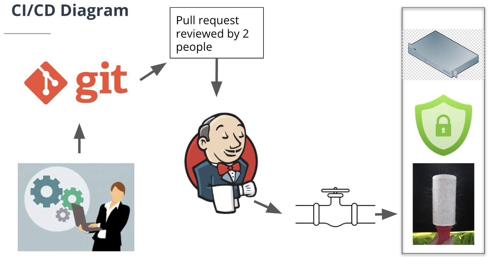

# CI / CD & DevOps

本章的主题将围绕CI/CD和DevOps.

## 1. DevOps

DevOps是开发和运营的结合，并且利用一系列工具配合软件开发，核心目的是**提高企业交付软件的速度**

展开说，DevOps可以

- 提高软件进化的速度
- 提供更好的软件可靠性
- 通过使用自动化工具，提高可扩展性。
- 改善团队之间的协作。

---

DevOps涉及规划、开发、交付和维护四个阶段。


规划阶段通常被视为DevOps的第一阶段。但是规划其实依赖于上一轮的反馈（正面或者负面）。

团队需要快速接受反馈，适应变化。这就需要软件开发具有一种全新的能力——敏捷。

敏捷开发是一个用于描述迭代软件开发的术语。迭代软件开发通过在短增量完成工作（通常称为*sprint冲刺*）来缩短DevOps周期。
sprint冲刺通常长达一到四周，一般是两周。而传统开发会提前规划大型项目，并根据计划完成它们，可能耗时数个月。

每次冲刺交付生产质量代码都需要敏捷开发团队来加快速度。每一次冲刺 (sprint) 周期都会完成一整轮的编码、测试和QA等任务。

CI/CD对敏捷开发至关重要，一般是团队在启动新项目时处理的第一项任务之一。借助CI/CD，可避免缓慢、易错且耗时的手动部署过程。



---


## 2. CI/CD

要讲清楚CI/CD，我们还要了解一个概念：**软件开发生命周期**


**软件生命周期（Software Development LifeCycle）** 是指软件的产生直到成熟的全部过程（软件开发过程）。

一般来说就是包含了规划，设计，实施，集成和测试，交付部署，和后期维护等阶段。

这种说法是受到了早期软件生命周期模型---瀑布流模型的影响。现代的软件开发往往不是一次性的，而是要不断更新，增加新的代码，迭代部署新的版本。再持续迭代的过程中，我们需要引入自动化流水线来频繁交付/部署应用系统，也就是所谓的CI/CD。

---

CI/CD是DevOps团队构建、打包、测试和部署应用程序的一种一致的、自动化的方式。

+ 它促使开发团队经常实施小的代码更改并将它们提交到版本控制存储库
+ 大多数现代应用程序需要使用各种平台和工具开发代码，因此团队需要一致的机制来集成和验证代码变动。
+ 持续集成建立了一种自动化的方式来构建、打包和测试的应用程序。
+ CI/CD 可以鼓励开发人员更频繁地提交代码更改，从而高效合作并提高代码质量。

---

#### CI代表着Continuous Integration，持续集成

持续集成会定期构建项目新开发的代码更新，使用自动化工具对整合后的代码进行验证和测试，并集成到类似Git这样的代码存储库中。

持续集成（CI）可以帮助开发人员快速的提交且合并代码变动。一旦代码提交完成，系统就会通过自动构建应用并运行不同级别的自动化测试来验证这些更新。如果自动化测试发现新代码和现有代码之间存在冲突，CI可以帮助开发人员尽早修复错误。


---

#### CD代表着Continuous Delivery or Deployment 持续交付或持续部署。

CD发生在CI的构建与自动测试之后，持续交付可自动将已验证的代码发布到存储库。

另一种*CD* `Continuous Deployment` 持续部署，指的是自动将代码变动从存储库发布到生产环境。

有时"持续交付"也包含了持续部署流程


---

我们没必要纠结于这些语义，只需记得 CI/CD 其实就是一个用于实现应用开发中的持续自动化的流程。
CI负责定期构建项目新开发的代码更新，使用自动化工具对整合后的代码进行验证和测试，并集成到代码存储库中。
CD负责将合并和验证的代码自动发布到存储库中，最后将准备好的版本交付到生产环境中


## 3. 搭建实验环境

#### 下载安装VirtualBox
#### 下载Ubuntu，使用VirtualBox的自动化安装
#### 配置虚拟机
1. 创建默认用户（我使用`用户名ubuntu，密码ubuntu`）
2. 将用户加入sudoers
    ```bash 
    # use root account
    su -

    # modify sudoers file
    visudo
    ```
   添加`ubuntu ALL=(ALL) NOPASSWD:ALL`

3. 安装ssh server
    ```bash
    sudo apt update
    sudo apt install openssh-server

    sudo systemctl status ssh
    sudo ufw allow ssh
    ```

4. 安装ifconfig，获取虚拟机IP
    ```bash
    sudo apt install net-tools
    ifconfig ｜ grep broadcast
    ```

5. 获取虚拟机IP之后，回到主机，远程登录至虚拟机服务器
+ Chrome 用户可以在插件商店安装[Secure Shell](https://chrome.google.com/webstore/detail/secure-shell/iodihamcpbpeioajjeobimgagajmlibd)
+ VSCode用户可以使用[Remote SSH](https://code.visualstudio.com/docs/remote/ssh)
+ Windows用户可以安装PuTTY或者XShell 
+ Mac用户可以直接使用mac自带的terminal

#### 安装Jenkins

[Jenkins官方](https://pkg.jenkins.io/debian/)给了一个比较复杂的安装步骤
```bash
# This is the Debian package repository of Jenkins to automate installation and upgrade. To use this repository, first add the key to your system:
curl -fsSL https://pkg.jenkins.io/debian/jenkins.io.key | sudo tee /usr/share/keyrings/jenkins-keyring.asc > /dev/null

# Then add a Jenkins apt repository entry:
echo deb [signed-by=/usr/share/keyrings/jenkins-keyring.asc] https://pkg.jenkins.io/debian binary/ | sudo tee /etc/apt/sources.list.d/jenkins.list > /dev/null

# Update your local package index, then finally install Jenkins:
sudo apt-get update
sudo apt-get install fontconfig openjdk-11-jre
sudo apt-get install jenkins
```

针对Ubuntu，推荐直接使用以下指令

```bash
# Update existing packages
sudo apt-get update

# Install Java
sudo apt install -y default-jdk

# Download Jenkins package. 
# Add a key to your system
wget -q -O - https://pkg.jenkins.io/debian/jenkins.io.key | sudo apt-key add -

# Add the following entry in your /etc/apt/sources.list:
sudo sh -c 'echo deb https://pkg.jenkins.io/debian-stable binary/ > /etc/apt/sources.list.d/jenkins.list'

# Update your local package index
sudo apt-get update

# Install Jenkins
sudo apt-get install -y jenkins

# Start the Jenkins server
sudo systemctl start jenkins

# Enable the service to load during boot
sudo systemctl enable jenkins

# Verify Jenkins status 
sudo systemctl status jenkins
```

## 4. 认识一下Jenkins
访问虚拟机的`8080`端口
#### 初次启动，配置用户，安装默认插件
第一次访问一个新的 Jenkins 实例时, 要求使用自动生成的密码对其进行解锁。

在 Unlock Jenkins 页面, 粘贴密码到 Administrator password 字段并点击 Continue。

#### 启动第一个项目

+ New Item > Freestyle project 
+ Build > Execute shell > Command

###### shell指令
`echo "Hello World"`

###### 动态求值 
`echo "Current data and time is $(date)"`

###### 传参 

打开`/tmp/script.sh`
```bash
#! /bin/bash
echo "Hello, $NAME1 and $NAME2"
```
保存`/tmp/script.sh`，启动Jenkins
```bash
NAME1=Tom
NAME2=Jerry
/tmp/script.sh $NAME1 $NAME2
```

###### 项目参数化
General > This project is parameterized

修改`/tmp/script.sh`
```bash
NAME1=$1
NAME2=$2
/tmp/script.sh $NAME1 $NAME2
```

###### 环境参数
```bash
echo "Build Number is $BUILD_NUMBER"
echo "Build ID is $BUILD_ID"
echo "Build URL is $BUILD_URL"
echo "Build Tag is $BUILD_TAG"
```

推荐阅读[Jenkins : Building a software project](https://wiki.jenkins.io/display/JENKINS/Building-a-software-project.html)

###### 自定义环境参数
Manage Jenkins > Configure System > Global Properties > Environment variables

```
Name: username
value: ubuntu_10.0.0.215
```

```bash
echo "Build Number is $BUILD_NUMBER"
echo "Build ID is $BUILD_ID"
echo "Build URL is $BUILD_URL"
echo "Build Tag is $BUILD_TAG"
echo "$username" 
```
