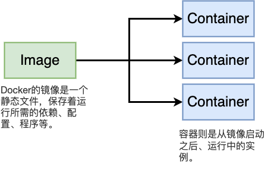

# 初识docker

## 为什么需要docker

假设我们需要在服务器上安装一个软件

1. 下载
2. 安装
3. 遇到一个bug
4. 开始排错，发现缺少某个依赖包
5. 安装依赖包
6. 重新安装
7. 遇到另一个bug
8. 发现缺少另一个依赖包
9. 安装依赖包
10. 重新安装
11. 遇到bug
12. 发现两个依赖包使用了同一个项目，但是指向了不同的版本
13. ....

使用docker：
```bash
docker run XXX
```
docker为我们解决了环境设置和软件依赖的问题，减轻了运维人员的负担。


## 什么是docker


Docker包含了由一系列工具组成生态系统：
+ Docker Client
+ Docker Server
+ Docker Machine
+ Docker Images
+ Docker Hub
+ Docker Compose

工作中，需要打交道最多的是Docker Client和Docker Hub。Docker的主要功能是构建、部署和管理容器。



## 镜像

Docker的镜像是一个静态文件，保存着运行所需的依赖、配置、程序等。

## 容器
容器则是从镜像启动之后、运行中的实例。

开发人员常常会将容器比做一个小型的虚拟机。容器有自己的运行环境、资源空间（独立的内存分配、硬盘存储、网络栈，隔离的进程环境）。

但是容器更加轻量，比虚拟机执行更快，占用资源更少
+ 更轻量：与虚拟机不同，容器不携带整个操作系统；它们仅包括执行代码所必需的操作系统进程和依赖关系。容器大小以MB为单位来计算（虚拟机大小以GB计算），可以更好地利用硬件容量，并且启动时间更快。
+ 资源利用率更高：使用容器在硬件上运行的应用副本数量是使用虚拟机的数倍。有助于减少开销。
+ 提高开发人员生产力：相较于虚拟机，容器部署、配置和重启更快。因此非常适用于持续集成和持续交付(CI/CD) 管道中，并且更适用于采用敏捷和DevOps实践的开发团队。


## 安装docker

访问 https://docs.docker.com/engine/install/ 根据自己操作系统版本选择安装方式。

## 初识docker 
查看安装好的docker版本
```bash
docker version
```
执行hello-world
```bash
docker run hello-world
# Unable to find image 'hello-world:latest' locally
# ......
```


## docker 原理

docker和现有的虚拟化技术有什么联系？

### 虚拟化技术

虚拟化其实是一个宽泛的概念，但是一般默认这个术语指的是虚拟机相关技术。


我们先以VMware vSphere虚拟化架构为例，说说虚拟机。

VMware vSphere的主要产品有两个：ESXi和vCenter Server。
ESXi是VMware自家的hypervisor，是在虚拟机和物理资源之间的一个抽象层。
+ Type-1 hypervisor直接运行在物理硬件上，比如VMware的ESXi，微软的Hyper-V，开源的Xen和KVM。
+ Type-2 hypervisor需要运行在虚拟机上，比如Oracle的VirtualBox， VMware的workstation。


所有的VM都是运行在hypervisor上的。VM有两个关键部分：VM Files（虚拟机文件）和Live State（虚拟机的实时状态）。Live State包含了vm在内存中的当前状态以及虚拟硬件的状态。比如虚vm写入文件时，将发送SCSI命令，这些命令被ESXi主机拦截并传递给存储适配器storage adapter。VM Files包含了vm的配置文件，比如vm运行在哪台主机上，拥有多少vCPU。

而vCenter Server是管理平台。运维一般会用Windows Server做AD和DNS，别的物理机通过远程管理卡安装ESXi，然后用vCenter Server做集中管理。存储可以利用iSCSI搭建IP SAN，或者FC SAN，或者VMware家的vSAN。网络层面VMware在vSphere 4.0开始推出了vDS（virtual distributed switch)，也允许使用第三方交换机比如Cisco Nexus 1000V。

> **云上一般使用什么虚拟化技术？**
> hypervisor层面Google Cloud Platform用的是修改后的KVM。AWS早期使用的是Xen，17年之后也转向KVM。Azure使用的是Windows Hyper-V。

### 容器化技术

理解容器，我们需要深入到操作系统本身。


操作系统管理资源，进程通过System Call向操作系统请求资源。


通过namespace隔离资源。

**chroot**

容器化的概念远早于docker。最初的容器是为了隔离计算机中的各类资源。最早可以追溯到1979年。Unix引入`chroot`指令之后，Unix上就已经可以为进程提供隔离的磁盘空间。`chroot`会将进程的根目录就会被锁定在命令参数所指定的路径下。

**namespace**

2002年，Linux Kernel 引入了Linux Namespaces。Namespace由内核直接提供的全局资源封装。进程在Namespace中，独自占Linux主机上的一切资源：文件系统、PID 编号、root用户、IP地址等等。


**cgroup**

Google在2000年左右就开始了容器化的相关工作。从一开始Google就没有引入虚拟机，因为利用虚拟机隔离程序会造成资源的浪费，Google认为操作系统本身就应该提供程序隔离的能力。

Google自己有一套容器标准叫做lmctfy（Let Me Contain That For You）。2006年Google把一部分技术加入了Linux, 就是我们现在看到的cgroups


Namespace隔离容器使用的计算资源，Cgroups限制容器使用资源的量。


### 镜像->容器


