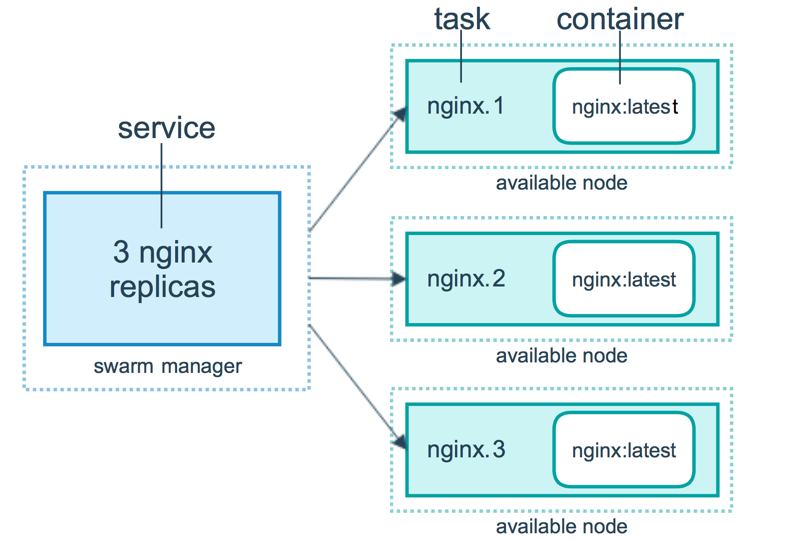

# Swarm集群管理

Docker是容器运行时，而Swarm是Docker公司出品的容器编排工具。

Swarm基于Docker运行时，一个swarm由多个节点组成，每个节点是在swarm模式下运行Docker Engine的物理机或虚拟机。。Docker Swarm 支持标准的Docker API，所有任何已经与Docker Engine通信的工具都可以与Swarm集成，轻松地扩展到多个主机。


## 节点
节点分为管理节点和工作节点。

### 管理节点
管理节点处理集群管理任务：
+ 维护集群状态
+ 调度服务
+ 响应swarm模式HTTP API 端点
  
管理节点通过Raft实现维护整个swarm所有服务的一致内部状态。

### 工作节点
工作节点是Docker引擎所在的物理机或虚拟机，其唯一目的是运行容器。
工作节点不参与 Raft 分布式状态，不做调度决策。

## 服务

在swarm上部署服务时，swarm管理节点接受服务定义作为服务的所需状态。

然后它将集群中节点上的服务调度为一个或多个副本任务。这些任务在集群中的节点上彼此独立运行。

例如，在三个nginx实例之间进行负载平衡。



容器是一个单独的进程。在swarm模式中，每个任务只调用一个容器。任务类似于调度器放置容器的“插槽”。一旦容器处于活动状态，调度器就会识别出任务处于运行状态。如果容器未通过健康检查或终止，则任务终止。

### 任务调度

任务是swarm调度的原子单位。创建或更新服务声明时，调度器会通过调度任务来实现所需的状态。
例如，定义一个服务，要求调度器始终保持三个nginx实例运行。调度器将创建三个任务。每个任务都是一个插槽，调度器通过生成容器来填充插槽。

容器是任务的实例化。如果nginx实例崩溃，调度器将创建一个新的nginx副本来生成一个新的容器。


swarm模式接受服务创建请求并将任务调度到工作节点:


## Swarm

```bash
docker info | grep Swarm


# docker swarm init --advertise-addr 10.0.0.215
docker swarm init
# Swarm initialized: current node (t5thzh5eplovkkup867xh6ik4) is now a manager.
# 
#To add a worker to this swarm, run the following command:
#
#     docker swarm join --token SWMTKN-1-03q2kxmu8mlhpsi4qgkwyfam032o4zk8ykty19tc854hmqwr43-53hjsrn5pev37z26ctzgciwk9 10.0.0.215:2377
#    
# To add a manager to this swarm, run 'docker swarm join-token manager' and follow the instructions.

docker node ls
# ID                            HOSTNAME   STATUS    AVAILABILITY   MANAGER STATUS   ENGINE VERSION
# t5thzh5eplovkkup867xh6ik4 *   ubuntu     Ready     Active         Leader           20.10.21
```
可以看到唯一一个node是当前的`Leader`

## serivce
`docker service`类似于`docker run`指令
创建一个服务 ping www.aws.com.cn
```bash
docker service create alpine ping 8.218.126.38
# tgbf1ac65aeismat25wfaajax
# overall progress: 1 out of 1 tasks 
# 1/1: running   [==================================================>] 
# verify: Service converged 
```
查看该服务：
+ 当前replicas状态为1/1
+ 系统分配了ID和名字
```bash
docker service ls
# ID             NAME                 MODE         REPLICAS   IMAGE           PORTS
# tgbf1ac65aei   distracted_volhard   replicated   1/1        alpine:latest   
```
根据名字查看细节
+ 当前运行的node
+ 每个容器的名字，是服务名加后缀
```bash
docker service ps distracted_volhard 
# ID             NAME                   IMAGE           NODE      DESIRED STATE   CURRENT STATE                ERROR     PORTS
# xcesiihrnc21   distracted_volhard.1   alpine:latest   ubuntu    Running         Running about a minute ago         
```
在节点层面，查看运行中的容器
```bash
docker container ls
# CONTAINER ID   IMAGE           COMMAND            CREATED         STATUS         PORTS     NAMES
# a0070e666888   alpine:latest   "ping 8.218.126.38"     2 minutes ago   Up 2 minutes             distracted_volhard.1.xcesiihrnc21vqsayq3dyyxp3
```
扩展服务节点
```bash
docker service update tgbf1ac65aei --replicas 3
tgbf1ac65aei
# overall progress: 3 out of 3 tasks 
# 1/3: running   [==================================================>] 
# 2/3: running   [==================================================>] 
# 3/3: running   [==================================================>] 
# verify: Service converged 
```
再次查看服务，replicas 3/3
```bash
docker service ls
# ID             NAME                 MODE         REPLICAS   IMAGE           PORTS
# tgbf1ac65aei   distracted_volhard   replicated   3/3        alpine:latest   
```
根据名字查看细节
```bash
docker service ps distracted_volhard 
# ID             NAME                   IMAGE           NODE      DESIRED STATE   CURRENT STATE            ERROR     PORTS
# xcesiihrnc21   distracted_volhard.1   alpine:latest   ubuntu    Running         Running 4 minutes ago              
# 5jp0ekrthai8   distracted_volhard.2   alpine:latest   ubuntu    Running         Running 44 seconds ago             
# n7jjoxqspjko   distracted_volhard.3   alpine:latest   ubuntu    Running         Running 44 seconds ago      
```
随便删除一个节点
```bash
docker container rm -f distracted_volhard.2

docker container ls
# CONTAINER ID   IMAGE           COMMAND            CREATED         STATUS         PORTS     NAMES
# 8f19c562d31b   alpine:latest   "ping 8.218.126.38"     3 minutes ago   Up 3 minutes             distracted_volhard.3.n7jjoxqspjkotvfsjx74usze9
# a0070e666888   alpine:latest   "ping 8.218.126.38"     7 minutes ago   Up 7 minutes             distracted_volhard.1.xcesiihrnc21vqsayq3dyyxp3
```
查看服务，状态变为2/3
```bash
docker service ls
# ID             NAME                 MODE         REPLICAS   IMAGE           PORTS
# tgbf1ac65aei   distracted_volhard   replicated   2/3        alpine:latest   
```
等待一会儿，状态又变成3/3
```bash
docker service ls
# ID             NAME                 MODE         REPLICAS   IMAGE           PORTS
# tgbf1ac65aei   distracted_volhard   replicated   3/3        alpine:latest   
```
查看看服务状态，可以看到之前有一个容器被删除
```bash
docker service ps distracted_volhard
# ID             NAME                       IMAGE           NODE      DESIRED STATE   CURRENT STATE               ERROR                         PORTS
# xcesiihrnc21   distracted_volhard.1       alpine:latest   ubuntu    Running         Running 7 minutes ago                                     
# w68ar2z42kdy   distracted_volhard.2       alpine:latest   ubuntu    Running         Running 40 seconds ago                                    
# sydzmsh6auzd    \_ distracted_volhard.2   alpine:latest   ubuntu    Shutdown        Failed 46 seconds ago       "task: non-zero exit (137)"   
# n7jjoxqspjko   distracted_volhard.3       alpine:latest   ubuntu    Running         Running 4 minutes ago  
```
删除服务
```bash
docker service rm distracted_volhard
# distracted_volhard
```
快速查看容器状态，发现容器还未完全删除。说明swarm是先解除服务，再清理容器
```bash
docker container ls
# CONTAINER ID   IMAGE           COMMAND            CREATED         STATUS         PORTS     NAMES
# 5a01c6c6c177   alpine:latest   "ping 8.218.126.38"   9 minutes ago   Up 9 minutes             distracted_volhard.1.bka8ah2jj4nc11m9zp2k0cht1
```
过一会儿再看，容器被清除
```bash
docker container ls
# CONTAINER ID   IMAGE     COMMAND   CREATED   STATUS    PORTS     NAMES
```

## 多节点swarm

配置一个三节点的虚拟机集群，node1/node2/node3，可相互通信

> 部署 https://github.com/play-with-docker/play-with-docker
>```bash
>docker swarm leave --force
>sudo apt install golang-go -y
>git clone https://github.com/play-with-docker/play-with-docker
>cd play-with-docker
>docker run hello-world
>sudo modprobe xt_ipvs
>docker swarm init
>docker pull franela/dind
>go mod vendor
>docker-compose up
>```

在node1上
```bash
docker swarm init
# Error response from daemon: could not choose an IP address to advertise since this system has multiple addresses on different interfaces (172.18.0.81 on eth1 and 192.168.0.8 on eth0) - specify one with --advertise-addr
# 选择对外可见的IP

docker swarm init --advertise-addr 192.168.0.8
# Swarm initialized: current node (xsnu8ijh23xj5qqv1crmrmqb5) is now a manager.
# 
# To add a worker to this swarm, run the following command:
# 
#     docker swarm join --token SWMTKN-1-0hpw0ddhbvj5e6hobki3sakfpi4pykv3c9f5juoqpfsapuelgj-4dgjf34cq6z3lltxsqe8888da 192.168.0.8:2377
# 
# To add a manager to this swarm, run 'docker swarm join-token manager' and follow the instructions.
```


在node2上，加入swarm集群
```bash
docker swarm join --token SWMTKN-1-0hpw0ddhbvj5e6hobki3sakfpi4pykv3c9f5juoqpfsapuelgj-4dgjf34cq6z3lltxsqe8888da 192.168.0.8:2377
# This node joined a swarm as a worker.
```
此时node2 以worker节点身份加入

在node1上，查看节点
```bash
docker node ls
# ID                            HOSTNAME   STATUS    AVAILABILITY   MANAGER STATUS   ENGINE VERSION
# xsnu8ijh23xj5qqv1crmrmqb5 *   node1      Ready     Active         Leader           20.10.17
# k10fphc0j8vh8u5o7j98vwdz3     node2      Ready     Active                          20.10.17
```
node2加入。当前node1 有leader状态

在node1上，修改node2的role
```bash
docker node update --role manager node2
# node2

docker node ls
# ID                            HOSTNAME   STATUS    AVAILABILITY   MANAGER STATUS   ENGINE VERSION
# xsnu8ijh23xj5qqv1crmrmqb5 *   node1      Ready     Active         Leader           20.10.17
# k10fphc0j8vh8u5o7j98vwdz3     node2      Ready     Active         Reachable        20.10.17
```
此时node2出现reachable状态。

让node3 直接以管理节点身份加入。在node1上
```bash
docker swarm join-token manager
#To add a manager to this swarm, run the following command:
#
#    docker swarm join --token SWMTKN-1-0hpw0ddhbvj5e6hobki3sakfpi4pykv3c9f5juoqpfsapuelgj-9rwy33fwi8xf9zpzh33muw4lf 192.168.0.8:2377
```
复制这段指令

在node3上
```bash
docker swarm join --token SWMTKN-1-0hpw0ddhbvj5e6hobki3sakfpi4pykv3c9f5juoqpfsapuelgj-9rwy33fwi8xf9zpzh33muw4lf 192.168.0.8:2377
# This node joined a swarm as a manager.
```
node3以管理节点身份加入。


在node1上查看
```bash
docker node ls
# ID                            HOSTNAME   STATUS    AVAILABILITY   MANAGER STATUS   ENGINE VERSION
# xsnu8ijh23xj5qqv1crmrmqb5 *   node1      Ready     Active         Leader           20.10.17
# k10fphc0j8vh8u5o7j98vwdz3     node2      Ready     Active         Reachable        20.10.17
# fldbwcgpw3bhyryoqu7x7y4qb     node3      Ready     Active         Reachable        20.10.17
```
此时node3出现reachable状态。

#### 在多节点swarm上启动服务
在node1上
```bash
docker service create --replicas 3 alpine ping 8.218.126.38
# 2oe8jd4jt0cxyqf4b9kaj0hcw
# overall progress: 3 out of 3 tasks 
# 1/3: running   [==================================================>] 
# 2/3: running   [==================================================>] 
# 3/3: running   [==================================================>] 
# verify: Service converged 

# 查看服务
docker service ls
# ID             NAME            MODE         REPLICAS   IMAGE           PORTS
# 2oe8jd4jt0cx   agitated_kare   replicated   3/3        alpine:latest   


# 查看当前节点容器
docker node ps
# ID             NAME              IMAGE           NODE      DESIRED STATE   CURRENT STATE            ERROR     PORTS
# pqse8hj55jkt   agitated_kare.2   alpine:latest   node1     Running         Running 16 seconds ago             

# 查看node2节点容器
docker node ps node2
# ID             NAME              IMAGE           NODE      DESIRED STATE   CURRENT STATE            ERROR     PORTS
# 7ug7hlhv15dt   agitated_kare.3   alpine:latest   node2     Running         Running 37 seconds ago             

# 查看服务在节点容器的分布
docker service ps agitated_kare
# ID             NAME              IMAGE           NODE      DESIRED STATE   CURRENT STATE            ERROR     PORTS
# 5kk10j2lo2bf   agitated_kare.1   alpine:latest   node3     Running         Running 52 seconds ago             
# pqse8hj55jkt   agitated_kare.2   alpine:latest   node1     Running         Running 51 seconds ago             
# 7ug7hlhv15dt   agitated_kare.3   alpine:latest   node2     Running         Running 51 seconds ago             

docker node ls
# ID                            HOSTNAME   STATUS    AVAILABILITY   MANAGER STATUS   ENGINE VERSION
# xsnu8ijh23xj5qqv1crmrmqb5 *   node1      Ready     Active         Leader           20.10.17
# k10fphc0j8vh8u5o7j98vwdz3     node2      Ready     Active         Reachable        20.10.17
# fldbwcgpw3bhyryoqu7x7y4qb     node3      Ready     Active         Reachable        20.10.17
```
说明三个可用节点，每个分配到了一个容器
