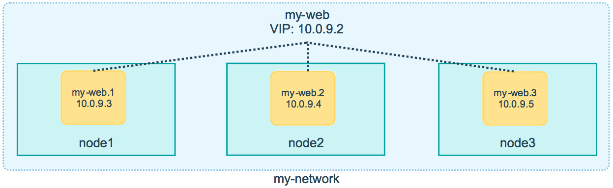

# Docker compose vs. Docker Swarn

回顾一下docker compose，同样可以一次性启动多个docker容器。但是二者的使用场景不同。docker compose更适合与本地测试与开发，而不适合生产环境。

## 使用docker compose 搭建一个网站

Drupal + PostgreSQL https://hub.docker.com/_/drupal

写成docker-compose.yml的形式
```yaml
version: '3.1'

services:
  drupal:
    image: drupal:8-apache
    ports:
      - 8080:80
    volumes:
      - /var/www/html/modules
      - /var/www/html/profiles
      - /var/www/html/themes
      - /var/www/html/sites
    restart: always
  postgres:
    image: postgres:10
    environment:
      POSTGRES_PASSWORD: mypassword
    restart: always
```

默认postgres的数据库和用户名都是postgres，密码为自己填写的字段。postgres数据库服务器地址使用DNS地址：postgres

## 使用docker swarm 搭建一个网站

### overlay网络
服务于容器间网络，提供了可选的加密特性，允许容器处于多个网络

同样创建一个postgres数据库、一个drupal站点和一个overlay网络。

创建overlay网络
```bash
docker network create --driver overlay mydrupal

docker network ls
# NETWORK ID     NAME              DRIVER    SCOPE
# 5054aae3e6c8   bridge            bridge    local
# 98b6ebbab0f4   docker_gwbridge   bridge    local
# 847fe6f59e50   host              host      local
# ywd5ipt7qdjy   ingress           overlay   swarm
# 88kyndqnrtpf   mydrupal          overlay   swarm
# b5b109343eb3   none              null      local
```

启动postgres数据库
```bash
docker service create --name psql --network mydrupal -e POSTGRES_PASSWORD=mypassword postgres:10

docker service ls
# ID             NAME      MODE         REPLICAS   IMAGE             PORTS
# n1rxvningqd1   psql      replicated   1/1        postgres:latest   

docker container logs psql
```

启动drupal，加入相同的网络
```bash
docker service create --name drupal --network mydrupal -p 80:80 drupal:8-apache

docker service ps drupal
# ID             NAME       IMAGE           NODE      DESIRED STATE   CURRENT STATE            ERROR     PORTS
# pyn97awt9y1r   drupal.1   drupal:latest   node2     Running         Running 15 seconds ago      

docker service ps psql 
# ID             NAME      IMAGE             NODE      DESIRED STATE   CURRENT STATE           ERROR     PORTS
# ldo8ydhk1wau   psql.1    postgres:latest   node1     Running         Running 8 minutes ago             
```    
注意，drupal和psql分别处于node1和node2，这点不用于docker compose。所以我们需要额外搭建overlay网络。

postgres数据库服务器地址使用DNS地址，而这次是service name：psql

docker swarm集群可以通过overlay网络实现夸节点通信。
docker compose一般则作为单节点引擎工具。

## swarm routing mesh

访问三个节点的80端口，发现都可以打开drupal的页面。然而实际上drupal在overlay网络上只有一个IP

```bash
docker service inspect drupal
```
在swarm集群的任意节点上都可以访问服务。这就是swarm的Routing Mesh机制。

Routing Mesh分为两类：
+ Internal Routing Mesh：容器与容器之间通过overlay网络进行访问。通过service name进行DNS解析，获得VIP(Virtual ip)



比如启动一个有三个replica的服务，三个容器分布在三个节点上。swarm会提供一个vip，并且承担流量在三个容器上的负载均衡

+ Ingress Routing Mesh：当在任何一个swarm节点去访问端口服务的时候会被本节点的IPVS(Linux ip virtual service)转发到真正的swarm节点上。


访问节点IP时，swarm会对击中节点的流量进行负载均衡。

```bash

# docker service create --name search --replicas 2 -p 9200:9200 elasticsearch:2 --detach

# docker build -t s09g/node-web .

docker service create --name showip --replicas 3 -p 8080:8080 s09g/node-web --detach

docker service ps showip

curl localhost:8080
```

+ 外部访问的均衡负载
+ 服务端口被暴露到各个swarm节点
+ 内部通过 IPVS 进行均衡负载

## Stack

docker stack 其实就是swarm版的docker-compose.yml，要求使用`version >= 3`

+ 使用`docker stack deploy`代替`docker service create`
+ Swarm不支持`build`标签，`build`标签失效
+ Compose不支持`deploy`标签，`deploy`标签失效

修改之前的docker-compose.yml
`vim docker-stack.yml`
```yaml
version: '3.1'

services:
  drupal:
    image: drupal:8-apache
    ports:
      - 8080:80
    volumes:
      - /var/www/html/modules
      - /var/www/html/profiles
      - /var/www/html/themes
      - /var/www/html/sites
  postgres:
    image: postgres:10
    environment:
      POSTGRES_PASSWORD: mypassword
```
```bash
docker stack deploy -c docker-stack.yml mystack

docker stack ls
# NAME      SERVICES   ORCHESTRATOR
# mystack   2          Swarm

docker stack services mystack 
# ID             NAME               MODE         REPLICAS   IMAGE             PORTS
# xj7vyueoqcmt   mystack_drupal     replicated   1/1        drupal:8-apache   *:8080->80/tcp
# wiqj2536orpr   mystack_postgres   replicated   1/1        postgres:10    

docker stack ps mystack 
# ID             NAME                 IMAGE             NODE       DESIRED STATE   CURRENT STATE                ERROR     PORTS
# sbk4up0fotdj   mystack_drupal.1     drupal:8-apache   manager1   Running         Running 58 seconds ago                 
# j3e06itrvpsr   mystack_postgres.1   postgres:10       worker1    Running         Running about a minute ago    
```

### Docker Swarm Visualizer
加入Visualizer
```bash
git clone https://github.com/dockersamples/docker-swarm-visualizer
cd docker-swarm-visualizer
docker-compose up -d
```
访问8080端口，查看仪表盘

还可以加入yaml文件，随集群一起启动
```yaml
version: '3.1'

services:
  drupal:
    image: drupal:8-apache
    ports:
      - 80:80
    volumes:
      - /var/www/html/modules
      - /var/www/html/profiles
      - /var/www/html/themes
      - /var/www/html/sites
  postgres:
    image: postgres:10
    environment:
      POSTGRES_PASSWORD: mypassword
  visualizer:
    image: dockersamples/visualizer
    ports:
      - 8080:8080
    volumes:
      - /var/run/docker.sock:/var/run/docker.sock
    deploy:
      placement:
        constraints: [node.role == manager]
```

## Docker secret
在之前的yaml文件中，我们将postgres的密码以明文形式存储在了文件中。这种做法并不安全。因此我们需要引入docker secret

Swarm模式下manager节点通过Raft Database保持状态一致。
Raft DB本身是一个在磁盘上加密的介质，并且信息仅保存于manager节点。我们可以利用这个数据库将一些敏感信息，例如账号、密码等信息保存在这里，然后通过给service授权的方式允许它进行访问，这样达到避免密码明文显示的效果。

```bash
echo "my_psql_user" >> psql_user.txt
# echo "my_psql_password" >> psql_password.txt

docker secret create psql_user psql_user.txt

echo "myDBpassWORD" | docker secret create psql_pass -

docker secret ls
# ID                          NAME        DRIVER    CREATED              UPDATED
# c6r82dvx39ljj3xm33b94g7qz   psql_pass             20 seconds ago       20 seconds ago
# rpugt2xwoid20iw6r186tvw6t   psql_user             About a minute ago   About a minute ago

docker secret inspect psql_user
# [
#     {
#         "ID": "rpugt2xwoid20iw6r186tvw6t",
#         "Version": {
#             "Index": 33
#         },
#         "CreatedAt": "2023-01-28T20:36:38.812337222Z",
#         "UpdatedAt": "2023-01-28T20:36:38.812337222Z",
#         "Spec": {
#             "Name": "psql_user",
#             "Labels": {}
#         }
#     }
# ]

docker service create --name psql --secret psql_user --secret psql_pass -e POSTGRES_PASSWORD_FILE=/run/secrets/psql_pass -e POSTGRES_USER_FILE=/run/secrets/psql_user postgres:10

docker service ps psql

docker exec -it psql

docker exec -ti psql.1.s6bfy7awutzxq87cgrmkwwjfl bash
# ls /run/secrets
# cat /run/secrets/psql_user 
#   my_psql_user
# exit
```

+ secret存在于Swarm Manager节点的的Raft Database里
+ secret可以分配给service，然后这个service就可以看到这个secret
+ 在container内部secret看起来像文件，实际上就是内存

### 将secret加入stack

需要`version >= '3.1'`
```yaml
version: '3.1'

services:
  drupal:
    image: drupal:8-apache
    ports:
      - 80:80
    volumes:
      - /var/www/html/modules
      - /var/www/html/profiles
      - /var/www/html/themes
      - /var/www/html/sites
  postgres:
    image: postgres:10
    environment:
      POSTGRES_PASSWORD_FILE: /run/secrets/psql_password
      POSTGRES_USER_FILE: /run/secrets/psql_user
  visualizer:
    image: dockersamples/visualizer
    ports:
      - 8080:8080
    volumes:
      - /var/run/docker.sock:/var/run/docker.sock
    deploy:
      placement:
        constraints: [node.role == manager]
secrets:
  psql_user:
    file: ./psql_user.txt
  psql_password:
    file: ./psql_password.txt
```
启动stack
```bash
docker stack deploy -c mystack.yml mydb

docker secret ls

docker stack rm mydb
```