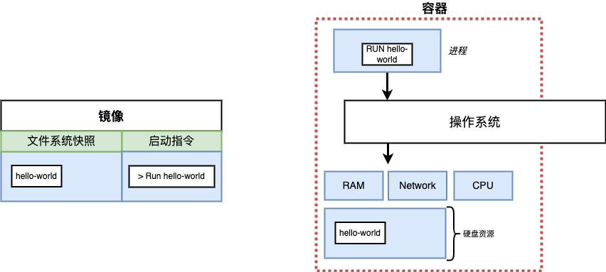
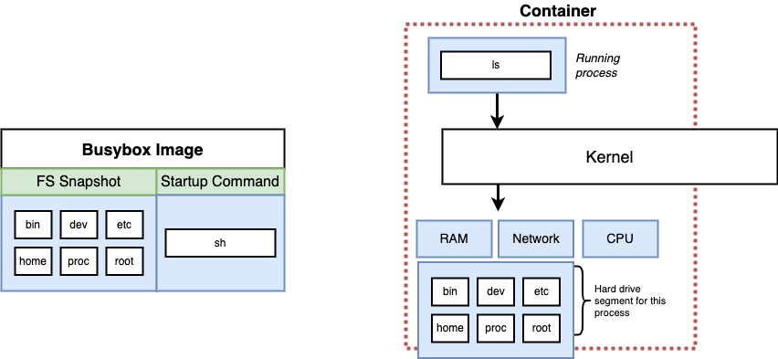
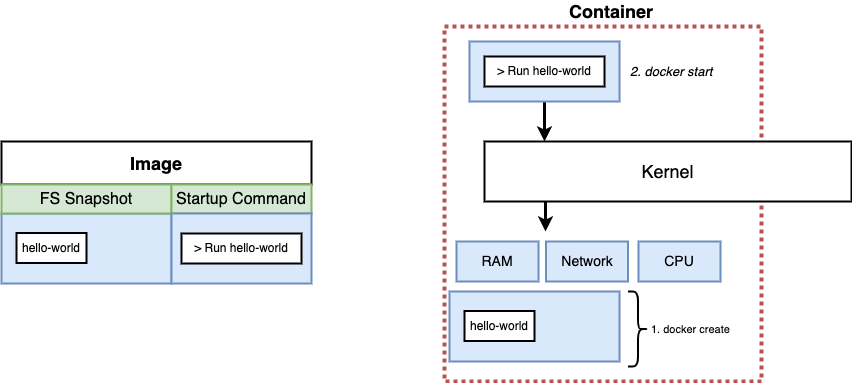
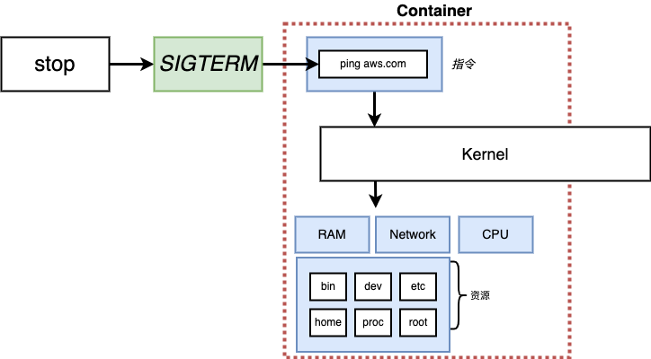
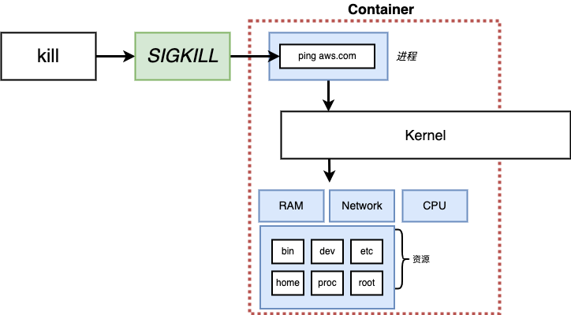

# docker client

## Docker Run
从镜像创建、执行一个容器
```bash
# docker run <image-name>
docker run hello-world
```


执行docker run的时候，docker会先去寻找image文件，然后执行run指令


## Override默认指令
```bash
# docker run <image-name> <command>

docker run busybox echo hello
docker run busybox echo bye
```
查看busybox的文件系统快照
```bash
docker run busybox ls
# bin
# dev
# etc
# ...
```
busybox拥有相对完整的linux环境


```bash
docker run hello-world ls
docker run hello-world echo hello
```
hello-world没有额外的指令


## docker ps
列出当前运行中的docker, 等价于docker container ls
```bash
docker ps

docker run busybox echo hello

docker ps

docker run busybox ping aws.com
```

在另一个窗口中
```bash
docker ps
# CONTAINER ID   IMAGE     COMMAND          CREATED          STATUS          PORTS     NAMES
# a4cd7f84a33f   busybox   "ping aws.com"   16 seconds ago   Up 14 seconds             sleepy_robinson
```
列出所有docker
```bash
docker ps --all

docker ps -a
```


## 生命周期 lifecycle
列出了已经结束的docker
```bash
docker ps --all
```
docker进程在何时结束？这就要说到docker的生命周期


```bash
# docker run = docker create + docker start

docker create hello-world
# container id

```


```bash
docker start -a ${container id}
```
-a 代表attach，将docker的输出打印到控制台


## 重启已经结束的docker

```bash
docker run busybox echo hello

docker ps -a

docker start -a ${container id}
```
第2步的docker start又执行了一次。


在此过程中，不能覆盖指令

```bash
docker ps -a
```
并无额外的docker创建

## 清除所有docker

```bash
docker system prune
```

## 获取docker的日志

```bash
docker create hello-world
# container id
docker start ${container id}
# container id
docker logs ${container id} / ${container}
```

## 终止docker

```bash
docker create busybox ping aws.com

docker start ${container id}

docker logs ${container id}

docker ps
```
终止docker
```bash
docker stop <container id>

docker kill <container id>
```

stop指令发送SIGTERM



kill指令发送SIGKILL


SIGTERM允许优雅退出，但是会有10s的timeout，10s之后docker会重新发送SIGKILL

```bash
docker ps

docker stop ${container id}

# after 10s...
docker ps -a

docker start ${container id} 

docker kill ${container id}
```
