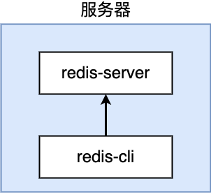
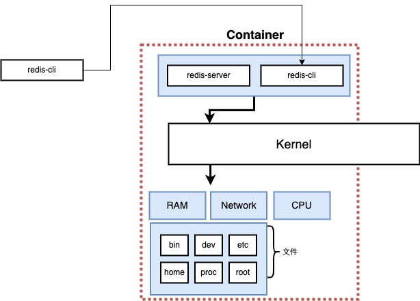
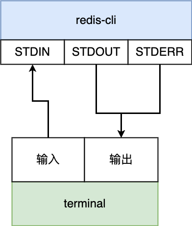

# docker 交互

## docker执行多条指令
如果我们需要docker执行多条指令怎么办？
比如在使用数据库时，我们需要启动一个MySQL Server，再启动一个MySQL Client与其交互。任何server/client架构的服务都会遇到这种场景，比如redis-server和redis-cli。


在本地开发时，我们需要两个窗口
```bash
redis-server
```
在新的窗口中
```bash
redis-cli

# > set myvalue 2023
# OK
# > get myvalue
# 2023
```
在docker环境下，略有区别
```bash
docker run redis
```
docker run命令会启动一个redis docker环境。当我们执行redis-cli时，也需要在对应的redis docker环境下执行


这里我们需要docker exec
```bash
# docker exec <option> <container> <command>
# e.g. docker exec -it ......

docker exec -it redis redis-cli
# > set myvalue 2023
# OK
# > get myvalue
# 2023
```

## -it参数
-it是什么含义呢？
如果不传入-it，执行docker命令后会直接返回终端
```bash
docker exec <redis container id> redis-cli
```
-it是传入了两个选项，等价于 -i -t
```bash
docker exec -i -t  <redis container id> redis-cli
```


-i 代表使用interactive交互模式
-t 代表模拟tty功能。TTY 代表TeleTYpewriter电报打字机，代表着我们的终端。-t参数会启动终端的一些功能。

只传入-i 参数
```bash
docker exec -i  <redis container id> redis-cli
# set myvalue 2023
# OK
# get myvalue  
# 2023
```

## 启动shell
如果需要一直与docker进行交互，但是又不想反复使用docker exec指令，我们可以直接打开shell
```bash
docker exec -it <redis container id> sh
# ls
# cd /home
```

将sh作为启动指令
```bash
docker run -it busybox sh
```
我们可以借此确认docker的隔离机制。在第一个窗口中启动busybox
```bash
docker run -it busybox sh
# touch busybox1
# ls
```
在第2个窗口中同样启动busybox
```bash
docker run -it busybox sh
# ls
```
默认情况下不同的docker进程相互隔离