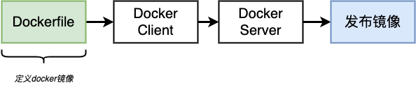
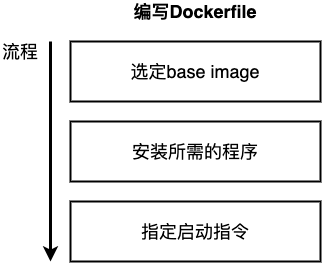
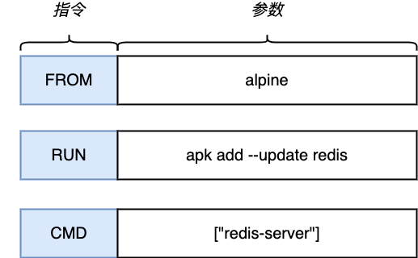
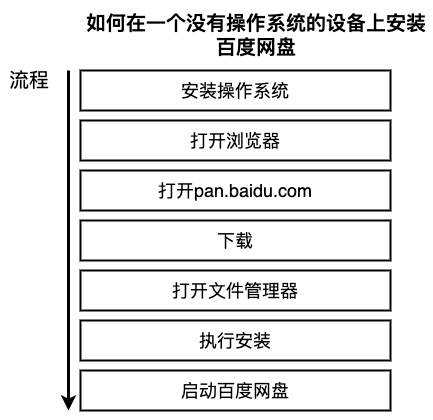
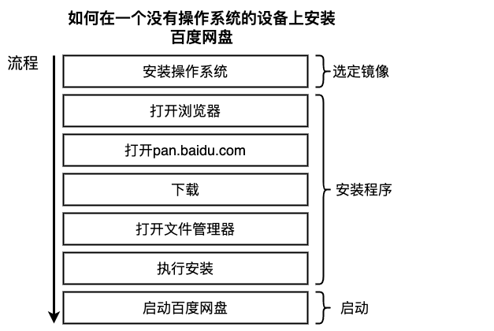
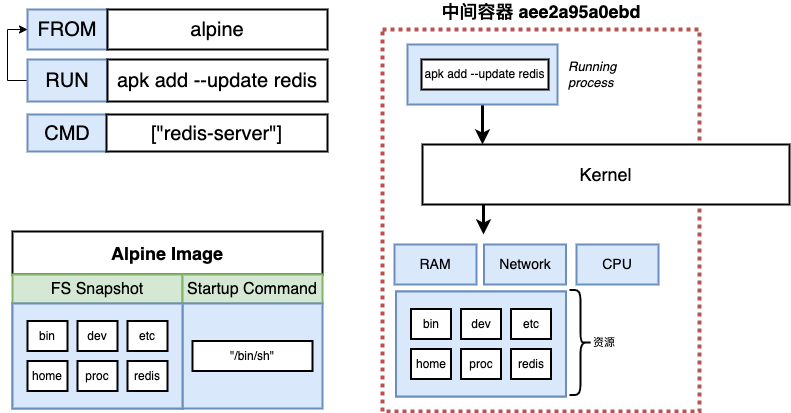
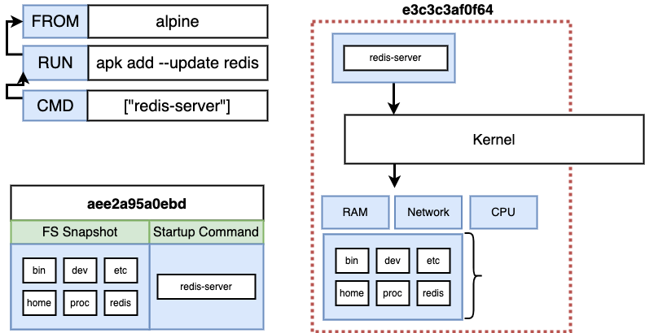
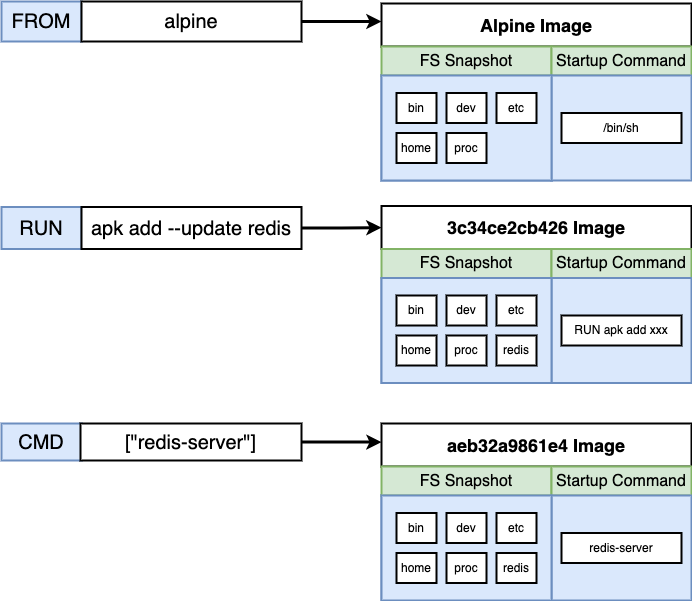
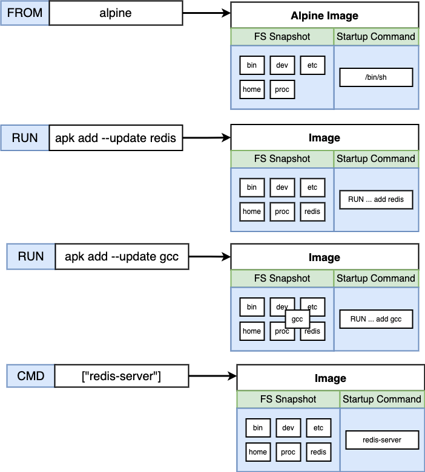
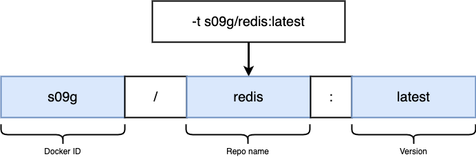

# docker 镜像

docker通过镜像发布，大多数时候我们会直接使用别人打包好的镜像

## Dockerfile



定义我们自己的docker镜像：



我们以redis为例，构建一个运行redis-server的docker镜像。
```bash
mkdir redis
cd redis

vim Dockerfile
```
编辑Dockerfile
```dockerfile
# 选定base image
FROM alpine

# 安装程序
RUN apk add --update redis

# 启动指令
CMD ["redis-server"]
```

```bash
docker build .
# Sending build context to Docker daemon  2.048kB
# Step 1/3 : FROM alpine
# latest: Pulling from library/alpine
# c158987b0551: Pull complete 
# Digest: sha256:8914eb54f968791faf6a8638949e480fef81e697984fba772b3976835194c6d4
# Status: Downloaded newer image for alpine:latest
#  ---> 49176f190c7e
# Step 2/3 : RUN apk add --update redis
#  ---> Running in aee2a95a0ebd
# fetch https://dl-cdn.alpinelinux.org/alpine/v3.17/main/x86_64/APKINDEX.tar.gz
# fetch https://dl-cdn.alpinelinux.org/alpine/v3.17/community/x86_64/APKINDEX.tar.gz
# (1/1) Installing redis (7.0.7-r0)
# Executing redis-7.0.7-r0.pre-install
# Executing redis-7.0.7-r0.post-install
# Executing busybox-1.35.0-r29.trigger
# OK: 10 MiB in 16 packages
# Removing intermediate container aee2a95a0ebd
#  ---> 3c34ce2cb426
# Step 3/3 : CMD ["redis-server"]
#  ---> Running in e3c3c3af0f64
# Removing intermediate container e3c3c3af0f64
#  ---> aeb32a9861e4
# Successfully built aeb32a9861e4
docker run <container id>
```

### Dockerfile 指令详解

Dockerfile是一个文本文件，每一条指令(Instruction)构建一层，指令的内容描述该层如何构建。



dockerfile的描述方式类似于在一个没有安装任何软件的机器上安装服务，比如我们需要在设备上安装百度网盘。



对比dockerfile



### FROM 指定基础镜像

基础镜像是必须指定的。Dockerfile中FROM是必备的指令，并且必须是第一条指令。

```dockerfile
FROM alpine
```
`alpine`是官方提供的基础操作系统镜像之一，类似的还有 `ubuntu`,`debian`,`centos`,`fedora`...

`alpine`本身非常精简，轻量级（～5MB），基于Alpine Linux，提供了基础的操作系统运行时支持（=busybox + musl libc）。
如果不需要操作系统运行时支持，可以使用更轻量的`scratch`作为基础镜像。

### RUN 执行命令

RUN指令是用来执行命令行，是最常用的指令之一

```dockerfile
RUN apk add --update redis
```
Alpine Linux使用Alpine Package Keeper作为包管理程序。这里我们使用apk去安装redis

### CMD 容器启动命令
CMD 指令用于指定默认的容器主进程的启动命令
```dockerfile
CMD ["redis-server"]
```

## docker build

```bash
# docker build <context>
docker build .
```
当我们执行docker build的时候，docker client会根据dockerfile开始构建镜像


```log
Sending build context to Docker daemon  2.048kB
Step 1/3 : FROM alpine
latest: Pulling from library/alpine
c158987b0551: Pull complete 
Digest: sha256:8914eb54f968791faf6a8638949e480fef81e697984fba772b3976835194c6d4
Status: Downloaded newer image for alpine:latest
 ---> 49176f190c7e
Step 2/3 : RUN apk add --update redis
 ---> Running in aee2a95a0ebd
fetch https://dl-cdn.alpinelinux.org/alpine/v3.17/main/x86_64/APKINDEX.tar.gz
fetch https://dl-cdn.alpinelinux.org/alpine/v3.17/community/x86_64/APKINDEX.tar.gz
(1/1) Installing redis (7.0.7-r0)
Executing redis-7.0.7-r0.pre-install
Executing redis-7.0.7-r0.post-install
Executing busybox-1.35.0-r29.trigger
OK: 10 MiB in 16 packages
Removing intermediate container aee2a95a0ebd
 ---> 3c34ce2cb426
Step 3/3 : CMD ["redis-server"]
 ---> Running in e3c3c3af0f64
Removing intermediate container e3c3c3af0f64
 ---> aeb32a9861e4
Successfully built aeb32a9861e4
```

### 中间容器
`Running in aee2a95a0ebd` & `Removing intermediate container aee2a95a0ebd`

docker下载好alpine镜像，启动一个临时容器，在上面执行RUN指令



打包成一个新的镜像，然后移除临时容器，只保留镜像


接下来
```log
Step 3/3 : CMD ["redis-server"]
 ---> Running in e3c3c3af0f64
Removing intermediate container e3c3c3af0f64
 ---> aeb32a9861e4
Successfully built aeb32a9861e4
```


打包成一个新的镜像

```bash
docker run <container id>

docker ps -a
```



## build cache
修改dockerfile，添加gcc
```dockerfile
# 选定base image
FROM alpine

# 安装程序
RUN apk add --update redis
RUN apk add --update gcc

# 启动指令
CMD ["redis-server"]
```

构建
```bash
docker build .
# Sending build context to Docker daemon  2.048kB
# Step 1/4 : FROM alpine
#  ---> 49176f190c7e
# Step 2/4 : RUN apk add --update redis
#  ---> Using cache
#  ---> 3c34ce2cb426
# Step 3/4 : RUN apk add --update gcc
#  ---> Running in 95ceafa7ee1e
# fetch https://dl-cdn.alpinelinux.org/alpine/v3.17/main/x86_64/APKINDEX.tar.gz
# fetch https://dl-cdn.alpinelinux.org/alpine/v3.17/community/x86_64/APKINDEX.tar.gz
# (1/10) Installing libgcc (12.2.1_git20220924-r4)
# (2/10) Installing libstdc++ (12.2.1_git20220924-r4)
# (3/10) Installing binutils (2.39-r2)
# (4/10) Installing libgomp (12.2.1_git20220924-r4)
# (5/10) Installing libatomic (12.2.1_git20220924-r4)
# (6/10) Installing gmp (6.2.1-r2)
# (7/10) Installing isl25 (0.25-r0)
# (8/10) Installing mpfr4 (4.1.0-r0)
# (9/10) Installing mpc1 (1.2.1-r1)
# (10/10) Installing gcc (12.2.1_git20220924-r4)
# Executing busybox-1.35.0-r29.trigger
# OK: 145 MiB in 26 packages
# Removing intermediate container 95ceafa7ee1e
#  ---> a860b45638e2
# Step 4/4 : CMD ["redis-server"]
#  ---> Running in 5d02c985275c
# Removing intermediate container 5d02c985275c
#  ---> d599940276f9
# Successfully built d599940276f9
```

docker发现第2步的指令和之前一致，所以`Using cache`。



再次执行docker build
```bash
docker build .
# Sending build context to Docker daemon  2.048kB
# Step 1/4 : FROM alpine
#  ---> 49176f190c7e
# Step 2/4 : RUN apk add --update redis
#  ---> Using cache
#  ---> 3c34ce2cb426
# Step 3/4 : RUN apk add --update gcc
#  ---> Using cache
#  ---> a860b45638e2
# Step 4/4 : CMD ["redis-server"]
#  ---> Using cache
#  ---> d599940276f9
# Successfully built d599940276f9
```

docker 构建的顺序和dockerfile指令顺序一致，每条指令会对应一个镜像。

如果我们更改指令顺序，那么会导致docker 重新构建镜像。

修改dockerfile，交换gcc和redis
```dockerfile
# 选定base image
FROM alpine

# 安装程序
RUN apk add --update gcc
RUN apk add --update redis

# 启动指令
CMD ["redis-server"]
```
再次执行docker build
```bash
docker build .
# Sending build context to Docker daemon  2.048kB
# Step 1/4 : FROM alpine
#  ---> 49176f190c7e
# Step 2/4 : RUN apk add --update gcc
#  ---> Running in 42c5361e6c68
# fetch https://dl-cdn.alpinelinux.org/alpine/v3.17/main/x86_64/APKINDEX.tar.gz
# fetch https://dl-cdn.alpinelinux.org/alpine/v3.17/community/x86_64/APKINDEX.tar.gz
# (1/10) Installing libgcc (12.2.1_git20220924-r4)
# (2/10) Installing libstdc++ (12.2.1_git20220924-r4)
# (3/10) Installing binutils (2.39-r2)
# (4/10) Installing libgomp (12.2.1_git20220924-r4)
# (5/10) Installing libatomic (12.2.1_git20220924-r4)
# (6/10) Installing gmp (6.2.1-r2)
# (7/10) Installing isl25 (0.25-r0)
# (8/10) Installing mpfr4 (4.1.0-r0)
# (9/10) Installing mpc1 (1.2.1-r1)
# (10/10) Installing gcc (12.2.1_git20220924-r4)
# Executing busybox-1.35.0-r29.trigger
# OK: 142 MiB in 25 packages
# Removing intermediate container 42c5361e6c68
#  ---> 0da89ee53cc2
# Step 3/4 : RUN apk add --update redis
#  ---> Running in c7dde39f4a06
# (1/1) Installing redis (7.0.7-r0)
# Executing redis-7.0.7-r0.pre-install
# Executing redis-7.0.7-r0.post-install
# Executing busybox-1.35.0-r29.trigger
# OK: 145 MiB in 26 packages
# Removing intermediate container c7dde39f4a06
#  ---> 36854d9f6a11
# Step 4/4 : CMD ["redis-server"]
#  ---> Running in cb8f42ec1a97
# Removing intermediate container cb8f42ec1a97
#  ---> 2ca1c586583a
# Successfully built 2ca1c586583a
```

## docker tag
我们可以通过contain id来启动docker
```bash
docker run <container id>
```
但是在启动busybox的时候是直接使用了名字

```bash
docker run redis
```

这个名字其实是镜像的tag，我们可以通过-t参数给镜像加上tag

```bash
docker build -t s09g/redis:latest . 
# ......
# Successfully built 2ca1c586583a
# Successfully tagged s09g/redis:latest

docker run s09g/redis
```



## 手动创建镜像
启动alpine，然后手动添加redis
```bash
docker run -it alpine sh

apk add --update redis
```
打包添加了redis的容器，加入启动命令
```bash
docker ps
# container id
docker commit -c 'CMD redis-server' $(docker ps -aq)
# image id
docker run <image id>
```
