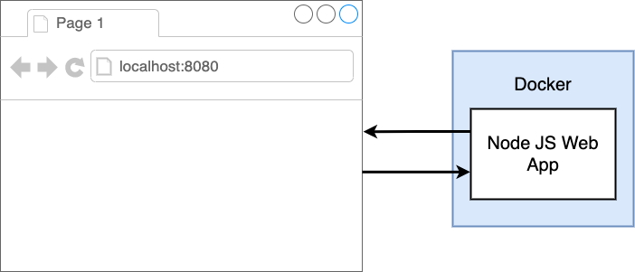
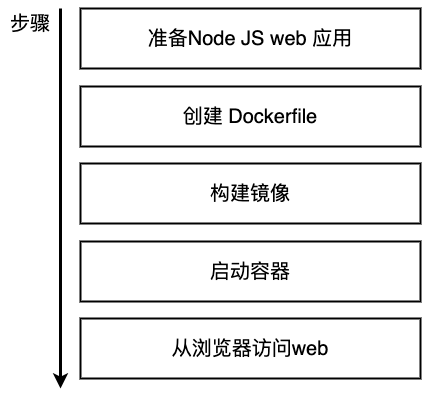
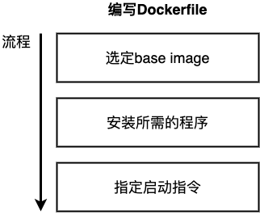
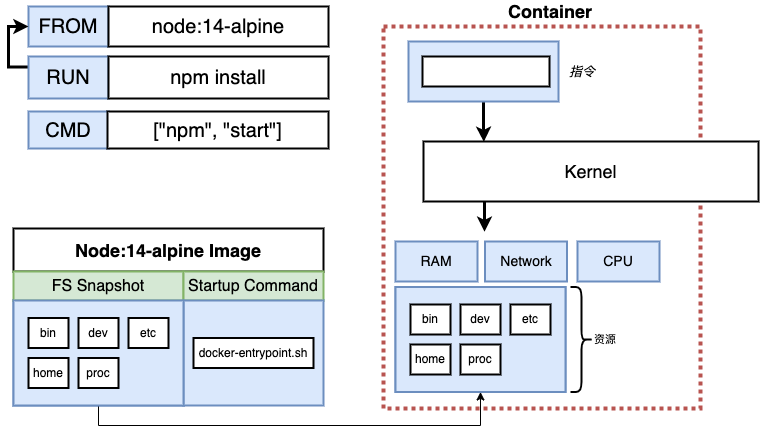
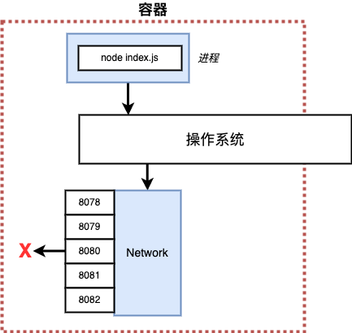
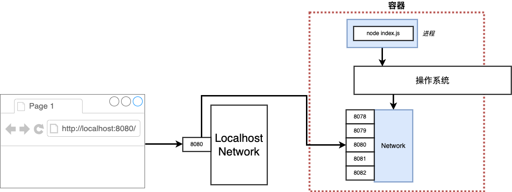

# docker 实战

本次实战我们将尽量融合之前所学的知识，尝试部署一个web服务



具体步骤：




## 准备NodeJS Web应用

```bash
mkdir node_web
cd node_web

touch package.json
touch index.js
touch Dockerfile
```
1. `vim package.json`
```json
{
  "dependencies": {
    "express": "*"
  },
  "scripts": {
    "start": "node index.js"
  }
}
```

2. `vim index.js`
```javascript
const express = require('express');

const app = express();

app.get('/', (req, res) => {
  res.send('Hello 2023!');
});

app.listen(8080, () => {
  console.log('Listening on port 8080');
});
```

## 创建Dockerfile 构建镜像
启动一个NodeJS程序，我们需要两个步骤

1. 安装依赖
   + npm install
2. 启动服务
   + npm start

回顾我们之前编写dockerfile的流程，使用了`FROM, RUN, CMD`指令


简单地将这两步转换成dockerfile

```dockerfile
FROM alpine

RUN npm install

CMD ["npm", "start"]
```
尝试构建镜像
```bash
docker build .
# Sending build context to Docker daemon  4.096kB
# Step 1/3 : FROM alpine
# latest: Pulling from library/alpine
# c158987b0551: Pull complete 
# Digest: sha256:8914eb54f968791faf6a8638949e480fef81e697984fba772b3976835194c6d4
# Status: Downloaded newer image for alpine:latest
#  ---> 49176f190c7e
# Step 2/3 : RUN npm install
#  ---> Running in 54bfa22121d3
# /bin/sh: npm: not found
# The command '/bin/sh -c npm install' returned a non-zero code: 127
```
出现一个报错信息：`npm: not found`

原因是alpine其实并没有安装好的npm。alpine本身只有5MB，预先安装好的程序非常少。所以并没有预先安装node。

解决方案有两种：
1. 在alpine上安装nodeJS，然后再运行`npm install`
2. 不使用alpine，选择一个已经安装好nodeJS的基础镜像

这里推荐使用方案2，我们应该尽量选择已有的、稳定的解决方案。打开 https://hub.docker.com，搜索node，找到[node镜像](https://hub.docker.com/search?q=node)。

选择14-alpine，即node:14-alpine镜像。

+ Alpine代表这个镜像基于Alpine Linux，使用了alpine官方镜像。当最终镜像尽可能小，不包含其他工具。

```dockerfile
FROM node:14-alpine

RUN npm install

CMD ["npm", "start"]
```
尝试构建镜像
```bash
docker build .
# Sending build context to Docker daemon  4.096kB
# Step 1/3 : FROM node:14-alpine
# 14-alpine: Pulling from library/node
# c158987b0551: Already exists 
# 859c8d0e9faf: Pull complete 
# 69c317f5cbe1: Pull complete 
# d0c4a6a4173f: Pull complete 
# Digest: sha256:80e825b1f5ab859498a2f0f98f8197131a562906e5f8c95977057502e68ca05a
# Status: Downloaded newer image for node:14-alpine
#  ---> fb7170aa2b9b
# Step 2/3 : RUN npm install
#  ---> Running in 1f887442b796
# npm WARN saveError ENOENT: no such file or directory, open '/package.json'
# npm notice created a lockfile as package-lock.json. You should commit this file.
# npm WARN enoent ENOENT: no such file or directory, open '/package.json'
# npm WARN !invalid#2 No description
# npm WARN !invalid#2 No repository field.
# npm WARN !invalid#2 No README data
# npm WARN !invalid#2 No license field.
# 
# up to date in 0.384s
# found 0 vulnerabilities
# 
# Removing intermediate container 1f887442b796
#  ---> e5dec21682a3
# Step 3/3 : CMD ["npm", "start"]
#  ---> Running in 682a23e398e3
# Removing intermediate container 682a23e398e3
#  ---> e4e7d3760b4c
# Successfully built e4e7d3760b4c
```
报错信息显示我们缺少package.json
`npm WARN saveError ENOENT: no such file or directory, open '/package.json'`

原因在于当我们启动容器时，容器依赖于镜像中的资源，而package.json此时并不在镜像中。



因此我们需要使用COPY指令将当前路径下所有的文件复制到镜像中。

```dockerfile
# COPY [--chown=<user>:<group>] <源路径>... <目标路径>
COPY ./ ./
# 相对路径以build context为起点
```

```dockerfile
FROM node:14-alpine

COPY ./ ./

RUN npm install

CMD ["npm", "start"]
```

尝试构建镜像
```bash
docker build .
# Sending build context to Docker daemon  4.096kB
# Step 1/4 : FROM node:14-alpine
#  ---> fb7170aa2b9b
# Step 2/4 : COPY ./ ./
#  ---> 6be82c2f7f80
# Step 3/4 : RUN npm install
#  ---> Running in 45ce4767645d
# npm notice created a lockfile as package-lock.json. You should commit this file.
# npm WARN !invalid#2 No description
# npm WARN !invalid#2 No repository field.
# npm WARN !invalid#2 No license field.
# 
# added 57 packages from 42 contributors and audited 57 packages in 2.808s
# 
# 7 packages are looking for funding
#   run `npm fund` for details
# 
# found 0 vulnerabilities
# 
# Removing intermediate container 45ce4767645d
#  ---> 19313a4c3990
# Step 4/4 : CMD ["npm", "start"]
#  ---> Running in 07f6ee79f3e7
# Removing intermediate container 07f6ee79f3e7
#  ---> 7dc004ba3d4e
# Successfully built 7dc004ba3d4e
```
加上tag
```bash
docker build -t s09g/node-web .

docker run s09g/node-web
# > @ start /
# > node index.js
# 
# Listening on port 8080
```
node web应用成功启动

## 启动容器访问网页

访问 localhost:8080，但是失败了



原因在于node web应用在容器内部监听了8080端口，但是容器本身因为有namespace隔，所以8080端口没有收到来自外界的流量。
我们在本机访问8080端口时，流量会发送至环回口，而不是转发至容器内部。

为了解决这个问题，我们需要对8080端口的流量进行转发。



通过-p参数，指定端口映射
```bash
# docker run -p <incoming traffic to port>:<port inside container> <image id>

docker run -p 8080:8080 s09g/node-web
```
访问 localhost:8080

有两个要注意的点：
1. 端口映射只针对ingress流量，对于向外的流量，默认可以与外界沟通（npm install）
2. 端口映射的两边可以使用不同端口

```bash
docker run -p 80:8080 s09g/node-web
```
访问 http://localhost

## 指定工作路径

进入交互模式
```bash
docker run -it s09g/node-web sh

ls
# Dockerfile
# package.json
# ...
```
默认的工作路径是容器的根目录，很容易不小心覆盖掉原有的docker程序。因此建议指定一个新的文件夹作为工作路径。

WORKDIR指令可以用来指定工作目录（或者称为当前路径）。如该路径不存在，WORKDIR会帮你建立路径。

```dockerfile
# WORKDIR <工作目录路径>
WORKDIR /usr/app
```

修改dockerfile
```dockerfile
FROM node:14-alpine

WORKDIR /usr/app

COPY ./ ./

RUN npm install

CMD ["npm", "start"]
```
尝试构建镜像
```bash
docker build -t s09g/node-web .

docker run -p 8080:8080 s09g/node-web
```
访问 http://localhost:8080

在新的窗口中
```bash
docker ps

docker exec -it 24aa512d676a sh
# /usr/app # ls
# Dockerfile         node_modules       package.json
# index.js           package-lock.json
# /usr/app # cd /
# /usr/app # ls
```

## 修改源码 重新构建

修改`index.js`为`Bye 2022`

```javascript
const express = require('express');

const app = express();

app.get('/', (req, res) => {
  res.send('Bye 2022!');
});

app.listen(8080, () => {
  console.log('Listening on port 8080');
});
```
刷新http://localhost，不同于本地开发，网页并没有变化。我们需要重新构建docker

```bash
docker build -t s09g/node-web .

# Sending build context to Docker daemon   5.12kB
# Step 1/5 : FROM node:14-alpine
#  ---> fb7170aa2b9b
# Step 2/5 : WORKDIR /usr/app
#  ---> Using cache
#  ---> 3ca25c714d9e
# Step 3/5 : COPY ./ ./
#  ---> 2e86014101fe
# Step 4/5 : RUN npm install
#  ---> Running in 68105d7258ec
# npm notice created a lockfile as package-lock.json. You should commit this file.
# npm WARN app No description
# npm WARN app No repository field.
# npm WARN app No license field.
# 
# added 57 packages from 42 contributors and audited 57 packages in 3.757s
# 
# 7 packages are looking for funding
#   run `npm fund` for details
# 
# found 0 vulnerabilities
# 
# Removing intermediate container 68105d7258ec
#  ---> c88666f0ea23
# Step 5/5 : CMD ["npm", "start"]
#  ---> Running in b9a60d60f321
# Removing intermediate container b9a60d60f321
#  ---> cdc9c95a262d
# Successfully built cdc9c95a262d
# Successfully tagged s09g/node-web:latest
```

执行step 2时，docker 使用了cache `Using cache`。执行step 3时，docker发现源文件发生了变动，所以重新生成了镜像。

问题在于，项目本身依赖的库并没有变动。但是step 4时，依然重新执行了npm install下载了依赖，造成了额外的开销。

为了解决这个问题，我们需要调整dockerfile

修改dockerfile
```dockerfile
FROM node:14-alpine

WORKDIR /usr/app

COPY ./package.json ./
RUN npm install
COPY ./index.js ./

CMD ["npm", "start"]
```
重新构建，然后随意修改一下index.js的消息，再次构建
```bash
docker build -t s09g/node-web .

docker build -t s09g/node-web .
# Sending build context to Docker daemon   5.12kB
# Step 1/6 : FROM node:14-alpine
#  ---> fb7170aa2b9b
# Step 2/6 : WORKDIR /usr/app
#  ---> Using cache
#  ---> 3ca25c714d9e
# Step 3/6 : COPY ./package.json ./
#  ---> Using cache
#  ---> 29db3f512074
# Step 4/6 : RUN npm install
#  ---> Using cache
#  ---> 3f65ec8054f2
# Step 5/6 : COPY ./index.js ./
#  ---> Using cache
#  ---> d3c07ce6d387
# Step 6/6 : CMD ["npm", "start"]
#  ---> Using cache
#  ---> b8c3f9f370fb
# Successfully built b8c3f9f370fb
# Successfully tagged s09g/node-web:latest

vim index.js

docker build -t s09g/node-web .
# Sending build context to Docker daemon   5.12kB
# Step 1/6 : FROM node:14-alpine
#  ---> fb7170aa2b9b
# Step 2/6 : WORKDIR /usr/app
#  ---> Using cache
#  ---> 3ca25c714d9e
# Step 3/6 : COPY ./package.json ./
#  ---> Using cache
#  ---> 29db3f512074
# Step 4/6 : RUN npm install
#  ---> Using cache
#  ---> 3f65ec8054f2
# Step 5/6 : COPY ./index.js ./
#  ---> 67dcfc3b75a2
# Step 6/6 : CMD ["npm", "start"]
#  ---> Running in 3f300079dbe2
# Removing intermediate container 3f300079dbe2
#  ---> d2ad9f305cc2
# Successfully built d2ad9f305cc2
# Successfully tagged s09g/node-web:latest
```