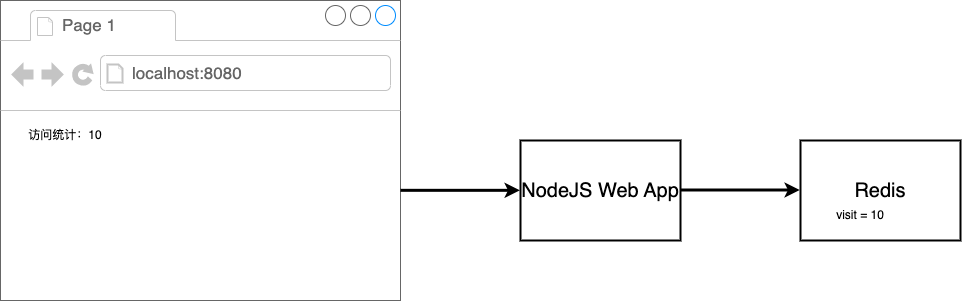
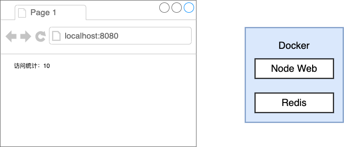
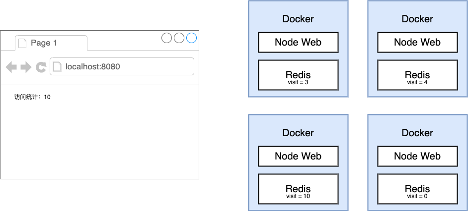
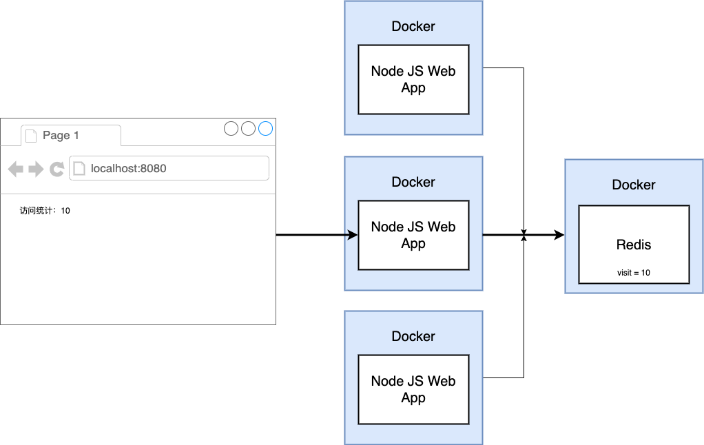
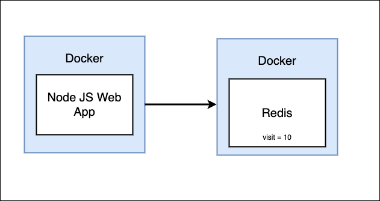

# Docker compose

本节课我们学习一个多docker的案例:使用redis对多实例服务器进行访问量计数。



我们需要设计一种统计方式，一个比较符合直觉的思路是将redis和网络应用打包在一起部署。



这种模式比较接近于边车模式，但是当我们需要部署多实例时，统计很可能失去意义



因此，我们需要用一个单独的redis服务器。



## 准备NodeJS Web应用
```bash
mkdir visit
cd visit

touch package.json
touch index.js
touch Dockerfile
```
`vim package.json`
```json
{
  "dependencies": {
    "express": "*",
    "redis": "2.8.0"
  },
  "scripts": {
    "start": "node index.js"
  }
}
```
`vim index.js`
```js
const express = require('express');
const redis = require('redis');

const app = express();
const client = redis.createClient();

client.set('visits', 0);

app.get('/', (req, res) => {
  client.get('visits', (err, visits) => {
    res.send('Number of visits: ' + visits);
    client.set('visits', parseInt(visits) + 1);
  });
});

app.listen(8081, () => {
  console.log('Listening on port 8081');
});
```

## 创建Dockerfile 构建镜像
```dockerfile
FROM node:14-alpine

WORKDIR '/app'

COPY package.json .
RUN npm install
COPY . .

CMD ["npm","start"]
```

```bash
docker build -t s09g/visit:latest .
```

## 启动docker

尝试启动
```bash
docker run -p 8081:8081 s09g/visit
# (node:18) UnhandledPromiseRejectionWarning: Error: The client is closed
#     at Commander._RedisClient_sendCommand (/app/node_modules/@redis/client/dist/lib/client/index.js:440:31)
```

启动失败，因为redis client没有办法连上redis服务器
在新的窗口中启动redis
```bash
docker run redis
```

回到原有窗口
```bash
docker run -p 8081:8081 s09g/visit
```
依然失败

## 定义Docker Compose文件

我们需要将两个隔离的docker环境进行连接，最简单的工具就是docker compose



`vim docker-compose.yml`

```yaml
version: '3'
services:
  redis-server:
    image: 'redis'
  node-app:
    build: .
    ports:
      - '8081:8081'
```

`vim index.js`
```js
const express = require('express');
const redis = require('redis');

const app = express();
const client = redis.createClient({
    host: 'redis-server',
    port: 6379
});

client.set('visits', 0);

app.get('/', (req, res) => {
  client.get('visits', (err, visits) => {
    res.send('Number of visits: ' + visits);
    client.set('visits', parseInt(visits) + 1);
  });
});

app.listen(8081, () => {
  console.log('Listening on port 8081');
});
```

## 启动docker compose

```bash
# 启动容器
docker compose up

# 构建+启动容器
docker compose up --build
```
访问 localhost:8081，并且刷新

### docker compose 管理

```bash
# detach 不向终端打印log
docker compose up -d

# 终止容器
docker compose down

# 查看容器状态
docker compose ps
```

## docker compose 重启设置
**修改 index.js，人为退出程序 exit(0)**
`vim index.js`
```js
const express = require('express');
const redis = require('redis');
const process = require('process');

const app = express();
const client = redis.createClient({
    host: 'redis-server',
    port: 6379
});

client.set('visits', 0);

app.get('/', (req, res) => {
  process.exit(0);
  client.get('visits', (err, visits) => {
    res.send('Number of visits: ' + visits);
    client.set('visits', parseInt(visits) + 1);
  });
});

app.listen(8081, () => {
  console.log('Listening on port 8081');
});
```
*Note:exit(0)为正常退出，别的数字为异常退出*

重新构建启动
```bash
docker compose up --build
# ...
# visit-node-app-1 exited with code 0
```
在新窗口中查看容器进程，只有redis
```bash
docker ps
# CONTAINER ID   IMAGE     COMMAND                  CREATED          STATUS          PORTS      NAMES
# 8ff9924662e5   redis     "docker-entrypoint.s…"   43 seconds ago   Up 42 seconds   6379/tcp   visit-redis-server-1
```
我们的目标是web应用可以自动重启，我们可以修改docker-compose.yml文件

Restart 有四种可选值:
+ `"no"`: 不重启 (需要引号，没有引号的`no`被yaml当做`false`)
+ `always`: 无论原因，一律重启
+ `on-failure`: 仅在异常退出时重启
+ `unless-stopped`: 仅在手动stop时停止，否则一律重启

`vim docker-compose.yml`

```yaml
version: '3'
services:
  redis-server:
    image: 'redis'
  node-app:
    restart: always
    build: .
    ports:
      - '8081:8081'
```
访问 localhost:8081

```bash
docker compose up --build
# ...
# visit-node-app-1      | 
# visit-node-app-1      | > @ start /app
# visit-node-app-1      | > node index.js
# visit-node-app-1      | 
# visit-node-app-1      | Listening on port 8081
# visit-node-app-1 exited with code 0
# visit-node-app-1      | 
# visit-node-app-1      | > @ start /app
# visit-node-app-1      | > node index.js
# visit-node-app-1      | 
# visit-node-app-1      | Listening on port 8081
```
web 应用重启成功

修改restart为on-failure
```bash
version: '3'
services:
  redis-server:
    image: 'redis'
  node-app:
    restart: on-failure
    build: .
    ports:
      - '8081:8081'
```
访问 localhost:8081
```bash
docker compose up --build
```
web 应用没有重启
