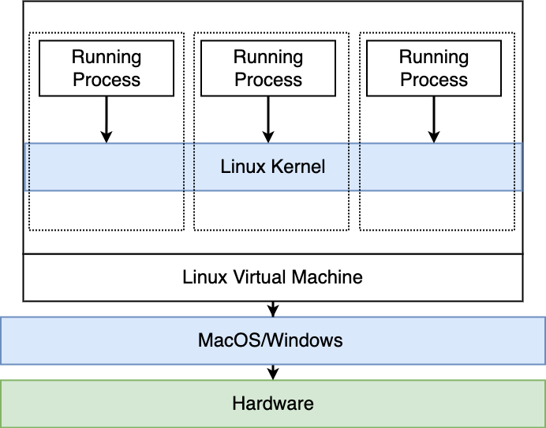
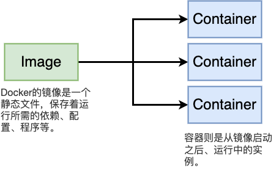

# Docker 进阶

## 查看docker

```bash
docker version
# Client:
#  Version:           20.10.17
#  API version:       1.41
#  Go version:        go1.17.11
#  Git commit:        100c701
#  Built:             Mon Jun  6 22:56:42 2022
#  OS/Arch:           linux/amd64
#  Context:           default
#  Experimental:      true
# 
# Server: Docker Engine - Community
#  Engine:
#   Version:          20.10.17
#   API version:      1.41 (minimum version 1.12)
#   Go version:       go1.17.11
#   Git commit:       a89b842
#   Built:            Mon Jun  6 23:01:45 2022
#   OS/Arch:          linux/amd64
#   Experimental:     true
#  containerd:
#   Version:          v1.6.6
#   GitCommit:        10c12954828e7c7c9b6e0ea9b0c02b01407d3ae1
#  runc:
#   Version:          1.1.2
#   GitCommit:        v1.1.2-0-ga916309f
#  docker-init:
#   Version:          0.19.0
#   GitCommit:        de40ad0
```
docker version 会显示两部分信息：docker client，docker server(docker engine)

+ OS/Arch：如果在MacOS或者Windows上使用docker，会出现两个不同的OS/Arch版本



因为MacOS和Windows的docker server其实是跑在linux虚拟机内的

docker依赖于容器，容器依赖于namespace和cgroups，这些都是linux的功能

```bash
docker info
# Client:
#  Context:    default
#  Debug Mode: false
#  Plugins:
#   buildx: Docker Buildx (Docker Inc., v0.8.2)
#   compose: Docker Compose (Docker Inc., v2.6.1)
# 
# Server:
#  Containers: 0
#   Running: 0
#   Paused: 0
#   Stopped: 0
#  Images: 0
#  Server Version: 20.10.17
#  Storage Driver: overlay2
#   Backing Filesystem: xfs
#   Supports d_type: true
#   Native Overlay Diff: true
#   userxattr: false
#  Logging Driver: json-file
#  Cgroup Driver: cgroupfs
#  Cgroup Version: 1
#  Plugins:
#   Volume: local
#   Network: bridge host ipvlan macvlan null overlay
  # Log: awslogs fluentd gcplogs gelf journald json-file local logentries splunk syslog
#  Swarm: inactive
 # Runtimes: io.containerd.runtime.v1.linux runc io.containerd.runc.v2
#  Default Runtime: runc
#  Init Binary: docker-init
#  containerd version: 10c12954828e7c7c9b6e0ea9b0c02b01407d3ae1
#  runc version: v1.1.2-0-ga916309f
#  init version: de40ad0
#  Security Options:
#   apparmor
#   seccomp
#    Profile: default
#  Kernel Version: 4.4.0-210-generic
#  Operating System: Alpine Linux v3.16 (containerized)
#  OSType: linux
#  Architecture: x86_64
#  CPUs: 8
#  Total Memory: 31.42GiB
#  Name: node1
 # ID: 7AEY:XQVU:W6YN:J3LZ:H4A6:J42K:23BH:O3E7:2T6N:AFTI:EIS5:HHFV
#  Docker Root Dir: /var/lib/docker
#  Debug Mode: true
#   File Descriptors: 27
#   Goroutines: 42
#   System Time: 2023-01-06T23:56:37.348498969Z
#   EventsListeners: 0
#  Registry: https://index.docker.io/v1/
#  Labels:
#  Experimental: true
#  Insecure Registries:
#   127.0.0.1
#   127.0.0.0/8
#  Live Restore Enabled: false
#  Product License: Community Engine
# 
# WARNING: API is accessible on http://0.0.0.0:2375 without encryption.
         # Access to the remote API is equivalent to root access on the host. Refer
         # to the 'Docker daemon attack surface' section in the documentation for
         # more information: https://docs.docker.com/go/attack-surface/
# WARNING: No swap limit support
# WARNING: bridge-nf-call-iptables is disabled
# WARNING: bridge-nf-call-ip6tables is disabled
```
显示docker engine的配置信息

```bash
docker

#  Usage:  ......
#  
#  Options: ......
#  
#  Management Commands:
#    builder     Manage builds
#    buildx*     Docker Buildx (Docker Inc., v0.8.2)
#    checkpoint  Manage checkpoints
#    compose*    Docker Compose (Docker Inc., v2.6.1)
#    config      Manage Docker configs
#    container   Manage containers
#    context     Manage contexts
#    image       Manage images
#    manifest    Manage Docker image manifests and manifest lists
#    network     Manage networks
#    node        Manage Swarm nodes
#    plugin      Manage plugins
#    secret      Manage Docker secrets
#    service     Manage services
#    stack       Manage Docker stacks
#    swarm       Manage Swarm
#    system      Manage Docker
#    trust       Manage trust on Docker images
#    volume      Manage volumes
#  
#  Commands:
#    attach      Attach local standard input, output, and error streams to a running container
#    build       Build an image from a Dockerfile
#    commit      Create a new image from a container's changes
#    cp          Copy files/folders between a container and the local filesystem
#    create      Create a new container
#    diff        Inspect changes to files or directories on a container's filesystem
#    events      Get real time events from the server
#    exec        Run a command in a running container
#    export      Export a container's filesystem as a tar archive
#    history     Show the history of an image
#    images      List images
#    import      Import the contents from a tarball to create a filesystem image
#    info        Display system-wide information
#    inspect     Return low-level information on Docker objects
#    kill        Kill one or more running containers
#    load        Load an image from a tar archive or STDIN
#    login       Log in to a Docker registry
#    logout      Log out from a Docker registry
#    logs        Fetch the logs of a container
#    pause       Pause all processes within one or more containers
#    port        List port mappings or a specific mapping for the container
#    ps          List containers
#    pull        Pull an image or a repository from a registry
#    push        Push an image or a repository to a registry
#    rename      Rename a container
#    restart     Restart one or more containers
#    rm          Remove one or more containers
#    rmi         Remove one or more images
#    run         Run a command in a new container
#    save        Save one or more images to a tar archive (streamed to STDOUT by default)
#    search      Search the Docker Hub for images
#    start       Start one or more stopped containers
#    stats       Display a live stream of container(s) resource usage statistics
#    stop        Stop one or more running containers
#    tag         Create a tag TARGET_IMAGE that refers to SOURCE_IMAGE
#    top         Display the running processes of a container
#    unpause     Unpause all processes within one or more containers
#    update      Update configuration of one or more containers
#    version     Show the Docker version information
#    wait        Block until one or more containers stop, then print their exit codes
#  .....
```
2017年之后，docker指令集变为管理指令集，旧指令依然有效。但是新的指令更有条理。
旧指令：`docker <COMMAND> (OPTIONS)`
新指令：`docker <COMMAND> <sub-command> (OPTIONS)`

```bash
# docker run = docker conatiner run

docker container ls
```

## 启动nginx服务器
```bash
docker container run --publish 80:80 nginx
```
尝试访问

+ publish会转发端口，可以缩写成-p


```bash
docker container run --publish 80:80 --detach nginx
```

+ detach将docker运行在后台，不会向终端打印日志，可以缩写成-d

```bash
docker container ls
# CONTAINER ID   IMAGE     COMMAND                  CREATED              STATUS              PORTS                NAMES
# 24da086df26c   nginx     "/docker-entrypoint.…"   About a minute ago   Up About a minute   0.0.0.0:80->80/tcp   ecstatic_proskuriakova
```
`docker container ls = docker ps`

显示正在运行的docker


```bash
docker container stop 24d
docker container ls
```
*Name是一个正面形容词+科学名人的姓氏，ecstatic_proskuriakova 热情的普罗斯库里亚科娃（玛雅考古学者）*

```bash
docker container ls -a
# CONTAINER ID   IMAGE     COMMAND                  CREATED         STATUS                      PORTS     NAMES
# 24da086df26c   nginx     "/docker-entrypoint.…"   4 minutes ago   Exited (0) 10 seconds ago             ecstatic_proskuriakova
# 5db308ba196b   nginx     "/docker-entrypoint.…"   5 minutes ago   Exited (0) 4 minutes ago              eloquent_easley
```
出现了两个nginx，因为我们从同一个镜像启动了两次docker，产生了两个容器



再次启动nginx，指定一个名字

```bash
docker container run --publish 80:80 --detach --name webhost nginx

docker container ls -a
```
反复刷新页面，产生一些log

通过名字查看docker
```bash
docker container logs webhost
```
`docker container logs = docker logs`

除了使用`log`，还可以利用`top`指令查看容器内部的进程
```bash
docker container top webhost
# PID                 USER                TIME                COMMAND
# 15337               root                0:00                nginx: master process nginx -g daemon off;
# 15394               101                 0:00                nginx: worker process
# 15395               101                 0:00                nginx: worker process
```
删除容器`docker container rm = docker rm`

```bash
docker container ls -a

docker container rm dc8 24d 5db
# Error response from daemon: You cannot remove a running container dc856922ccad8fa3a2e895f844968d4458c6208ce0d7551df2b9c2e4ea735f3e. Stop the container before attempting removal or force remove

docker container rm -f dc8

docker container ls -a
```

## 容器的本质是进程
启动一个mongoDB，并且打印运行中的进程
```bash
top

ps aux | grep mongo

docker container run --name mongo -d mongo

docker container ls

docker container top mongo
```
查看主机上的进程
```bash
top

ps aux | grep mongo

docker container stop mongo

ps aux | grep mongo
```

## 查看容器内部

```bash
# 容器内进程
docker container top

# 容器配置
docker container inspect

# 容器性能状态
docker container stats
```
举个栗子，启动一个mysql

```bash

docker container run -d --name mysql -e MYSQL_ROOT_PASSWORD=1234 mysql

docker container ls -a

docker container top mysql

docker container inspect mysql

docker container stats
# CONTAINER ID   NAME      CPU %     MEM USAGE / LIMIT     MEM %     NET I/O   BLOCK I/O       PIDS
# 26752b058036   mysql     0.74%     409.1MiB / 31.42GiB   1.27%     0B / 0B   115kB / 368MB   38
# 9762e80b86e9   nginx     0.00%     9.285MiB / 31.42GiB   0.03%     0B / 0B   0B / 8.19kB     9
```
