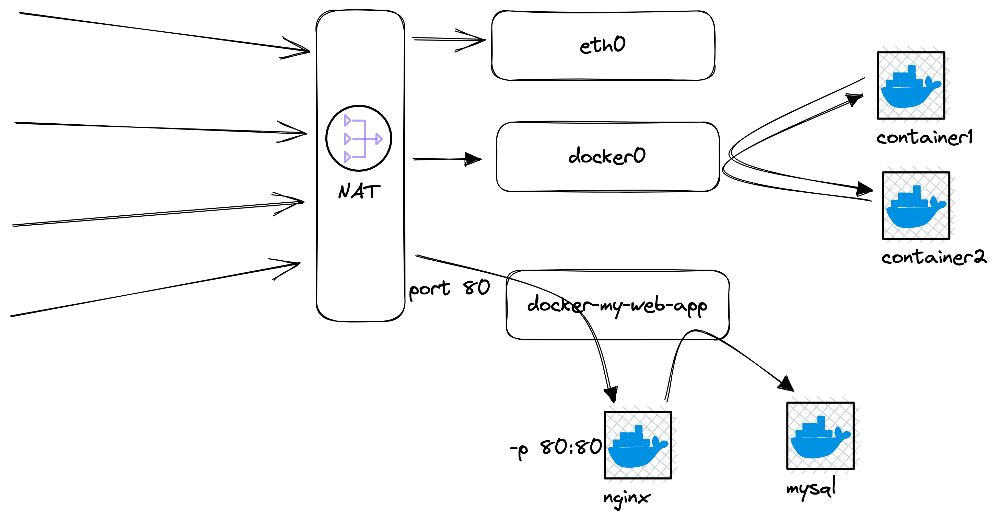

# Docker Network

## Docker 网络
docker利用Linux Network Namespace实现了网络隔离。
每个容器都会连通私有的bridge网络。理论上同一个网络内的容器不需要`-p`，可相互通信。容器之间存在NAT防火墙。

查看本机网络
```bash
$ ifconfig
#docker0   Link encap:Ethernet  HWaddr 02:42:98:0F:68:C2  
#          inet addr:172.17.0.1  Bcast:172.17.255.255  Mask:255.255.0.0
#          UP BROADCAST RUNNING MULTICAST  MTU:1500  Metric:1
#          RX packets:0 errors:0 dropped:0 overruns:0 frame:0
#          TX packets:0 errors:0 dropped:0 overruns:0 carrier:0
#          collisions:0 txqueuelen:0 
#          RX bytes:0 (0.0 B)  TX bytes:0 (0.0 B)

$ brctl show
# bridge name     bridge id               STP enabled     interfaces
# docker0         8000.0242980f68c2       no
```

启动一个容器，查看网络信息

```bash
docker container run -p 80:80 --name webhost -d nginx:alpine

docker container port webhost
# 80/tcp -> 0.0.0.0:80

docker container inspect webhost | grep IPAddress

docker container inspect --format '{{ .NetworkSettings.IPAddress }}' webhost
```
对比本地网段

```bash
$ ifconfig eth0
# eth0      Link encap:Ethernet  HWaddr 96:20:B6:C9:3D:30  
#           inet addr:192.168.0.18  Bcast:0.0.0.0  Mask:255.255.254.0
#           UP BROADCAST RUNNING MULTICAST  MTU:1500  Metric:1
#           RX packets:16 errors:0 dropped:0 overruns:0 frame:0
#           TX packets:0 errors:0 dropped:0 overruns:0 carrier:0
#           collisions:0 txqueuelen:0 
#           RX bytes:1296 (1.2 KiB)  TX bytes:0 (0.0 B)
```



```bash
docker network ls
# NETWORK ID     NAME      DRIVER    SCOPE
# 7b938a05520a   bridge    bridge    local
# 624a2b2f9a40   host      host      local
# a8b0b1303939   none      null      local
```
Docker会自动创建三个网络
+ Bridge：此模式会为每一个容器分配、设置 IP 等，并将容器连接到一个 docker0 虚拟网桥，通过 docker0 网桥以及 Iptables nat 表配置与宿主机通信。
+ host：容器将不会虚拟出自己的网卡，配置自己的 IP 等，而是使用宿主机的IP和端口（和宿主机共用一个 Network Namespace）。
+ None：该模式关闭了容器的网络功能。
+ Container：创建的容器不会创建自己的网卡，配置自己的 IP，而是和一个指定的容器共享 IP、端口范围。

Docker内置这三个网络，运行容器时，可以用 --network / –net 选项指定容器的网络模式：

+ host 模式：使用 –net=host 指定。
+ none 模式：使用 –net=none 指定。
+ bridge 模式：使用 –net=bridge 指定，默认设置。
+ container 模式：使用 –net=container:NAME_or_ID 指定。

```bash
docker network inspect bridge
```
查看bridge连接了哪些容器
```json
[
    {
        "Name": "bridge",
        "Id": "7b938a05520a344ff2f47616dc60ec3d1a653cf573e91ff7b85ec7b1bbbde71b",
        "Created": "2023-01-08T22:40:56.01195358Z",
        "Scope": "local",
        "Driver": "bridge",
        "EnableIPv6": false,
        "IPAM": {
            "Driver": "default",
            "Options": null,
            "Config": [
                {
                    "Subnet": "172.17.0.0/16"
                }
            ]
        },
        "Internal": false,
        "Attachable": false,
        "Ingress": false,
        "ConfigFrom": {
            "Network": ""
        },
        "ConfigOnly": false,
        "Containers": {
            "0c54db019d6e53a4fa06bb7b698ab87448b9f06f0467dbe63bbaf6c26d1eee19": {
                "Name": "webhost",
                "EndpointID": "d697b0c2b0abdf2859da80cb2a4b17270259418c91d0ffd2bcc530298efa8ae8",
                "MacAddress": "02:42:ac:11:00:02",
                "IPv4Address": "172.17.0.2/16",
                "IPv6Address": ""
            }
        },
        "Options": {
            "com.docker.network.bridge.default_bridge": "true",
            "com.docker.network.bridge.enable_icc": "true",
            "com.docker.network.bridge.enable_ip_masquerade": "true",
            "com.docker.network.bridge.host_binding_ipv4": "0.0.0.0",
            "com.docker.network.bridge.name": "docker0",
            "com.docker.network.driver.mtu": "1500"
        },
        "Labels": {}
    }
]
```

## 创建docker网络

```bash
docker network create my_app_net

docker network ls

docker network inspect my_app_net

docker container run -d --name new_nginx --network my_app_net nginx:alpine

docker network inspect my_app_net
```

`connect / disconnect`连接网络和容器

```bash
docker network connect my_app_net webhost

docker network inspect my_app_net

docker network disconnect my_app_net webhost
```

## DNS

自定义的网络可以控制容器之间通信，还可以自动 DNS 解析容器名称到 IP 地址。
默认网络，没有dns功能。
```bash
docker container run -d --name my_nginx --network my_app_net nginx:alpine

docker network inspect my_app_net

docker container exec -it my_nginx ping new_nginx

docker container exec -it new_nginx ping my_nginx

docker 
```

### DNS round robin

使用之前的node-web项目

```bash
cd ~/node_web

vim index.js
```
```javascript
const express = require('express');

const app = express();

function getIPAdress() {
    var interfaces = require('os').networkInterfaces();　　
    for (var devName in interfaces) {　　　　
        var iface = interfaces[devName];　　　　　　
        for (var i = 0; i < iface.length; i++) {
            var alias = iface[i];
            if (alias.family === 'IPv4' && alias.address !== '127.0.0.1' && !alias.internal) {
                return alias.address;
            }
        }　　
    }
}
const ip = getIPAdress();

app.get('/', (req, res) => {
  res.send('Hello 2023 from ' + ip + " !\n");
});

app.listen(8080, () => {
  console.log('Listening on port 8080');
});
```
修改dockerfile
```dockerfile
FROM node:14-alpine

WORKDIR /usr/app

COPY ./package.json ./
RUN npm install
COPY ./index.js ./
EXPOSE 8080/tcp
CMD ["npm", "start"]
```

使用net-alias设置别名，用于实现DNS负载均衡
```bash
docker build -t s09g/node-web .

docker network create node_web

docker container run -d --net node_web --net-alias web s09g/node-web

docker container run -d --net node_web --net-alias web s09g/node-web

docker container ls

docker container run --rm --net node_web centos curl -s web:8080

docker container run --rm --net node_web centos curl -s web:8080
```

