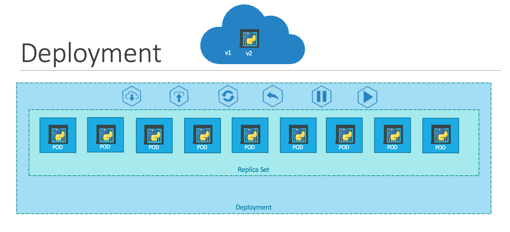
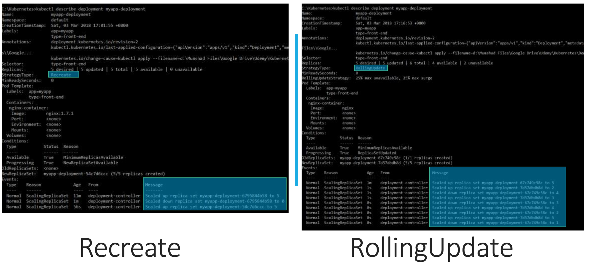

# Kubernetes基础-1

掌握Kubernetes，需要我们有扎实的docker基础。

深入了解pods之前，我们需要：
+ 应用程序已经开发并打包成Docker镜像，并且在Docker存储库（如Docker Hub）中可用，可下载
+ Kubernetes集群正在工作（单节点或多节点）

使用Kubernetes的最终目标是将应用程序以容器的形式部署在配置为集群中工作节点的一组机器上。
Kubernetes不会直接在工作节点上部署容器。容器被封装到称为pods的Kubernetes对象中。pod是应用程序的单个实例。pod是您可以在Kubernetes中创建的最小对象。在这里，我们看到了最简单的情况，即您有一个单节点Kubernetes集群，其中您的应用程序的单个实例在单个Docker容器中运行，封装在pod中。


## Pod

Pod是kubernetes的最小调度单元，也是最基础的概念。
容器的本质是一个隔离的进程；而Pod则是一组相互联系的进程。Pod可以包含一个或者多个容器。

我们可以通过`kubectl run`来启动Pod，默认image会从docker hub拉取

```bash
kubectl run nginx-pod --image=nginx
# pod/nginx created

kubectl get pods
# NAME    READY   STATUS    RESTARTS   AGE
# nginx   1/1     Running   0          50s

kubectl describe pod nginx-pod
# Name:         nginx
# Namespace:    default
# Priority:     0
# Node:         node2/192.168.0.7
# Start Time:   Thu, 02 Feb 2023 06:44:13 +0000
# Labels:       run=nginx
# Annotations:  <none>
# Status:       Running
# IP:           10.5.1.2
# IPs:
#   IP:  10.5.1.2
# Containers:
#   nginx:
#     Container ID:   docker://40f5485d27cce5862a6424645a01c962aa3f9c4ae85dc5db7273cfbc4c717cdf
#     Image:          nginx
#     Image ID:       docker-pullable://nginx@sha256:b8f2383a95879e1ae064940d9a200f67a6c79e710ed82ac42263397367e7cc4e
#     Port:           <none>
#     Host Port:      <none>
#     State:          Running
#       Started:      Thu, 02 Feb 2023 06:44:27 +0000
#     Ready:          True
#     Restart Count:  0
#     Environment:    <none>
#     Mounts:
#       /var/run/secrets/kubernetes.io/serviceaccount from default-token-69hgb (ro)
# Conditions:
#   Type              Status
#   Initialized       True 
#   Ready             True 
#   ContainersReady   True 
#   PodScheduled      True 
# Volumes:
#   default-token-69hgb:
#     Type:        Secret (a volume populated by a Secret)
#     SecretName:  default-token-69hgb
#     Optional:    false
# QoS Class:       BestEffort
# Node-Selectors:  <none>
# Tolerations:     node.kubernetes.io/not-ready:NoExecute op=Exists for 300s
#                  node.kubernetes.io/unreachable:NoExecute op=Exists for 300s
# Events:
#   Type     Reason            Age                From               Message
#   ----     ------            ----               ----               -------
#   Warning  FailedScheduling  49s (x5 over 63s)  default-scheduler  0/3 nodes are available: 1 node(s) had taint {node-role.kubernetes.io/master: }, that the pod didn't tolerate, 2 node(s) had taint {node.kubernetes.io/not-ready: }, that the pod didn't tolerate.
#   Normal   Scheduled         39s                default-scheduler  Successfully assigned default/nginx to node2
#   Normal   Pulling           37s                kubelet            Pulling image "nginx"
#   Normal   Pulled            26s                kubelet            Successfully pulled image "nginx" in 11.258745578s
#   Normal   Created           25s                kubelet            Created container nginx
#   Normal   Started           25s                kubelet            Started container nginx

kubectl get pods -o wide
# NAME    READY   STATUS    RESTARTS   AGE    IP         NODE    NOMINATED NODE   READINESS GATES
# nginx   1/1     Running   0          103s   10.5.1.2   node2   <none>           <none>
```
kubectl get pods命令可以帮助我们查看集群中的pod列表

## YAML描述对象

Kubernetes不推荐使用命令行的方式直接运行容器（kubectl run），而是用 YAML 文件的方式：`kubectl create -f file.yml`

kubernetes使用yaml文件来描述API对象，`kubectl run nginx --image=nginx`等价于
`vim myapp-pod.yml`
```yaml
apiVersion: v1
kind: Pod
metadata:
  name: myapp-pod
  labels: 
    app: myapp
    type: myservice
spec:
  containers:
  - name: nginx
    image: nginx
```
之前在docker章节，我们已经见过用yaml声明对象的方式。在这个yaml文件中，它要求kubernetes创建一个Pod，使用nginx镜像，开放端口80。

Kubernetes使用YAML文件作为创建对象的输入，如Pod、Replica、Deployment、Service等等。所有这些都遵循类似的结构。Kubernetes定义文件总是包含四个顶级字段：API版本、种类、元数据和规格spec。这些也是必须的字段.

+ apiVersion：API版本号。根据创建的内容，必须使用正确的API版本。V1, app/V1beta，extensions/V1beta，等等
+ kind：资源类型，类型指的是创建的对象的类型，其他可能的值 Pod, Service, ReplicaSet, Deployment...
+ metadata:元数据，用来标记对象,比如它的名字、标签等等。不同于前两项，metadata采用字典格式,所以元数据下的所有东西都向右移一点，名字和标签是元数据的子节点。
  + 名字和标签这两个属性前面的空格数并不重要，但它们应该是一样的，因为它们是同级别的。
  + 标签是元数据字典中的一个字典，它可以存储任何键值对。
    + 例如，有数百个运行前端应用程序的pod和数百个运行后端应用程序或数据库的pod。一旦这些pod被部署，你将很难对它们进行分组。如果你现在把它们标记为前端、后端或数据库，以后根据这个标签来过滤这些pod。
+ spec: 同样使用字典。其中container是一个数组，因为pod中可以有多个容器，名字前面的破折号表示这是列表中的第一个项目。
  + 列表中的每一个元素又是一个字典，所以要添加一个名称和image属性。image的值是nginx，这是docker仓库中的docker镜像。


我们可以使用`kubectl apply`来创建对象
```bash
kubectl apply -f myapp-pod.yml
# pod/myapp-pod created

kubectl get pods
# NAME        READY   STATUS    RESTARTS   AGE
# myapp-pod   1/1     Running   0          29s

# kubectl describe pod myapp-pod

# kubectl delete -f myapp-pod.yml
```
kubectl get从Kubernetes里面获取指定的 API 对象。


## ReplicationController & ReplicaSet

Pod可以通过控制器来管理。控制器是Kubernetes的大脑,它们监测Kubernetes对象并作出相应反应。

ReplicationController 确保在任何时候都有特定数量的 Pod 副本处于运行状态:
场景:有一个单一的pod运行应用程序。如果由于某种原因，应用程序崩溃了，pod失败了怎么办？
+ 用户将不再能够访问应用程序。为了防止用户失去对应用程序的访问，需要有一个以上的实例或pod同时运行。如果一个失败了，仍然有应用程序在另一个上运行。
ReplicationController在Kubernetes集群中运行一个pod的多个实例，从而提供高可用性。
即使只有一个pod，当现有的pod发生故障时，ReplicationController也可以通过自动调出一个新的pod来。因此，Replication Controller确保指定数量的pod在任何时候都在运行，即使只有一个或100个。

需要Replication Controller的另一个原因是创建多个pod来分担它们的负载。例如，在这个简单的场景中，有一个单一的pod为一组用户服务。当用户数量增加时，部署额外的pod来平衡两部分的负载。如果需求进一步增加，如果在第一个节点上耗尽资源，可以在集群的其他节点上部署额外的部分。

Replication Controller是旧的技术，正在被Replica Set取代。Replica Set是新推荐的设置副本的方式。

创建一个Replication Controller的定义文件。我们将其命名为myapp-rc.yml：有四个部分：API版本、种类、元数据和规格。
+ API版本V1支持Replication Controller，所以我们将其设置为V1。
+ Kind就是Replication Controller。
+ 在元数据下，我们将添加一个名称，我们将称之为myapp-rc，
  + 添加标签，应用程序和类型，并为它们赋值。到目前为止，这与我们在上一节中创建一个pod的方式非常相似。接下来是
+ 定义Spec: 我们需要在Spec下创建一个template部分，提供一个pod template，由Replication Controller用来创建副本。
  + 定义pod template
  + 在Spec中添加另一个名为replicas的属性，输入需要的复制数量。template和replicas是Spec部分的直接子项，必须在同一缩进上

`vim myapp-rc.yml`
```yaml
apiVersion: v1
kind: ReplicationController
metadata:
  name: myapp-rc
  labels: 
    app: myapp
    type: myservice
spec:
  template:
    metadata:
      name: myapp-pod
      labels: 
        app: myapp
    spec:
      containers:
      - name: nginx
        image: nginx
  replicas: 3
```
从nginx-pod.yml复制spec中的内容到template，然后设置replicas为3

```bash
kubectl create -f myapp-rc.yml 
# replicationcontroller/myapp-rc created

# kubectl get replicationcontroller
kubectl get rc
# NAME       DESIRED   CURRENT   READY   AGE
# myapp-rc   3         3         3       20s

kubectl get pods
# NAME             READY   STATUS    RESTARTS   AGE
# myapp-rc-ngbhp   1/1     Running   0          44s
# myapp-rc-qskjr   1/1     Running   0          44s
# myapp-rc-tk8lx   1/1     Running   0          44s
```
Replica Set与Replication Controller非常相似。ReplicaSet则相当于ReplicationController的升级版，它的作用也是控制pod的数量始终维持在预设的个数。
+ 首先API版本、Kind、Metadata和Spec。不过API版本有点不同，是app/V1，这与Replication Controller不同，后者只是V1。如果弄错了，控制台报错没有匹配的Replica Set，因为指定的Kubernetes API版本不支持Replica Set。
+ spec 与Replication Controller非常相似，有一个template部分。Replication Controller和Replica Set之间有一个主要区别，Replica Set需要一个选择器定义。选择器部分帮助Replica Set识别哪些pod属于它。
  + 这是因为 Replica Set 也可以管理那些没有作为 Replica Set 创建的一部分而创建的 pod。
    + 比如说，在创建Replica Set之前，有一些pod是与选择器中指定的标签相匹配的，Replica Set在创建副本时也会考虑到这些pod。
    + 在Replication Controller中，选择器不是一个必须的字段，但它仍然是可用的。不显示定义时，它假定它与pod定义文件中提供的标签相同。
    + 在Replica Set中，这个属性需要用户输入，它必须以matchLabel的形式写入。选择器将指定的标签与Pod上的标签相匹配。


`vim myapp-rs.yml`
```yaml
apiVersion: apps/v1
kind: ReplicaSet
metadata:
  name: myapp-rs
  labels: 
    app: myapp
    type: myservice
spec:
  template:
    metadata:
      name: myapp-pod
      labels: 
        app: myapp
        type: myservice
    spec:
      containers:
      - name: nginx
        image: nginx
  replicas: 3
  selector: 
    matchLabels:
      type: myservice
```
+ `apiVersion`需要设置为`apps/v1`，否则会无法识别ReplicaSet
+ `selector`可以用来匹配已有对象的label标签
+ labels是一组 key-value 格式的标签。
+ selector.matchLabels字段，一般称之为Label Selector。

```bash
kubectl create -f myapp-rs.yml 
# replicaset.apps/myapp-rc created

kubectl get replicaset
# NAME       DESIRED   CURRENT   READY   AGE
# myapp-rc   3         3         3       23s

kubectl get pods
# NAME             READY   STATUS    RESTARTS   AGE
# myapp-rc-j29gh   1/1     Running   0          34s
# myapp-rc-pf9sx   1/1     Running   0          34s
# myapp-rc-vlgl7   1/1     Running   0          34s

kubectl delete pod myapp-rc-j29gh 

kubectl get pods

kubectl describe replicaset myapp-rs
```
kubectl describe命令，查看一个 API 对象的细节。所有重要操作，会被记录在Events里，并且显示在 kubectl describe 指令返回的结果中。

### 扩容
从myapp-pod新建一个pod，会发现因为存在replicaset，新建的pod被自动终止了

```bash
kubectl apply -f myapp-pod.yml

kubectl get pods

kubectl describe replicaset myapp-rs
```

kubectl apply命令进行Kubernetes对象的创建和更新操作。Kubernetes会根据 YAML文件的内容变化，自动进行具体的处理。

尝试将replicaset的副本扩容成6个
```bash
kubectl scale replicaset myapp-rs --replicas=6
```

## Deployment

官方推荐不要直接使用ReplicaSet，用Deployments。Deployment可以通过selector来匹配labels字段，过滤出它所关心的被控制对象。

Deployment不直接管理Pod对象，而是由Deployment管理ReplicaSet，再由ReplicaSet负责管理Pod对象。



Deployment是一个Kubernetes对象，在层次结构中更高。
Deployment为我们提供了使用滚动更新无缝升级底层实例的能力，e.g.撤销变化，暂停，并根据需要恢复变化。

创建一个Deployment定义文件。Deployment定义文件的内容与ReplicaSet定义文件完全相似。(在这里ReplicaSet和Deployment之间还没有太大的区别，除了Deployment创建了一个新的Kubernetes对象，叫做deployment)

```bash
kubectl create deployment my-nginx --image nginx
# deployment.apps/my-nginx created

kubectl get all
```

`vim myapp-deploy.yml`
```yaml
apiVersion: apps/v1
kind: Deployment
metadata:
  name: myapp-deployment
  labels: 
    app: myapp
    type: myservice
spec:
  selector: 
    matchLabels:
      type: myservice
  replicas: 3
  template:
    metadata:
      name: myapp-pod
      labels: 
        app: myapp
        type: myservice
    spec:
      containers:
      - name: nginx
        image: nginx
```

创建deployment
```bash
kubectl create -f myapp-deploy.yml

kubectl get deployments

kubectl get replicaset

kubectl get pods
```

### 版本升级 & 回滚

升级策略
+ recreate 一次性升级
+ rolling update 滚动升级


```bash
# kubectl create -f myapp-deploy.yml

kubectl delete deployment myapp-deployment

kubectl create -f myapp-deploy.yml && \
kubectl rollout status deployment/myapp-deployment
# deployment.apps/myapp-deployment created
# Waiting for deployment "myapp-deployment" rollout to finish: 0 of 3 updated replicas are available...
# Waiting for deployment "myapp-deployment" rollout to finish: 1 of 3 updated replicas are available...
# Waiting for deployment "myapp-deployment" rollout to finish: 2 of 3 updated replicas are available...
# deployment "myapp-deployment" successfully rolled out

kubectl rollout history deployment/myapp-deployment
# deployment.apps/myapp-deployment 
# REVISION  CHANGE-CAUSE
# 1         <none>
```
可以看见所有的pod被挨个启动，change cause为空。我们重新执行这次部署
```bash
kubectl delete deployment myapp-deployment

kubectl get pods

kubectl create -f myapp-deploy.yml --record 

kubectl rollout status deployment/myapp-deployment

kubectl describe deployment myapp-deployment
# 在annotation中出现

kubectl edit deployment myapp-deployment --record
# 修改使用nginx：alpine

kubectl rollout status deployment/myapp-deployment
# Waiting for deployment "myapp-deployment" rollout to finish: 1 out of 3 new replicas have been updated...
# Waiting for deployment "myapp-deployment" rollout to finish: 1 out of 3 new replicas have been updated...
# Waiting for deployment "myapp-deployment" rollout to finish: 1 out of 3 new replicas have been updated...
# Waiting for deployment "myapp-deployment" rollout to finish: 2 out of 3 new replicas have been updated...
# Waiting for deployment "myapp-deployment" rollout to finish: 2 out of 3 new replicas have been updated...
# Waiting for deployment "myapp-deployment" rollout to finish: 2 out of 3 new replicas have been updated...
# Waiting for deployment "myapp-deployment" rollout to finish: 1 old replicas are pending termination...
# Waiting for deployment "myapp-deployment" rollout to finish: 1 old replicas are pending termination...

kubectl describe deployment myapp-deployment
# 注意annotation 和 events

kubectl set image deployment myapp-deployment nginx=nginx:perl --record

kubectl rollout status deployment/myapp-deployment

kubectl rollout history deployment/myapp-deployment

kubectl describe deployment myapp-deployment | grep nginx

kubectl rollout undo deployment/myapp-deployment

kubectl set image deployment myapp-deployment nginx=nginx:3 --record

kubectl rollout status deployment/myapp-deployment


kubectl get deployment myapp-deployment
# NAME               READY   UP-TO-DATE   AVAILABLE   AGE
# myapp-deployment   3/3     1            3           18m

kubectl get pods
# NAME                                READY   STATUS             RESTARTS   AGE
# myapp-deployment-56b894845f-7pm9v   1/1     Running            0          4m25s
# myapp-deployment-56b894845f-rs699   1/1     Running            0          4m18s
# myapp-deployment-56b894845f-svjs5   1/1     Running            0          4m22s
# myapp-deployment-67c8cfbf79-p4j6j   0/1     ImagePullBackOff   0          77s

kubectl rollout undo deployment/myapp-deployment

kubectl get pods
```


`vim myapp-deploy.yml`
```yaml
apiVersion: apps/v1
kind: Deployment
metadata:
  name: myapp-deployment
  labels: 
    app: myapp
    type: myservice
spec:
  selector: 
    matchLabels:
      type: myservice
  replicas: 3
  template:
    metadata:
      name: myapp-pod
      labels: 
        app: myapp
        type: myservice
    spec:
      containers:
      - name: nginx
        image: nginx
```

## api资源 & 缩写形式
```bash
kubectl api-resources
# NAME                              SHORTNAMES   APIVERSION                             NAMESPACED   KIND
# bindings                                       v1                                     true         Binding
# componentstatuses                 cs           v1                                     false        ComponentStatus
# configmaps                        cm           v1                                     true         ConfigMap
# endpoints                         ep           v1                                     true         Endpoints
# events                            ev           v1                                     true         Event
# limitranges                       limits       v1                                     true         LimitRange
# namespaces                        ns           v1                                     false        Namespace
# nodes                             no           v1                                     false        Node
# persistentvolumeclaims            pvc          v1                                     true         PersistentVolumeClaim
# persistentvolumes                 pv           v1                                     false        PersistentVolume
# pods                              po           v1                                     true         Pod
# podtemplates                                   v1                                     true         PodTemplate
# replicationcontrollers            rc           v1                                     true         ReplicationController
# resourcequotas                    quota        v1                                     true         ResourceQuota
# secrets                                        v1                                     true         Secret
# serviceaccounts                   sa           v1                                     true         ServiceAccount
# services                          svc          v1                                     true         Service
# mutatingwebhookconfigurations                  admissionregistration.k8s.io/v1        false        MutatingWebhookConfiguration
# validatingwebhookconfigurations                admissionregistration.k8s.io/v1        false        ValidatingWebhookConfiguration
# customresourcedefinitions         crd,crds     apiextensions.k8s.io/v1                false        CustomResourceDefinition
# apiservices                                    apiregistration.k8s.io/v1              false        APIService
# controllerrevisions                            apps/v1                                true         ControllerRevision
# daemonsets                        ds           apps/v1                                true         DaemonSet
# deployments                       deploy       apps/v1                                true         Deployment
# replicasets                       rs           apps/v1                                true         ReplicaSet
# statefulsets                      sts          apps/v1                                true         StatefulSet
# tokenreviews                                   authentication.k8s.io/v1               false        TokenReview
# localsubjectaccessreviews                      authorization.k8s.io/v1                true         LocalSubjectAccessReview
# selfsubjectaccessreviews                       authorization.k8s.io/v1                false        SelfSubjectAccessReview
# selfsubjectrulesreviews                        authorization.k8s.io/v1                false        SelfSubjectRulesReview
# subjectaccessreviews                           authorization.k8s.io/v1                false        SubjectAccessReview
# horizontalpodautoscalers          hpa          autoscaling/v1                         true         HorizontalPodAutoscaler
# cronjobs                          cj           batch/v1beta1                          true         CronJob
# jobs                                           batch/v1                               true         Job
# certificatesigningrequests        csr          certificates.k8s.io/v1                 false        CertificateSigningRequest
# leases                                         coordination.k8s.io/v1                 true         Lease
# endpointslices                                 discovery.k8s.io/v1beta1               true         EndpointSlice
# events                            ev           events.k8s.io/v1                       true         Event
# ingresses                         ing          extensions/v1beta1                     true         Ingress
# flowschemas                                    flowcontrol.apiserver.k8s.io/v1beta1   false        FlowSchema
# prioritylevelconfigurations                    flowcontrol.apiserver.k8s.io/v1beta1   false        PriorityLevelConfiguration
# ingressclasses                                 networking.k8s.io/v1                   false        IngressClass
# ingresses                         ing          networking.k8s.io/v1                   true         Ingress
# networkpolicies                   netpol       networking.k8s.io/v1                   true         NetworkPolicy
# runtimeclasses                                 node.k8s.io/v1                         false        RuntimeClass
# poddisruptionbudgets              pdb          policy/v1beta1                         true         PodDisruptionBudget
# podsecuritypolicies               psp          policy/v1beta1                         false        PodSecurityPolicy
# clusterrolebindings                            rbac.authorization.k8s.io/v1           false        ClusterRoleBinding
# clusterroles                                   rbac.authorization.k8s.io/v1           false        ClusterRole
# rolebindings                                   rbac.authorization.k8s.io/v1           true         RoleBinding
# roles                                          rbac.authorization.k8s.io/v1           true         Role
# priorityclasses                   pc           scheduling.k8s.io/v1                   false        PriorityClass
# csidrivers                                     storage.k8s.io/v1                      false        CSIDriver
# csinodes                                       storage.k8s.io/v1                      false        CSINode
# storageclasses                    sc           storage.k8s.io/v1                      false        StorageClass
# volumeattachments                              storage.k8s.io/v1                      false        VolumeAttachment
```
