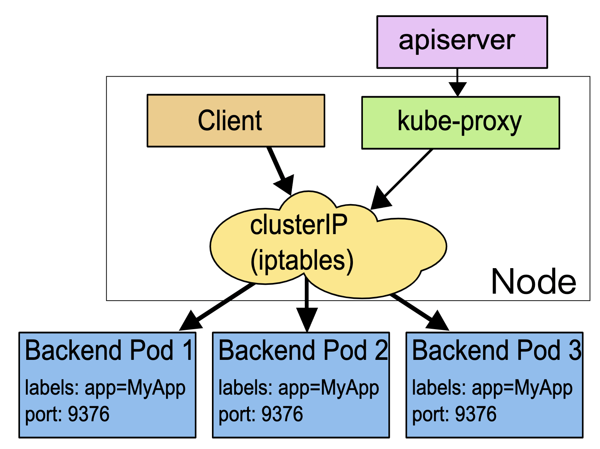
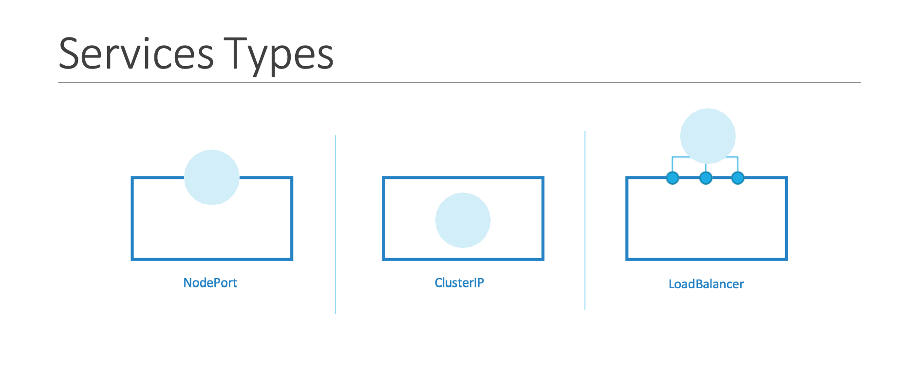
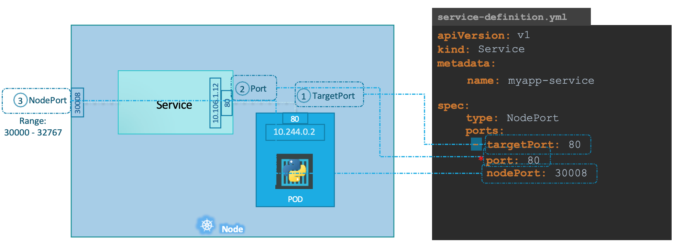
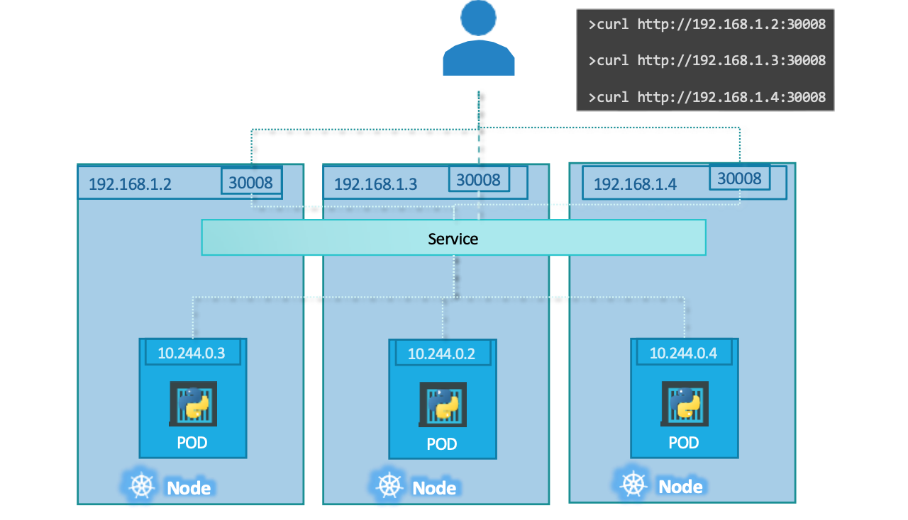
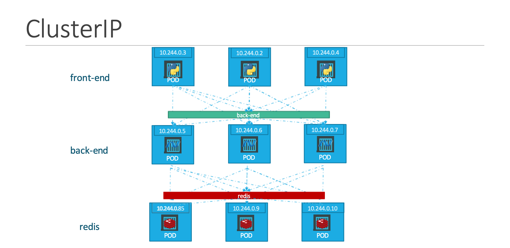
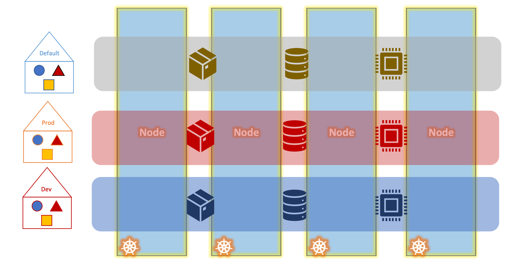
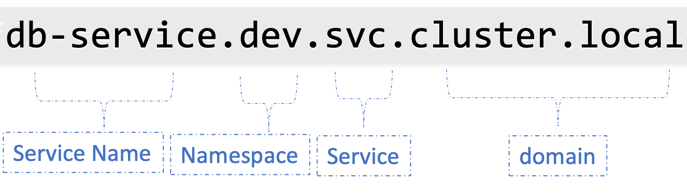

# Kubernetes基础-2


## Service

Kubernetes服务使应用程序内部和外部的各种组件之间能够进行通信。
service是一个固定的、可响应的端点。
+ 需要有固定的IP和端口
+ 背后要有Pod

Kubernetes 会给Service分配一个静态 IP 地址，Service自动管理、维护后面动态变化的 Pod 集合，当客户端访问 Service，它就根据某种策略，把流量转发给后面的某个 Pod。



这张图上Service使用了iptables技术，每个节点上的kube-proxy组件自动维护iptables规则。
客户端不需要关心Pod的具体地址，只要访问Service的固定IP地址。
Service会根据iptables规则转发请求给后端的Pod。

Kubernetes服务是一个对象，就像我们之前使用的Pod、ReplicaSet或Deployments。支持多种services：

+ NodePort： NodePort服务监听节点上的一个端口并将请求转发给Pod。把Service通过端口号暴露到集群中的节点主机。
+ ClusterIP：CusterIP是默认的Service的IP地址，是一个虚拟IP地址（类似Swarm，分配了VIP）。只能kubernetes集群内部访问使用，外部网络无法ping通。服务在cluster内部创建一个虚拟IP，以实现不同服务之间的通信，比如一组前端服务器到一组后端服务器。
+ LoadBalancer：LoadBalancer需要搭配云厂商（第三方）的负载均衡器来使用。它在支持的云供应商中为我们的应用程序提供一个负载平衡器
+ ExternalName：ExternalName的服务将service映射到 DNS CNAME（不常用）。




### NodePort
NodePort服务可以通过将节点上的端口映射到Pod上的端口。



仔细看一下这个服务，有三个端口。
+ 实际运行Web服务器的Pod上的端口是80，它被称为目标端口targetPort
+ 第二个端口是服务本身的端口。它被简单地称为端口port。
+ 节点本身的端口，我们用它来访问外部的Web服务器，这就是节点端口nodePort。节点端口只能在一个有效的范围内，默认情况下是30,000到32,767

在一个窗口中进行watch
```bash
kubectl get pods -w
```
在另一窗口中
```bash
kubectl get deployments

kubectl get pods

vim myapp-service.yml
```

+ API版本是v1，kind是Service。
+ 元数据可以有名称和标签。
+ spec有类型和端口。
  + 类型指的是我们正在创建的服务的类型。可以是ClusterIP、NodePort或LoadBalancer。
  + 在这里，设置为NodePort。
  + 端口：
    + targetPort，设置为80。
    + port是服务对象的端口，设置为80。
    + nodePort设置为30,008（或有效范围内的任何数字）。
    + 在这些字段中，唯一必须的字段是port。
      + 如果没有提供targetPort，它将被假定为与port相同。
      + 如果没有提供nodePort，那么在30000和32767之间的有效范围内的一个空闲端口将被自动分配。
    + 注意ports是一个数组，port下面的破折号，表示数组中的第一个元素。可以在一个服务中拥有多个这样的端口映射。
  + 使用标签和选择器将pod和service联系起来。在选择器下，提供一个标签列表来识别Pod。

```yaml
apiVersion: v1
kind: Service
metadata: 
  name: myapp-service
spec:
  type: NodePort
  ports:
    - port: 80
      targetPort: 80
      nodePort: 30008
  selector:
    app: myapp
```
使用kubectl create命令创建服务，并输入服务定义文件。

运行kubectl get services命令查看创建的服务，该命令列出了服务、ClusterIP和映射端口。类型是nodePort，节点上的端口被设置为30008。


```bash
kubectl create -f myapp-service.yml

kubectl get service
# NAME            TYPE        CLUSTER-IP    EXTERNAL-IP   PORT(S)        AGE
# kubernetes      ClusterIP   10.96.0.1     <none>        443/TCP        23m
# myapp-service   NodePort    10.105.97.7   <none>        80:30004/TCP   7s


# minikube service myapp-service --url
```


在生产环境中，有多个Web应用程序的实例运行，以达到高可用性和负载平衡的目的。在这种情况下，多个Pod在运行应用程序。他们都有相同的标签，在创建服务的过程中，相同的标签被用作选择器。当服务被创建时，它寻找具有该标签的匹配Pod。服务会自动选择这三个Pod作为端点，转发来自用户的外部请求。
服务使用的是随机算法作为一个内置的负载平衡器，在不同的Pod之间分配负载。


### CusterIP

web应用程序一般有不同种类的部分，所有单元都分配了一个IP地址。但是这些IP不是静态的。这些组件随时可能出现故障，并且创建新的pod。因此，不能依赖这些IP地址进行应用程序之间的内部通信。

Kubernetes service将这些单元组合在一起，为此服务提供单个接口。为后端pod创建的服务把所有后端pod组合在一起，并为其他pod提供一个单一的接口来访问这个服务。请求被随机地转发到service下的一个pod。每一层都可以根据需要进行扩展或移动，而不会影响各种服务之间的通信。

每个service都在集群内获得一个IP和分配给它的名称，这是其他路径访问该service时应使用的名称。这种类型的service称为ClusterIP。

```bash
kubectl get deployments

kubectl get pods

vim clusterip.yml
```
+ API版本是V1，kind是Service。给服务起一个名字为backend。
+ 在spec中，我们有类型和端口。类型是ClusterIP。
  + ClusterIP是默认的类型，没有指定时，kubernetes会自动假定类型是ClusterIP。
  + 在端口下，我们有一个目标端口和端口。
    + 目标端口是后端暴露的端口
    + 端口是服务暴露的地方
  + 使用选择器将服务链接到一组端口

```yaml
apiVersion: v1
kind: Service
metadata: 
  name: backend
spec:
  type: ClusterIP
  ports:
    - port: 80
      targetPort: 80
  selector:
    app: myapp
    type: backend
```
创建服务
```bash
kubectl create -f clusterip.yml

kubectl get service
```

## Namespace

Kubernetes在集群首次启动时，自动创建默认名称空间default namespace。

Kubernetes在内部创建了一组pod和service，如网络方案、DNS服务等。为了将这些与用户隔离开来，防止意外删除或修改这些服务，Kubernetes在集群启动时创建的另一个名为kube-system的名称空间下创建了这些服务。

Kubernetes自动创建的第三个名称空间被称为kube-public，创建应向所有用户开放的资源的地方。

将Kubernetes集群用于企业或生产目的时，可能要考虑使用名称空间。例如，在开发和生产环境中使用同一个集群，但同时在它们之间隔离资源，可以为它们各自创建一个不同的名称空间。在开发环境中工作时，就不会意外地修改生产环境中的资源。



每个名称空间都可以有自己的策略，定义谁可以做什么。可以给这些名字空间的每个人分配资源配额。这样一来，每个名称空间都能保证一定的数量，不会使用超过其允许的限额。


一个名字空间里的资源也可以简单地以name通信。如果要连接另一个名字空间的服务，必须将名称空间的名称附加到服务的名称上。例如，对于默认名称空间中的web pod，要连接到dev环境或名称空间中的数据库，使用servicename.namespace.svc.cluster.local格式：dbservice.dev.svc.cluster.local。

从后向前解析：
+ cluster.local，是Kubernetes集群的默认域名。
+ svc是服务的子域
+ dev是名称空间
+ dbservice是服务本身的名称
 

```bash
kubectl get pods

kubectl get pods --namespace=kube-system

kubectl get pods -n kube-system

kubectl get pods --all-namespaces

kubectl get pods -A
```
这个命令被用来列出所有的pod，但它只列出默认名称空间的pod。要列出另一个名字空间的pod，在命令中使用名字空间选项和名字空间的名称。
`vim myapp-pod.yml`
```yaml
apiVersion: v1
kind: Pod
metadata:
  name: myapp-pod
  namespace: dev
  labels: 
    app: myapp
    type: myservice
spec:
  containers:
  - name: nginx
    image: nginx
```
创建一个pod时，pod是在默认的名字空间中创建的。要在另一个名字空间中创建pod，使用名字空间选项。
如果想确保这个pod一直在开发环境中被创建，可以把名字空间定义移到pod定义文件中,添加在元数据部分。

### 创建名称空间
`vim namespace-dev.yml`
```yaml
apiVersion: v1
kind: Namespace
metadata:
  name: dev
```

```bash
kubectl create -f namespace-dev.yml

kubectl create namespace dev

kubectl get ns
```

### 切换到开发名称空间

```bash
kubectl config set-context $(kubectl config current-context) --namespace=dev
```

首先识别当前的上下文，然后将名称空间设置为当前context所需的名称空间。context是用来从同一个管理系统中管理多个集群和多个环境的.

### 资源配额
为了限制名称空间中的资源，需要创建一个资源配额。

`vim resource-quota.yml`
```yaml
apiVersion: v1
kind: ResourceQuota
metadata:
  name: compute-quota
  namespace: dev
spec:
  hard:
    pods: "10"
    requests.cpu: "4"
    requests.memory: 5Gi
    limits.cpu: 10
    limits.memory: 10Gi
```
指定想创建配额的名称空间，然后在spec下，提供限制:
+ 10个pod
+ 10个CPU单元
+ 10GB字节的内存

在 ResourceQuota 里可以设置各类资源配额：
+ CPU 和内存配额，使用request.*，limits.*
+ 存储容量配额，使用requests.storage限制PVC的存储总量，用 persistentvolumeclaims限制PVC的个数
+ 核心对象配额，使用对象的名字pods、configmaps、secrets、services
+ ...

在调度的时候，kube-scheduler 只会按照 requests 的值进行计算。而在真正设置 Cgroups 限制的时候，kubelet 则会按照 limits 的值来进行设置。
```bash
kubectl create -f resource-quota.yml
```
