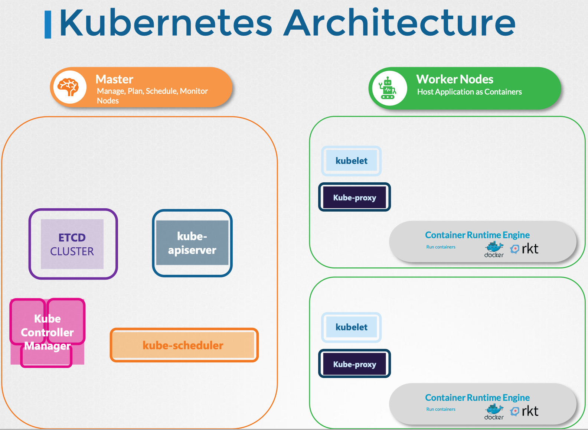
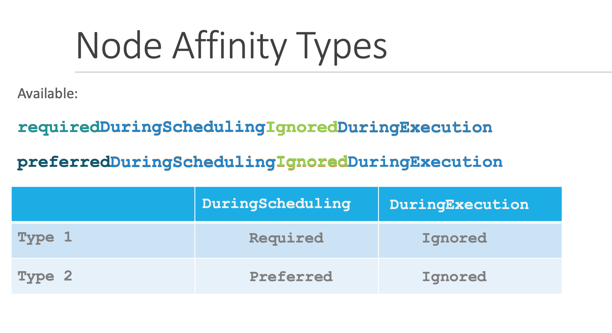
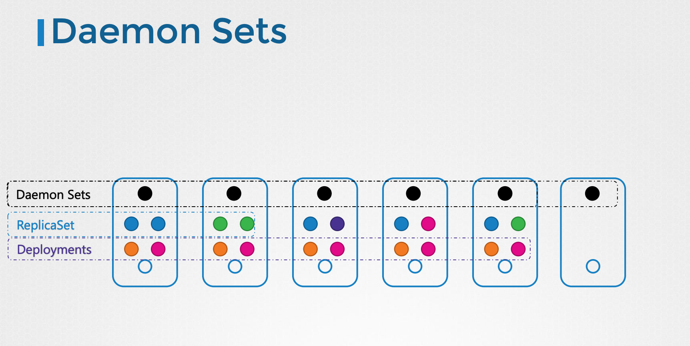
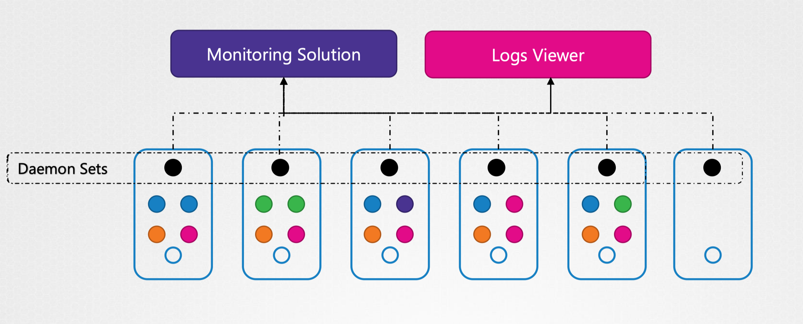

# schedule 调度



## Node Name

调度器到底是如何在后端工作的呢？

1. 每个pod都有一个叫做NodeName的字段，默认情况下是不设置的。创建pod文件时，通常不会指定这个字段。Kubernetes会自动添加它。
2. 调度器会扫描所有的pod，并寻找没有设置这个属性的pod，作为调度的候选对象。
3. 调度器通过运行调度算法为pod分配正确的节点。一旦确定节点，调度器会创建一个绑定对象binding，将NodeName设置为分配节点的名称，从而在该节点上调度pod。

如果没有调度器来监控和调度节点，会发生什么？Pod继续处于Pending状态。我们以手动将pod分配给节点。

+ 在没有调度器的情况下，调度pod的最简单的方法是在创建pod时，将NodeName字段设置为节点名称。然后该pod就会被分配到指定的节点上。但是只能在创建时指定节点名称。
```yaml
apiVersion: v1
kind: Pod
metadata:
  name: nginx
spec:
  containers:
    - image: nginx
      name: nginx
  nodeName: node01      
```

```bash
kubectl replace --force -f nginx.yaml
```

+ 如果pod已经创建。Kubernetes不允许修改pod的NodeName属性。
  + 另一种方法是创建一个Binding绑定对象，并向pod的绑定API发送一个POST请求，从而模仿实际调度程序的做法。
  + 在绑定对象中，用NodeName指定一个目标节点，然后向pod的绑定API发送一个POST请求，将数据以JSON格式设置到绑定对象中（必须将YAML文件转换为等效的JSON形式）。

```yaml
apiVersion: v1
kind: Binding
metadata:
  name: nginx
target:
  apiVersion: v1
  kind: Node
  name: ......
```

## Label & Selector


对Kubernetes来说，pod､ service､ replicaset､ deployment都是不同的对象。集群中可能会有成百上千个这样的对象。需要按不同类别筛选和查看对象的方法，例如按对象类型进行分组，或者按应用程序或功能查看。

### 指定标签
在元数据下，创建一个名为label的部分，以键值格式添加任意多个标签。
`vim myapp-rs.yml`
```yaml
apiVersion: apps/v1
kind: ReplicaSet
metadata:
  name: myapp-rs
  labels: 
    app: myapp
    type: myservice
spec:
  replicas: 3
  selector: 
    matchLabels:
      type: myservice
  template:
    metadata:
      name: myapp-pod
      labels: 
        app: myapp
        type: myservice
    spec:
      containers:
      - name: nginx
        image: nginx
```
Kubernetes对象在内部使用标签和选择器将不同的对象连接在一起。
例如：
1. 创建一个包含三个不同pod的replicaset，首先pod定义label，然后在replicaset中使用选择器对pod进行分组。
2. 在replicaset定义文件中，在两个位置存在标签。
   + template下定义的label是pod上配置的label。
   + 顶部的label是replicaset本身的label。
   + replicaset通过matchLabel发现Pod。（如果要配置其他对象来发现replicaset，则将使用replicaset上的label。）
3. 为了将replicaset连接到Pod，我们在replicaset spec下配置selector字段，以匹配Pod上定义的label。

```bash
kubectl get po --selector env=dev

kubectl get po --selector env=dev --no-headers | wc -l

kubectl get po --selector env=prod，bu=finance，tier=frontend
```
### Annotation注释

label与选择器用于编组与选择对象，而注释用于记录其他详细信息以提供信息。例如，如名称､ 版本､ 构建信息等
```yaml
apiVersion: apps/v1
kind: ReplicaSet
metadata:
  name: myapp-rs
  labels: 
    app: myapp
    type: myservice
  annotations:
    buildVersion: 1.0
spec:
  replicas: 3
  selector: 
    matchLabels:
      type: myservice
  template:
    metadata:
      name: myapp-pod
      labels: 
        app: myapp
        type: myservice
    spec:
      containers:
      - name: nginx
        image: nginx
```

## Taints污点 & Tolerations容忍度

Taints污点和Tolerations容忍度的概念运用在如何限制将哪些Pod放置在哪些节点上，用于设置节点上可调度的pod的限制。

一个三个工作节点的集群开始，分别命名为node1､ node2和node3。部署一组Pod，称为podA､ podB､ podC和podD。

创建pod后，Kubernetes调度程序会尝试将这些pod放置在可用的工作节点上。一开始调度程序将pod放置在所有节点上，达到负载均衡。

现在，假设我们在node1上为特定用例或应用程序提供了专用资源。因此，我们希望仅将属于此应用程序的那些pod放置在node1上。

1. 需要通过在node上放置taint来防止所有pod都被放置在node1上。默认情况下，pod没有Tolerations。因此，没有一个pod可以放置在节点1上，
2. 给对应的pod增加Tolerations，比如podD有了Toleration。因此，当调度程序尝试将此pod放置在node1上时，将通过。

node上设置taint，而pod上设置Toleration。使用kubectl taint nodes命令对node进行taint指定，后跟taint键值对。

### node上设置taint
```bash
kubectl taint nodes node-name key=value:taint-effect

kubectl taint nodes node1 tier=backend:NoSchedule
```
taint-effect定义了如果pod不能容忍taint时会发生什么。

有三个taint-effect：
+ NoSchedule 无调度，这意味着node上不会调度Pod。
+ PreferNoSchedule，这意味着系统将尝试避免在node上放置Pod，但并不保证。
+ NoExecute不执行，这意味着新的pod将不会在node上调度，并且如果node上的现有pod（如果有的话）不能容忍taint，则将被逐出。

### pod上设置toleration
`vim myapp-pod.yml`
```yaml
apiVersion: v1
kind: Pod
metadata:
  name: myapp-pod
spec:
  containers:
  - name: nginx
    image: nginx
  tolerations:
  - key: "tier"
    operator: "Equal"
    value: "backend"
    effect: "NoSchedule"
```


在pod定义文件的spec中，添加名为“tolerations”的部分，所有值都需要用双引号。

现在使用新的toleration创建或更新pod时，根据effect，pod或者不在node上进行调度，或者从现有node中逐出。
taint和tolerations只是为了限制node接受某些pod。node1只能接受podD，但并不保证podD总是被放置在node1上。可以将podD放置在任何没有应用污染或限制的node上。
taint和tolerations并不告诉Pod去特定的node。相反，它告诉node仅接受具有特定tolerations的pod。

kubernetes的controlplane节点，应该只允许管理组件，而不承担负载。首次设置Kubernetes集群时，会在主节点上自动设置一个taint，以防止在此节点上调度任何pod。
```bash
kubectl describe node controlplane | grep Taint
# Taints:             node-role.kubernetes.io/control-plane:NoSchedule
```
controlplane默认有一个taint，名字是 node-role.kubernetes.io/control-plane，效果是 NoSchedule，也就是说这个污点会拒绝 Pod 调度到本节点上运行，而 Worker 节点的 taint 字段则是空的
```bash
kubectl taint node controlplane tier=backend:NoSchedule

kubectl run mynginx --image nginx

kubectl get pod
# NAME       READY   STATUS    RESTARTS   AGE
# mynginx   0/1     Pending   0          63s

kubectl create -f myapp-pod.yml

kubectl taint node controlplane tier=backend:NoSchedule-

kubectl get pod
```

## Node Selector

一个三节点群集，其中两个节点较小，硬件资源较少；另一个节点较大，提供了较多的资源。

集群中运行着不同种类的工作负载。我们可以对pod设置一个限制，使其仅在特定节点上运行。

方案一：使用节点选择器 Node Selector
为了限制pod在较大的节点上运行，需要向spec部分添加了一个名为node selector的新属性，并将大小指定为large。size和large的键值对实际上是分配给节点的标签。
调度程序使用这些标签来匹配和标识要放置Pod的正确节点。使用节点选择器之前，必须先标记节点。

```bash
# kubectl label nodes <node-name> <label-key>=<labey-value>
kubectl label nodes node1 size=Large
```

然后创建pod
`vim myapp-pod.yml`
```yaml
apiVersion: v1
kind: Pod
metadata:
  name: myapp-pod
  labels: 
    app: myapp
    type: myservice
spec:
  containers:
  - name: nginx
    image: nginx
  nodeSelector:
    size: Large
```

但是如果我们的需求非常复杂。比如例如，需要将pod放在一个大节点或中等节点上。
这就需要引入节点亲和性

## Node Affinity 节点亲和性

节点亲和性提供了更高级的功能，以限制Pod放置在特定节点上。



+ requiredDuringSchedulingIgnoredDuringExecution
+ preferredDuringSchedulingIgnoredDuringExecution


pod的生命周期中有两种状态：Scheduling调度期和Execution执行期

Scheduling调度期是指pod不存在，且是首次创建的状态。在首次创建pod时，kubernetes会考虑节点亲和规则

+ required：调度程序将强制将pod放置在具有给定关联性规则的节点上。
+ preferred：调度程序将尽力将pod放置在匹配的节点上。如果未找到匹配的节点，则调度程序将忽略节点关联性规则，并将单元放置在任何可用节点上

Execution执行期是指pod一直在运行，并且环境中发生了影响节点关联性的更改（例如节点标签的更改）的状态。

假设管理员从节点中删除了设置的`size=large`标签。
对于正在在节点上运行的pod，目前两种类型的节点关联都将此值设置为“忽略”，pod将继续运行，并且节点关联中的任何更改都不会影响它们。

kubernetes计划在未来引入requiredDuringSchedulingRequiredDuringExecution


`vim myapp-pod.yml`
```yaml
apiVersion: v1
kind: Pod
metadata:
  name: myapp-pod
  labels: 
    app: myapp
    type: myservice
spec:
  containers:
  - name: nginx
    image: nginx
  affinity:
    nodeAffinity:
      requiredDuringSchedulingIgnoredDuringExecution:
        nodeSelectorTerms:
        - matchExpressions:
          - key: size
            operator: In
            values:
            - Large
```

节点亲和性表达非常灵活
```yaml
key: size
operator: NotIn
values:
- Small
```
等价于
```yaml
key: size
operator: In
values:
- Large
- Medium
```
有些标签只存在key，可以用Exists operator
```yaml
key: controlplane
operator: Exists
```

## 资源限制

调度程序会考虑pod所需的资源量以及节点上可用的资源量。

如果节点没有足够的资源，调度程序将避免将pod放置在该节点上，而是将pod放置在有足够资源可用的节点上。

如果所有节点上都没有足够的可用资源，Kubernetes就会阻止调度pod。
pod将处于Pending状态。

默认情况下，Kubernetes假设一个pod需要0.5个CPU和256Mi内存，称为容器的资源请求。调度程序尝试在节点上放置pod时，请求的最小CPU和内存量。

修改资源默认值，添加一个名为resources的字段，在该字段下添加requests并指定内存和CPU的值。
`vim myapp-pod.yml`
```yaml
apiVersion: v1
kind: Pod
metadata:
  name: myapp-pod
  labels: 
    app: myapp
    type: myservice
spec:
  containers:
  - name: nginx
    image: nginx
    resources:
      requests:
        memory: "1Gi"
        cpu: 1
```

Docker容器可以在节点上使用的资源没有限制。
默认情况下，Kubernetes为容器设置了一个CPU的限制，容器将被限制为仅使用节点中的一个CPU，内存限制为512Mi。

修改默认限制
`vim myapp-pod.yml`
```yaml
apiVersion: v1
kind: Pod
metadata:
  name: myapp-pod
  labels: 
    app: myapp
    type: myservice
spec:
  containers:
  - name: nginx
    image: nginx
    resources:
      requests:
        memory: "1Gi"
        cpu: 1
      limits:
        memory: "2Gi"
        cpu: 2
```
limit和request是为pod内的每个container设置的。

+ requests：容器要申请的资源，要求Kubernetes在创建Pod的时候必须分配这里列出的资源，否则容器就无法运行。
+ limits：容器使用资源的上限，不能超过设定值，否则就有可能被强制停止运行。

在调度的时候，scheduler 只会按照 requests 的值进行计算。而执行期间，在真正设置 Cgroups 限制的时候，kubelet 则会按照 limits 的值来进行设置。

## DaemonSet 守护进程集

Deployment能够创建任意多个的 Pod 实例，并且维护这些 Pod 的正常运行，保证应用始终处于可用状态。但是，Deployment 并不关心这些 Pod 会在集群的哪些节点上运行。
DaemonSet会在 Kubernetes 集群的每个节点上都运行一个 Pod。

DaemonSet 类似于ReplicaSet，它在集群中的每个节点上运行一个pod副本。每当有新节点添加到群集时，pod将自动添加到该节点。删除节点时，Pod也会自动删除。DaemonSet 确保pod的一个副本始终存在于集群的每一个节点中。


 
比如需要在集群中的每个节点上部署一个监控代理或日志收集器，以便更好地监控集群。

DaemonSet非常适合这类场景，它可以在集群中的所有节点上以pod的形式部署代理。

之前介绍Kubernetes架构时，集群中每个节点都需要一个工作节点组件：kube-proxy代理。就可以使用daemonset部署。
另一个案例是网络解决方案，也需要在集群中的每个节点上部署一个代理。

DaemonSet 开始运行的时机，很多时候比整个 Kubernetes 集群出现的时机都要早。

```bash
kubectl get ds -A
# NAMESPACE      NAME              DESIRED   CURRENT   READY   UP-TO-DATE   AVAILABLE   NODE SELECTOR            AGE
# kube-flannel   kube-flannel-ds   1         1         1       1            1           <none>                   6m35s
# kube-system    kube-proxy        1         1         1       1            1           kubernetes.io/os=linux   6m38s
```

创建DaemonSet与创建ReplicaSet类似

+ API版本apps/v1
+ kind是DaemonSet
+ 在spec下有一个选择器和一个pod template，但是没有replicas字段，因为不会在集群里创建多个 Pod 副本，每个节点上只创建出一个 Pod 实例。


`vim es-daemon-set.yml`
```yaml
apiVersion: apps/v1
kind: DaemonSet
metadata:
  labels:
    app: elasticsearch
  name: elasticsearch
  namespace: kube-system
spec:
  selector:
    matchLabels:
      app: elasticsearch
  template:
    metadata:
      labels:
        app: elasticsearch
    spec:
      containers:
      - image: registry.k8s.io/fluentd-elasticsearch:1.20
        name: fluentd-elasticsearch
```
使用DaemonSet
```bash
kubectl create -f es-daemon-set.yml

kubectl get ds -o wide

kubectl describe ds elasticsearch
```

注意，DaemonSet的设计上是每个节点上部署一个，但是control-plane的设计是控制节点不承担常规工作负载。二者存在冲突，Kubernetes使用了污点（taint）和容忍度（toleration）来避免。

可以通过以下两种方案来取消：
1. 去掉controlplane的taint
```bash
kubectl taint node controlplane node-role.kubernetes.io/controlplane:NoSchedule-
```
操作 Node 上的“污点”属性需要使用命令 kubectl taint，然后指定节点名、污点名和污点的效果，去掉污点要额外加上一个 -。
2. 给Pod添加tolerations
```yaml
tolerations:
- key: node-role.kubernetes.io/controlplane
  effect: NoSchedule
  operator: Exists
```

### DaemonSet的工作原理

之前我们说过，可以在pod上设置node名称，以绕过调度程序，直接将pod放置在node上。
在 Kubernetes v1.11 之前，由于调度器尚不完善，DaemonSet 是由 DaemonSet Controller 自行调度的，它会直接设置 Pod 的 spec.nodename 字段.

在Kubernetes v1.12之前，DaemonSet采取的都是这种方式。从v1.12开始，Kubernetes使用NodeAffinity规则来调度节点上的pod。DaemonSet Controller 会在创建 Pod 的时候，自动在这个 Pod 的 API 对象里，加上一个 nodeAffinity 定义，绑定到节点。

## Static Pod 静态Pod

DaemonSet 是在 Kubernetes 里运行节点专属 Pod 最常用的方式。
Kubernetes 还支持另外一种叫“静态Pod”的应用部署手段。

回顾Kubernetes架构，kubelet依赖于API-server来获得关于在当前节点上加载哪些Pod的指令，指令存储在etcd中，由scheduler所决定。


如果没有API-server，scheduler，controller和etcd集群会怎么样？
单独存在的Kubelet可以独立管理一个节点，并且创建Pod。但是没有API-server来提供pod详细信息。
Kubelet可以从所在服务器上指定用于存储Pod信息的目录中读取Pod定义文件。

静态Pod不受 Kubernetes 系统的管控，不与 apiserver、scheduler 发生关系，所以是static静态。
```bash
cat /var/lib/kubelet/config.yaml | grep staticPodPath
# staticPodPath： /etc/kubernetes/manifests
```
静态Pod的YAML文件默认都存放在节点的 /etc/kubernetes/manifests 目录下，它是 Kubernetes 的专用目录。Kubelet会定期检查此目录中的文件，读取这些文件并在主机上创建Pod。并且保持Pod在线；如果程序崩溃，Kubelet会尝试重新启动它。

对此目录中的任何文件进行更改，Kubelet将重新创建Pod使更改生效。
如果从该目录中删除文件，则Pod将自动删除。
这些由Kubelet自行创建的pod（无需API服务器或其余Kubernetes集群组件的干预）被称为静态pod。

PS，只能以这种方式创建Pod。不能通过将定义文件放在指定目录中来创建replicaset､deployment或service。它们都是整个Kubernetes架构的概念组成部分，需要replica和deployment controller等其他集群组件。

Kubelet在pod级别工作，只能理解pod，只能够以这种方式创建静态pod。

指定的静态Pod文件夹可以是主机上的任何目录，该目录的位置在运行服务时作为一个选项传递给kubelet。

```bash
/usr/local/bin/kubelet \
--container-runtime=remote \\
--container-runtime-endpoint=unix:///var/run/containerd/containerd.sock \\
--pod-manifest-path=/etc/Kubernetes/manifests \\
--kubeconfig=/var/lib/kubelet/kubeconfig \\
--network-plugin=cni \\
--register-node=true \\
--v=2
```

另一种配置方法，可以修改config.yaml，并在该文件中将目录路径定义为静态pod路径。
```bash
cat /var/lib/kubelet/config.yaml | grep staticPodPath
# staticPodPath： /etc/kubernetes/manifests
```


### 为什么要使用静态Pod
静态Pod不依赖于Kubernetes控制平面，可以使用静态Pod将控制平面组件本身作为Pod部署在节点上。

在所有主节点上安装kubelet，然后创建pod定义文件，该文件使用各种控制平面组件的Docker镜像。
将定义文件放在指定的manifest文件夹中，Kubelet负责将控制平面组件本身作为pod部署到集群上。
```bash
ls -al /etc/kubernetes/manifests/

# -rw------- 1 root root 2376 Feb 19 00:23 etcd.yaml
# -rw------- 1 root root 3854 Feb 19 00:23 kube-apiserver.yaml
# -rw------- 1 root root 3370 Feb 19 00:23 kube-controller-manager.yaml
# -rw------- 1 root root 1440 Feb 19 00:23 kube-scheduler.yaml
```
Kubernetes 的 4 个核心组件 apiserver、etcd、scheduler、controller-manager 原来都以静态 Pod 的形式存在的，所以能够先于 Kubernetes 集群启动。
如果服务中的任何一个崩溃，kubelet会重新启动它。

