# 存储 & 状态持久化

了解Kubernetes中的存储如何与容器配合使用非常重要｡

## Docker 持久化

Docker中的存储有两个概念：存储驱动程序Storage Driver和卷驱动程序Volumes Drivers

### 存储驱动 Storage Driver

1. 从Docker如何在本地文件系统上存储数据

在系统上安装Docker时, 它会在/var/lib/docker的位置创建文件夹, 在该文件夹下有多个文件夹: aufs, container, image, volumes等｡
```bash
cd /var/lib/docker/

ls -al

# drwx--x--x    4 root     root           120 Feb 24 22:19 buildkit
# drwx--x--x    3 root     root            20 Feb 24 22:19 containerd
# drwx--x---    2 root     root             6 Feb 24 22:19 containers
# drwx------    3 root     root            22 Feb 24 22:19 image
# drwxr-x---    3 root     root            19 Feb 24 22:19 network
# drwx--x---    3 root     root            40 Feb 24 22:19 overlay2
# drwx------    4 root     root            32 Feb 24 22:19 plugins
# drwx------    2 root     root             6 Feb 24 22:19 runtimes
# drwx------    2 root     root             6 Feb 24 22:19 swarm
# drwx------    2 root     root             6 Feb 24 22:19 tmp
# drwx------    2 root     root             6 Feb 24 22:19 trust
# drwx-----x    2 root     root            50 Feb 24 22:19 volumes
```

默认情况下, Docker将在此存储所有数据,包括与运行在Docker主机上的镜像和容器相关的文件｡与容器相关的所有文件都存储在containers文件夹下, 而与镜像相关的文件则存储在image文件夹下｡Docker容器创建的任何卷都将创建在volumes文件夹下｡


Dockers存储镜像和容器的文件基于Dockers的分层架构｡

当Docker构建镜像时, 它会在分层体系结构中构建这些镜像｡Docker文件中的每一行指令都会在Docker镜像中创建一个新层, 其中只包含上一层的更改｡
```Dockerfile
FROM ubuntu
RUN apt-get update && apt-get install -y python
RUN pip install flask
COPY . /source
ENTRYPOINT run.py
```
+ 第一层是基本Ubuntu操作系统
+ 第二指令将创建第二层, 用于安装所有应用程序包
+ 第三条指令创建第三层,包含python包, 
+ 第四层复制源代码, 
+ 最后是第五层更新镜像的入口点｡
由于每一层仅存储来自前一层的更改, 反映在大小中｡基本镜像的大小约为120 MB｡安装的apt包大约是300 MB, 然后剩下的层很小｡

如果有另一个应用程序，有一个不同的Docker文件, 但与第一个应用程序非常相似,因为它使用与Ubuntu相同的基础镜像, 使用相同的python和flask依赖项, 但使用不同的源代码来创建不同的应用程序,因此也使用不同的入口点｡

运行Docker build命令为另一个应用程序构建一个新的镜像时,因为两个应用程序的前三层是相同的｡
Docker不打算构建前三层｡它重用缓存中的第一个应用程序构建的三个层,并且只使用新的源代码和新的入口点创建最后两个层｡

Docker可以更快地构建镜像并有效地节省磁盘空间｡
这也适用于每当更新应用程序代码时都要更新应用程序代码的情况｡

在这种情况下,Docker只是重用缓存中所有以前的层, 并通过更新最新的源代码来快速重建应用程序镜像, 从而在重建和更新期间节省大量时间｡

从下往上重新排列这些层, 在底部有基本的ubuntu层, 然后是包, 然后是依赖项, 然后是应用程序的源代码,然后是入口点｡

所有这些层都是在运行Docker build命令以形成最终Docker镜像时创建的,都是Docker镜像层｡构建完成后, 将无法修改这些层的内容｡
它们是只读的, 只能通过启动新的构建来修改它们｡
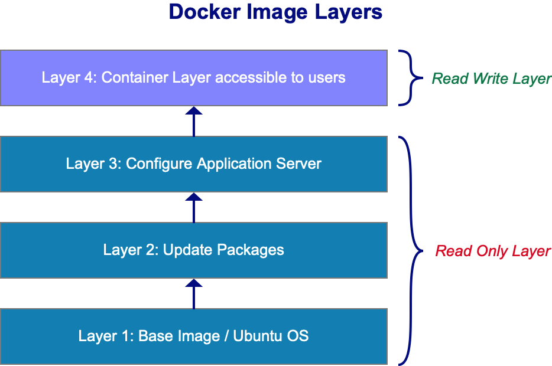
Docker run命令运行基于此镜像的容器时, Docker将创建基于这些层的容器,并在镜像层上创建新的读写层｡读写层用于存储容器创建的数据,例如应用程序写入的日志文件､ 容器生成的任何临时文件或用户在该容器上修改的任何文件｡
这一层只在容器运行时有效。容器销毁时，此层以及存储在其中的所有更改也将被销毁｡


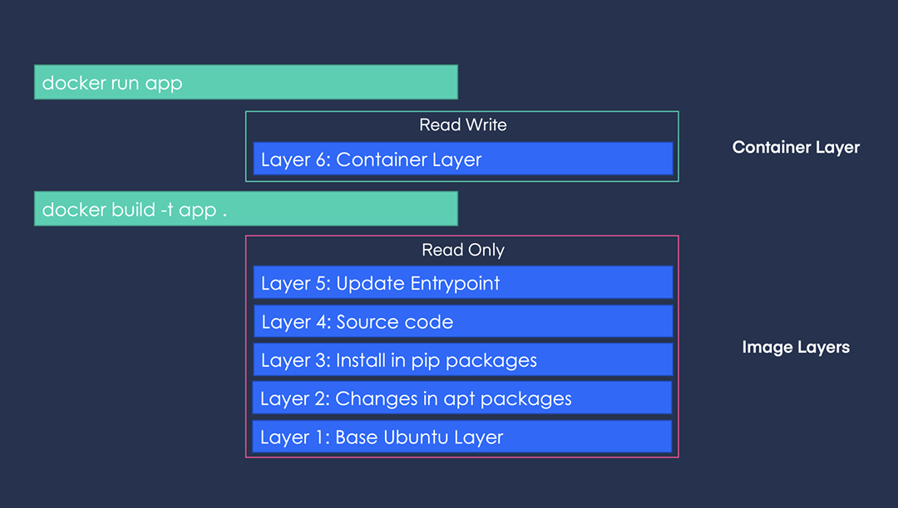
如果登录到新创建的容器, 并创建一个新文件, docker将在容器层中创建该文件,该文件是可读写的｡
但镜像层中的文件是只读的, 所以不能编辑镜像层中的任何内容｡
以应用程序代码为例，我们将代码复制到镜像中, 因此代码是镜像层的一部分, 因此是只读的｡
在运行一个容器之后, 如果想修改源代码来测试，Docker会自动在读写层中创建该文件的副本, 然后在读写层中修改该文件的不同版本｡所有修改都将在读写层中的该文件副本上完成｡
这称为copy-on-write写时复制机制｡
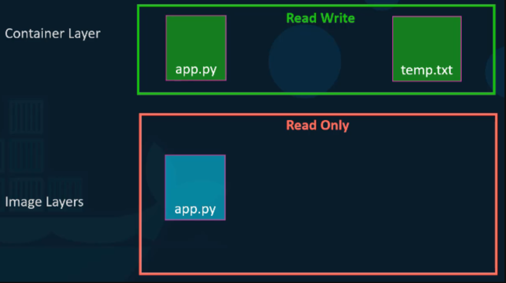

只读镜像层意味着这些层中的文件不会在镜像本身中修改｡镜像将始终保持不变, 直到使用Docker build命令重建镜像｡


删除docker之后，存储在容器层中的所有数据也将被删除，创建的临时文件也将被删除｡
如果希望持久化这些数据，可以向容器添加一个持久卷｡如正在使用一个数据库, 并且希望保留由容器创建的数据,

使用Docker volume create命令创建一个卷｡
```bash
$ ls /var/lib/docker/volumes -l
total 24
brw-------    1 root     root        8,  16 Feb 24 22:19 backingFsBlockDev
-rw-------    1 root     root         32768 Feb 24 23:00 metadata.db

$ docker volume create data_volume
data_volume

$ ls /var/lib/docker/volumes -al
total 24
brw-------    1 root     root        8,  16 Feb 24 22:19 backingFsBlockDev
drwx-----x    3 root     root            19 Feb 24 23:00 data_volume
-rw-------    1 root     root         32768 Feb 24 23:00 metadata.db
```
运行`docker volume create data_volume`命令,它在`/var/lib/docker/volumes/`目录下创建一个名为data_volume的文件夹｡
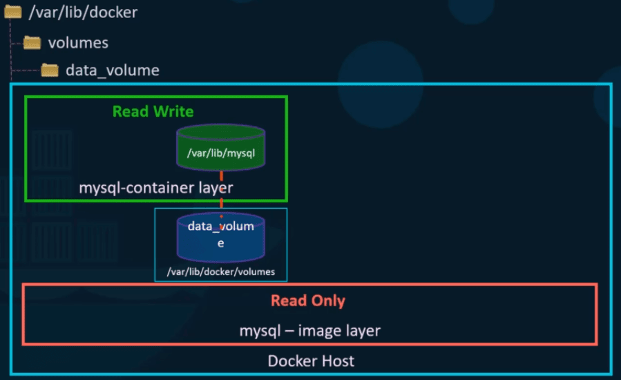
使用Docker run -v选项在Docker容器的读写层中挂载卷
```bash
docker run -v data_volume:/var/lib/mysql mysql
```
执行docker run -v指定新创建的卷名,后跟容器内的位置.
这将创建一个新的容器, 并将我们创建的数据卷挂载到容器内的/var/lib/mysql文件夹中
数据库写入的所有数据都存储在Docker主机上创建的卷上。即使容器被销毁, 数据仍然保存｡


如果在`docker run`命令之前没有运行`docker volume create`命令来创建卷,,Docker将自动创建一个名为data_volume的卷并挂载到容器中｡
这称为卷挂载volume mounting, 因为我们要挂载一个由Docker在/var/lib/docker/volumes文件夹下创建的卷｡
```bash
$ docker run -v data_volume2:/var/lib/mysql mysql

$ ls /var/lib/docker/volumes -l
total 24
brw-------    1 root     root        8,  16 Feb 24 22:19 backingFsBlockDev
drwx-----x    3 root     root            19 Feb 24 23:00 data_volume
drwx-----x    3 root     root            19 Feb 24 23:09 data_volume2
-rw-------    1 root     root         32768 Feb 24 23:09 metadata.db
```


如果我们的数据已经在另一个位置,我们希望将数据库数据存储在该路径上, 而不是存储在默认的/var/lib/docker/volumes文件夹中｡
在这种情况下, 使用命令docker run -v提供要挂载的文件夹的完整路径｡

```bash
docker run -v /data/mysql:/var/lib/mysql mysql
```
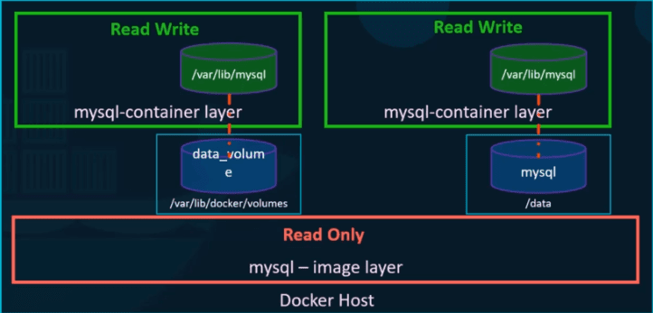
这将创建一个容器, 并将文件夹挂载到该容器中，称为绑定挂载bing mounting｡

两种类型的挂载：卷挂载和绑定挂载:
+ 卷挂载从卷目录挂载卷
+ 绑定挂载从Docker主机上的任何位置挂载目录

新的写法中，使用-v不再推荐，但是依旧兼容。
新的方法是使用--mount，必须以键等于值的格式指定每个参数｡
```bash
# docker run -v /data/mysql:/var/lib/mysql mysql

docker run --mount type=bind,source=/data/mysql,target=/var/lib/mysql mysql
```

+ 类型是bind
+ source是主机上的位置
+ target是容器上的位置

存储驱动程序Storage Driver负责执行所有这些操作:维护分层体系结构, 创建读写层,跨层移动文件以实现拷贝与写入等

Docker使用存储驱动程序来支持分层体系结构｡

一些常见的存储驱动Storage Driver:
+ AUFS
+ ZFS
+ BTRFS
+ Device Mapper
+ Overlay
+ Overlay2
  
存储驱动程序的选择取决于所使用的底层操作系统｡
对于Ubuntu, 默认存储驱动程序是AUFS,而AUFS在Fedora或CentOS等其他操作系统上不可用｡
在这种情况下, Device Mapper设备映射器是更好的选择｡Docker将根据操作系统自动选择可用的最佳存储驱动程序｡

### 卷驱动 Volumes Driver

存储驱动Storage Driver不处理卷, 卷由卷驱动插件Volumes Driver Plugin处理｡默认的卷驱动程序插件是本地local｡

local volume插件可帮助在Docker主机上创建卷, 并将其数据存储在/var/lib/docker/volumes目录下｡

许多其他卷驱动程序插件允许在第三方解决方案上创建卷：
+ Azure File Storage
+ Google Compute Persistent Disk
+ GlusterFS
+ VMware vSphere Storage
+ ....


运行Docker容器时, 可以选择使用特定的卷驱动程序，创建一个容器并从云上附加一个卷｡当容器退出时, 数据在云上是安全的｡

## CSI 容器存储接口 container storage interface

以前, Kubernetes单独使用Docker作为容器运行时引擎｡Docker被嵌入到Kubernetes的源代码中｡

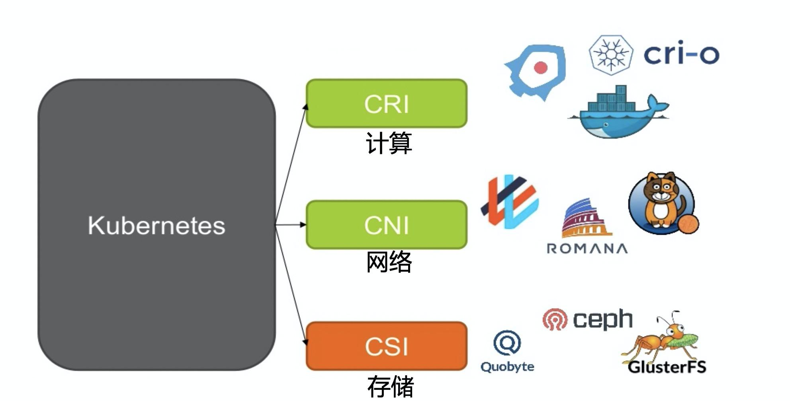
随着其他容器运行时（如rocket和cri-o）的出现, kubernetes开放和扩展对不同的容器运行时的支持。这就是容器运行时接口CRI｡
容器运行时接口container runtime interface是一个标准, 定义了编排解决方案（如Kubernetes）如何与容器运行时（如Docker）进行通信｡如果开发任何新的容器运行时接口, 它们可以简单地遵循CRI标准｡新的容器运行时将与Kubernetes兼容, 而不必直接接触Kubernetes源代码｡

类似地, Kubernetes为了扩展对不同网络解决方案的支持,引入了容器网络接口container network interface｡任何新的网络供应商都可以简单地基于CNI标准开发插件, 并使其解决方案与Kubernetes兼容｡

容器存储接口container storage interface是为了支持多个存储解决方案｡

使用CSI, 供应商现在可以为自己的存储技术编写驱动程序
+ EMC
+ GlusterFS
+ Amazon EBS
+ PureStorage
+ ...

CSI不是Kubernetes的特定标准｡它旨在成为一个通用标准, 并且允许任何容器编排工具与任何具有受支持插件的存储供应商相互通信｡Kubernetes､ Cloud Foundry和MESOS都支持CSI｡

CSI定义了一组将由容器编排器调用的RPC远程过程调用，由存储驱动程序来实现｡
例如, 创建一个pod并需要一个卷时,容器编排器（Kubernetes）应调用CreateVolume RPC并传递一组详细信息, 如卷名｡存储驱动程序应实现RPC并处理该请求, 在存储阵列上配置新卷, 然后返回操作结果｡
删除卷时, 容器编排器应当DeleteVolume RPC,存储驱动器应当实现调用然后从阵列中停用卷｡

RPC规范详细说明了 容器编排器应发送哪些参数, 解决方案提供商应接收哪些参数,以及应返回哪些错误代码｡

### Volume

Docker在本质上是短暂的,它们只能持续很短的一段时间｡当需要处理数据时, 容器会被创建,并在完成后销毁｡对于容器内的数据也是如此，数据将与容器一起销毁｡

为了保留容器处理的数据, 我们在创建容器时将卷附加到容器｡容器处理的数据将放置在卷中,从而永久保留｡即使删除了容器, 由容器生成或处理的数据仍将保留｡


像Docker中一样,Kubernetes中创建的pod本质上是短暂的｡
创建一个Pod来处理数据。删除Pod时,该Pod处理的数据也将被删除｡

我们需要将一个卷附加到Pod｡Pod生成的数据现在存储在卷中, 即使删除Pod后,数据仍会保留｡


创建一个简单的pod, 生成一个1到100之间的随机数,并将其写入/opt/number.out.
Pod将与随机数一起被删除｡
```yaml
apiVersion: v1
kind: Pod
metadata:
  name: random-number
spec:
  containers:
  - image: alpine
    name: alpine
    command: ["/bin/sh","-c"]
    args: ["shuf -i 0-100 -n 1 >> /opt/number.out;"]
```
为了保留Pod生成的数字, 我们创建了一个卷｡
卷需要存储路径｡
创建卷时,可以选取以不同的方式配置其存储｡先将其配置为使用主机上的目录｡
```yaml
volumes:
- name: data-volume
  hostPath:
    path: /data
    type: Directory
```
在卷中创建的任何文件都将存储在节点上的目录/data中｡


```yaml
volumeMounts:
- mountPath: /opt
    name: data-volume
```

创建卷后, 为了从容器访问卷, 需要将卷挂载到容器内的一个目录｡使用容器中的volumeMounts字段将数据卷挂载到容器内的目录/opt中｡
我们的目标文件路径是/opt/number.out，位于数据卷上。删除Pod后,带有随机数的文件仍保留在主机上｡

```yaml
apiVersion: v1
kind: Pod
metadata:
  name: random-number
spec:
  containers:
  - image: alpine
    name: alpine
    command: ["/bin/sh","-c"]
    args: ["shuf -i 0-100 -n 1 >> /opt/number.out;"]
    volumeMounts:
    - mountPath: /opt
      name: data-volume
  volumes:
  - name: data-volume
    hostPath:
      path: /data
      type: Directory
```
注意卷存储选项，我们使用主机路径选项直接在主机上将其配置为卷的存储空间｡它可以在单个节点上正常工作,但是在多节点集群中，pod将在所有节点上使用/data目录,并期望所有节点都相同｡
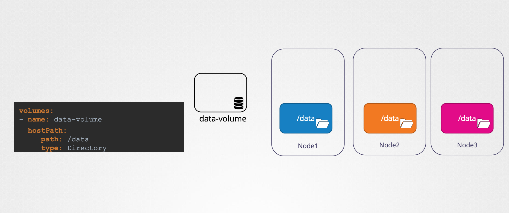
实际上因为它们在不同的服务器上,所以是不一致的。所以一般需要配置了某种外部群集存储解决方案｡

Kubernetes支持多种不同类型的存储解决方案
+ NFS
+ ClusterFS
+ Flocker
+ Ceph FS
+ AWS EBS
+ Azure
+ GCP
+ ......
例如, 将AWS EBS弹性块存储卷配置为卷的存储选项,需要将卷的主机路径字段替换为AWS弹性块存储字段以及卷ID和文件系统类型｡

```yaml
volumes:
- name: data-volume
  awsElasticBlockStore:
    volumeID: <VOLUME-ID>
    fsType: ext4
```

### 持久卷 Persistent Volume

创建卷时, 我们在Pod定义文件中配置了Volume。

但如果有一个大型kubernetes环境,有许多用户部署了许多Pod。这种做法就不合适了。用户每次都必须为每个Pod配置存储｡每次要进行更改时, 用户都必须在其所有Pod上进行更改｡

我们需要集中管理存储配置｡存储的配置方式需要让管理员创建一个大型存储池,然后让用户根据需要从中划分出部分存储｡

这就是持久卷｡持久卷是由管理员配置的群集范围的存储卷池,供在群集上部署应用程序的用户使用｡用户可以使用持久卷声明从此池中选择存储｡

先创建一个持久卷｡
`vim pv-definition.yaml`

```yaml
apiVersion: v1
kind: PersistentVolume
metadata:
  name: pv-vol1
spec: 
  accessModes:
    - ReadWriteOnce
  capacity:
    storage: 1Gi
  hostPath:
    path: /tmp/data
  persistentVolumeReclaimPolicy: Retain
```
+ API版本v1
+ 类型为持久卷
+ 在spec下, 指定存取模式｡
  + 访问模式accessModes定义了卷在主机上的挂载方式,是只读模式还是读/写模式等｡支持的值包括ReadOnlyMany､ ReadWriteOnce或ReadWriteMany模式｡
  + 容量：要为此持久卷保留的存储量。
  + hostPath：该选项使用节点本地目录中的存储｡此选项不适用于生产环境，生产环境中不应该使用本地节点存储。

accessModes定义了存储设备的访问模式，也就是虚拟盘的读写权限，类似Linux的文件访问模式：
+ ReadWriteOnce：存储卷可读可写，但只能被一个节点上的 Pod 挂载
+ ReadOnlyMany：存储卷只读不可写，可以被任意节点上的 Pod 多次挂载
+ ReadWriteMany：存储卷可读可写，也可以被任意节点上的 Pod 多次挂载。

```bash
kubectl create –f pv-definition.yaml

kubectl get persistentvolume
```

生产环境中可以使用云存储，比如awsEBS，将hostPath选项替换为AWS弹性块存储｡

```yaml
apiVersion: v1
kind: PersistentVolume
metadata:
  name: pv-vol1
spec: 
  accessModes:
    - ReadWriteOnce
  capacity:
    storage: 1Gi
  awsElasticBlockStore:
    volumeID: <VOLUME-ID>
    fsType: ext4
```

### PersistentVolumeClaim 持久卷声明 PVC 

持久卷和持久卷声明是Kubernetes命名空间中的两个独立对象｡PVC使存储可用于Ppd｡

管理员创建一组持久卷,用户创建持久卷声明以使用存储｡

创建持久卷声明后, Kubernetes将根据请求和卷上设置的属性将持久卷绑定到声明｡每个持久卷声明都绑定到一个持久卷｡
在绑定过程中, Kubernetes会尝试查找与声明所请求匹配的持久卷：
+ 足够容量的
+ 访问模式
+ 卷模式
+ StorageClass
+ ......

单个声明有多个可能得匹配项,但如果希望专门使用特定得卷, 可以使用标签与选择器绑定。如果所有其他条件都匹配,并且没有更好的选项, 则较小的声明可能绑定到较大的卷｡
声明与卷之间存在一对一关系,因此没有其他声明可以利用卷中得剩余容量.

如果没有可用的卷,则永久卷声明将保持Pending挂起状态, 直到有更新的卷可供群集使用｡一旦有更新的卷可用,声明将自动绑定到新的可用卷｡

`vim pvc-definition.yaml`
```yaml
apiVersion: v1
kind: PersistentVolumeClaim
metadata:
  name: mypvc
spec:
  accessModes:
    - ReadWriteOnce
  resources:
    requests:
      storage: 500Mi
```

+ API版本设置为V1
+ kind设置为持久卷声明PersistentVolumeClaim
+ spec下将访问模式设置ReadWriteOnce，并设置资源以请求500Mi的存储｡

```bash
kubectl create –f pvc-definition.yaml

kubectl get persistentvolumeclaim

kubectl get pvc
```

创建声明时, Kubernetes会查看之前创建的体积，访问模式匹配｡
请求的容量为500 MB, 但卷配置了1 GB的存储空间｡由于没有其他卷可用,因此将持久卷声明绑定到持久卷｡
```bash
kubectl delete persistentvolumeclaim mypvc
```

删除声明, 可以选择要对卷执行的操作｡
+ 默认情况下, 它设置为保留Retain｡持久卷将一直保留,直到管理员手动将其删除｡但它不能被任何其他声明重复使用｡
+ 可以被自动删除Delete｡一旦删除了声明,卷也将被删除｡从而释放终端存储设备上的存储空间｡
+ 第三种是Recycle｡在这种情况下, 数据卷中的数据将在可用于其他声明之前被擦除｡


在Pod中使用PVC，key指定claimName
```yaml
apiVersion: v1
kind: Pod
metadata:
  name: mypod
spec:
  containers:
    - name: myfrontend
      image: nginx
      volumeMounts:
      - mountPath: "/var/www/html"
        name: mypd
  volumes:
    - name: mypd
      persistentVolumeClaim:
        claimName: mypvc
```

### 存储类 Storage Class

StorageClass可以给存储空间分类。如果系统里的存储资源非常多，PVC去遍历查找合适的PV会比较麻烦，可以通过给PV和PVC添加storageClassName进行匹配。

但是PV和PVC依然存在一个问题：需要人工管理。

假设生产环境完全上云，每次创建PV之前, 用户都必须在云上先申请存储空间｡
每次应用程序需要存储时，要先在云平台购买存储空间,然后手动创建对应的持久卷定义文件｡这称为静态配置卷static provisioning volume｡

storage class能够在应用程序需要时自动配置卷｡

使用StorageClass, 可以定义一个配置器provisioner，用来自动在云平台上配置存储卷，并在pvc创建时将存储附加到Pod｡这就是卷动态配置Dynamic Provisioning｡

StorageClass的定义
```yaml
apiVersion: storage.k8s.io/v1
kind: StorageClass
metadata:
  name: gce-pd
provisioner: kubernetes.io/gce-pd
```
```yaml
apiVersion: storage.k8s.io/v1
kind: StorageClass
metadata:
  name: nfs-storage
provisioner: k8s-sigs.io/nfs-subdir-external-provisioner
```
+ API版本storage.k8s.io/v1
+ kind为StorageClass
+ 指定一个名称
+ provisioner取决于所使用的平台，
  + 公有云平台如谷歌云使用kubernetes.io/gce-pd
  + 自建nfs平台使用k8s-sigs.io/nfs-subdir-external-provisioner

`vim pvc-definition.yaml`
```yaml
apiVersion: v1
kind: PersistentVolumeClaim
metadata:
  name: mypvc
spec:
  accessModes:
    - ReadWriteOnce
  storageClassName: gce-pd
  resources:
    requests:
      storage: 500Mi
```

之前，我们有使用PVC进行pod存储, PVC绑定到PV｡
有了一个StorageClass之后, 不再需要PV,因为创建StorageClass时将自动创建PV｡

在PVC定义中指定StorageClass名称｡StorageClass使用定义的配置在云平台上配置具有所需大小的新磁盘, 然后创建一个持久卷,并将PVC绑定到该卷｡
这个过程中仍然会创建一个PV｡只是不再需要手动创建PV，而是由StorageClass自动创建的｡

有些StorageClass要求传入参数，参数取决于平台配置。比如云平台会要求指定：
+ 磁盘类型：标准或SSD
+ 复制模式：无或区域性PD
+ ......

可以创建不同的StorageClass, 每个StorageClass使用不同类型的磁盘，提供不同级别的存储类型。（这就是它被称为StorageClass的原因）

## Stateful Set 有状态集

### StatefulSet

假设你有一台服务器，想要在上面部署一个数据库服务｡直接做法就是在服务器上安装启动MySQL, 并创建database和table等｡

数据库运行，其他应用程序可以将数据存入数据库防止丢失。
接下来我们需要部署一个高可用性解决方案, 因此我们部署了额外的服务器, 并在这些服务器上同样安装了MySQL｡
利用MySQL的主从备份机制，将数据库复制到新服务器中的数据库。
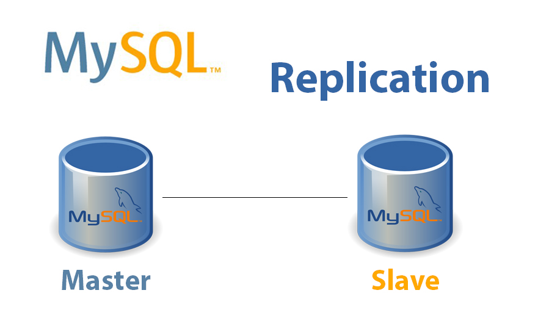
因此要分别设置主备服务器，并且有先后顺序。先部署主服务器，再部署从属数据库。
部署从属数据库后, 执行从主服务器到第一个从属数据库的数据库初始克隆｡
在初始复制之后, 启用从主节点到从属数据库连续复制,以便从属数据库的数据库始终与主节点上的数据库同步｡
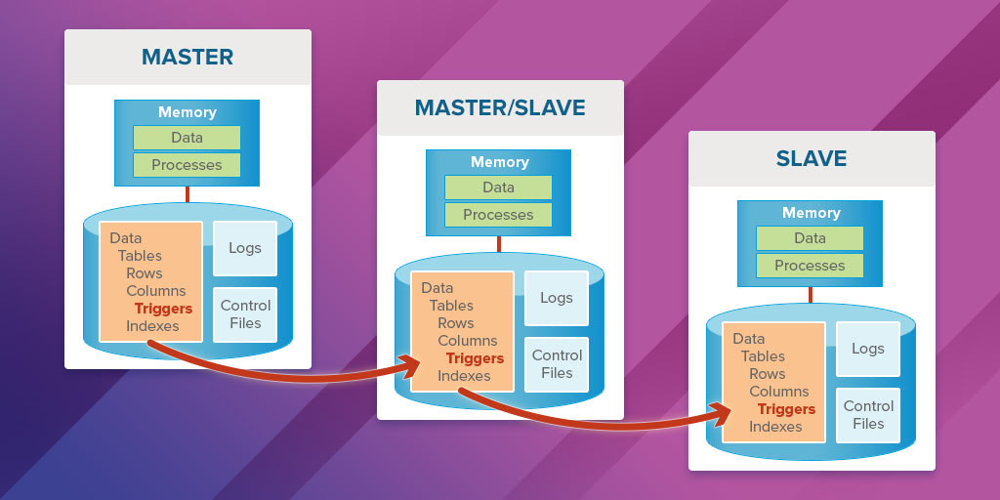
第二个从服务器采用相同的操作,但这样做都会影响主机上的资源｡
因此采用链式复制从第一个从服务器复制数据，第一个从服务器称为中继数据库。
因此, 我们等待从属数据库1准备就绪, 然后将数据从从属数据库1克隆到从属数据库2｡最后在从服务器2上启用从主服务器的连续复制｡
这种场景下，我们的初始化出现了依赖关系。

回到Kubernetes和容器的视角, 我们之前所学的方案无法实现这种关系。deployment无法保证部署的顺序。所以要使用StatefulSet。

StatefulSet类似于ReplicaSet, 基于模板创建, 可以扩容和缩小，执行滚动更新和回滚｡

区别在于，使用StatefulSet将按顺序创建Pod｡在部署第一个Pod后, 等待直到处于运行和就绪状态，才部署下一个Pod。

StatefulSet为每个pod分配一个唯一的序号索引, 该索引是一个从零开始的数字，并递增｡每个Pod都将获得一个唯一的名称, 该名称是索引与StatefulSet名称的组合｡如mysql-0，mysql-1，mysql-2...该名称是可靠的，StatefulSet为其每个Pod维护一个粘滞标识，即使主服务器发生故障并重新创建了pod, 它仍然会使用相同的名称｡


是否使用StatefulSet取决于要部署的应用程序的类型｡
程序是否需要以特定顺序出现, 需要固定的名称等｡

创建StatefulSet类似创建Deployment

`vim statefulset-def.yml`
```yaml
apiVersion: apps/v1
kind: StatefulSet
metadata:
  name: redis
  labels: 
    app: redis
spec:
  serviceName: redis-h
  selector: 
    matchLabels:
      app: redis
  replicas: 3
  template:
    metadata:
      labels: 
        app: redis
    spec:
      containers:
      - name: redis
        image: redis
```

kind为StatefulSet，两个S都是大写.
StatefulSet需要指定服务名称serviceName
```bash
kubectl create -f statefulset-def.yml

kubectl get pod -w

kubectl get sts
```
创建一个StatefulSet时, 它会一个接一个地创建pod, 这些pod按顺序有序部署｡
每个Pod都配有一条稳定､ 唯一的DNS记录, 其他应用程序可以使用该DNS记录访问Pod｡

扩容StatefulSet时, 会以有序方式进行扩展, 即每个Pod都ready, 然后才出现下一个Pod｡缩容时, 会以相反的顺序运作｡首先删除最后一个实例, 然后删除倒数第二个实例｡终止时也是，删除StatefulSet时, 将以相反的顺序删除Pod｡这是StatefulSet合的默认行为｡

该行为可以被覆盖。将Pod管理策略podManagementPolicy字段设置为parallel, stateful set将并行部署所有Pod｡
```yaml
spec:
  podManagementPolicy: Parallel
```

### Headless Service 无头服务

在Kubernetes中,将集群中的一个应用程序指向另一个应用程序的方式是通过service｡
如果有一个web服务器, 为了访问数据库服务器, 需要为数据库创建了一个服务｡服务充当负载平衡器，进入服务的流量在部署中的所有Pod之间保持平衡｡该服务有一个ClusterIP和关联的DNS名称。任何其他应用程序（例如web服务器）都可以使用此DNS名称访问数据库｡

在数据库主从备份的场景下，我们希望利用读写分离来减轻主服务器的压力。
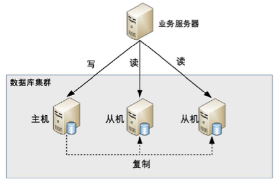

所以从web服务器发起的写请求需要直达主数据库。

如果您知道主单元的IP地址, 则可以在web服务器中配置该地址｡IP地址是动态的, 如果重新创建Pod, IP地址可能会发生变化｡Pod的DNS地址是根据其IP地址创建的,也不能用｡

我们需要一种服务, 它不会对请求进行负载平衡, 而是为我们提供一个DNS条目来访问每个pod｡这就是headless service无头服务｡

headless service的创建方式与普通Service类似, 但它没有自己的IP（如ClusterIP）, 它不执行任何负载平衡｡它所做的只是使用Pod名称和subdomain为每个Pod创建DNS条目｡
`vim headless-svc.yaml`
```yaml
apiVersion: v1
kind: Service
metadata:
  name: redis-h
spec:
  ports:
  - port: 6379
    protocol: TCP
    targetPort: 6379
  selector:
    app: redis
  clusterIP: None
```

创建一个headless service时,Service发现这些Pod是有状态应用，需要有稳定的网络标识，所以就会为Pod创建出一个新的域名，格式是`Pod名.服务名.名字空间.svc.cluster.local`。e.g.`redis-0.redis-h.default.svc.cluster.local`.这个域名也可以简写成“Pod名.服务名”。

### StatefulSet的数据持久化

假设我们希望数据库拥有主从备份和读写分离。那么StatefulSet下的每一个Pod都应该有自己单独的卷。Pod不希望共享数据, 每个Pod都需要自己的本地存储｡

每个实例都有自己的数据库, 数据库之间的数据复制是在数据库级别完成的｡
所以每个Pod都需要一个PVC｡PVC绑定到PV, 因此每个PVC都需要一个PV｡

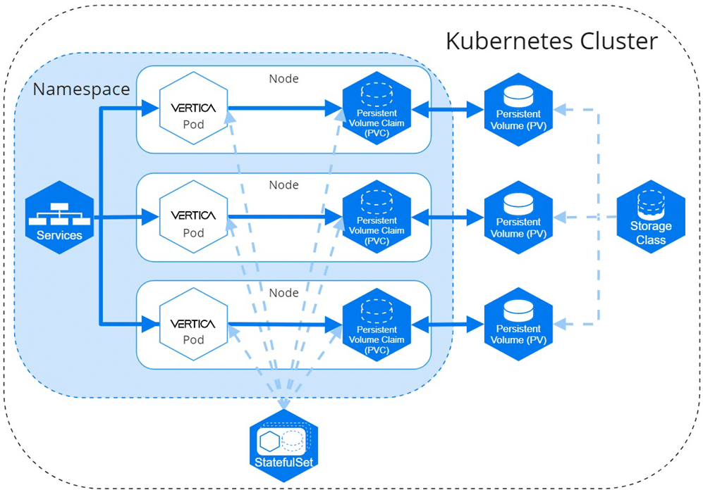
那么, 如何呢？

可以使用volumeClaimTemplates来为StatefulSet中的每个Pod自动创建PV､ PVC

`vim statefulset-def.yml`
```yaml
apiVersion: apps/v1
kind: StatefulSet
metadata:
  name: redis
  labels: 
    app: redis
spec:
  serviceName: redis-h
  selector: 
    matchLabels:
      app: redis
  replicas: 3
  template:
    metadata:
      labels: 
        app: redis
    spec:
      containers:
      - name: redis
        image: redis
        volumeMounts: 
        - mountPath: /data
          name: data-volume
  volumeClaimTemplates:
  - metadata: 
      name: data-volume 
      spec: 
        storageClassName: gce-pd
        accessModes: 
        - ReadWriteMany
        resources: 
          requests: 
            storage: 100Mi
```

如果其中一个Pod发生故障, 并在节点上重新创建或重新调度, StatefulSet不会自动删除PVC或与Pod关联的卷｡而是确保Pod重新连接到之前连接的同一条PVC｡

类似于Pod，PVC的名称也有规律,所以新的Pod还能够找到这个PVC，再次绑定使用之前存储的数据。

因此, StatefulSet可确保Pod的稳定存储｡
