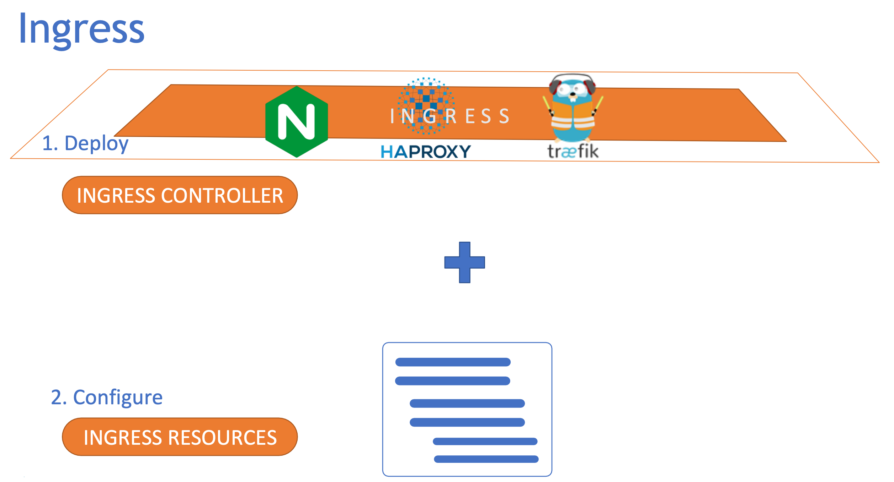

# Ingress

在Kubernetes上部署一个web应用程序｡
应用程序需要一个数据库, 因此部署了一个MySQL数据库,并创建一个名为mysql-service的ClusterIP类型的服务, 使应用程序能够访问数据库｡

外界流量访问应用程序, 我们创建了另一个NodePort服务, 使应用程序在集群中节点的38080端口上可用｡用户现在可以使用URL http://node-ip:38080 来访问应用程序｡ 我们不希望用户每次都必须键入IP地址｡因此我们加入DNS, 将DNS服务器配置为指向节点的IP｡在DNS服务器和群集之间引入一个附加层,例如代理服务器, 它将端口80上的请求代理到节点上的端口38080｡

每当流量增加时, 我们扩展Pod的副本数量以处理额外的流量,并且服务负责在Pod之间均分负载｡在公共云环境中,service可以将其设置为LoadBalancer类型,而不是创建NodePort类型的服务｡
Kubernetes向云平台发送请求, 要求为该服务配置网络负载平衡器｡收到请求后, 云平台会自动部署负载均衡器, 将流量路由到所有节点上的服务端口,并将其信息返回给Kubernetes｡负载平衡器具有外部IP, 可将其提供给用户以访问应用程序｡

我们将DNS设置为指向此IP, 用户使用URL访问应用程序｡


业务不断增长,url变得多样且复杂.每个url背后会有一个新的service，每个服务后端是一组Pod，运行独立的应用程序。每个service创建LoadBalancer类型的服务｡Kubernetes为服务提供端口,并在云中提供网络负载平衡器｡新负载平衡器具有新IP｡
因为有多个URL，所以我们还需要另一个代理或负载平衡器,根据URL将流量重定向到不同的服务｡每次引入新服务时, 都必须重新配置负载平衡器｡最后, 还需要为应用程序启用SSL,以便用户可以使用HTTPS访问应用程序｡

当应用程序扩展时，团队增多, 配置都难以管理｡每个新服务配置防火墙规则,成本也很高,因为每个服务都需要配置一个新的云原生负载平衡器｡不同级别的代理需要在不同级别进行配置。维护量很大。

Kubernetes集群可以管理所有这些内容,并将所有这些配置作为另一个Kubernetes定义文件与其余应用程序部署文件一起使用,这就是Ingress｡


Ingres帮助用户使用单个外部可访问的URL访问应用程序,同时也实现了SSL安全。我们基于URL路径将消息路由到群集内的不同服务｡

可以将Ingress视为内置于Kubernetes集群中的第7层负载平衡器,它可以使用原生Kubernetes指令进行配置｡Ingress需要对外发布为LoadBalancer或者NodePort,以便在集群外部可以访问。IngressControlloer上可以执行SSL和基于URL的路由配置的所有负载平衡｡

以前没有Ingress的场景下,我们需要使用反向代理或负载平衡解决方案,如nginx或HAProxy或Traefik｡

将它们部署在Kubernetes集群上,并将它们配置为将流量路由到其他服务，包括定义URL路由､配置SSL证书等｡
Kubernetes以类似的方式实现了Ingress｡
1. 部署一个受支持的解决方案,解决方案称为Ingress Controller｡Kubernetes集群在默认情况下没有Ingress Controller｡
2. 指定一组规则来配置Ingress,配置的规则集称为Ingress Resources.Ingress Resources是由定义文件创建｡



但是Ingress和IngressController之间存在强依赖。为了将二者解耦，kubernetes引入了IngressClass的概念，作为流量规则和控制器的中间层。我们可以通过管理 Ingress Class，来定义不同的业务逻辑分组，简化 Ingress 规则。


### 创建Ingress Resources
Ingress Resources是应用于Ingress Controller的一组规则和配置｡Ingress Resources使用Kubernetes定义文件创建｡
`vim ingress-resources.yaml`
```yaml
apiVersion: networking.k8s.io/v1
kind: Ingress
metadata:
  name: ingress-resource
  annotations:
    nginx.ingress.kubernetes.io/rewrite-target: /
    nginx.ingress.kubernetes.io/ssl-redirect: "false"
spec:
  ingressClassName: nginx-ingress-class
  rules:
  - host: "*.bar.com"
    http:
      paths:
      - path: /video
        pathType: Prefix
        backend:
          service:
            name: video-service
            port: 
             number: 8080
      - path: /
        pathType: Exact
        backend:
          service:
            name: homepage
            port:
              number: 8080
```

host 和 http path，path指定了路径的匹配方式，可以是精确匹配（Exact）或者是前缀匹配（Prefix）。再用 backend 来指定转发的目标 Service 对象。

IngressClassName帮助将Ingress 和 Ingress Controller相互匹配。
`vim nginx-ingress-class.yaml`
```yaml
apiVersion: networking.k8s.io/v1
kind: IngressClass
metadata:
  name: nginx-ingress-class
spec:
  controller: nginx-ingress-controller
```

### 部署Ingress Controller

有许多解决方案可用于Ingress,Nginx是社区使用最广泛的项目。Ingress Controller内置了额外的特性, 可以监控Kubernetes集群中的新定义的Ingress Resources,并相应地配置nginx服务器｡负载平衡器只是其中的一部分功能｡

nginx配置选项包括存储日志的路径､ keepalive阈值､ SSL设置､会话超时等｡创建一个ConfigMap对象将配置数据从nginxController镜像中分离出来,目前我们先创建一个空的configmap

`vim nginx-configmap.yaml`
```yaml
kind: ConfigMap 
apiVersion: v1 
metadata:
  name: nginx-configuration
```

nginx Controller作为Kubernetes中的一个deployment进行部署｡（Ingress Controller不是api对象，而是一个承担流量的程序，因此由Pod管理，通常由deployment或者deamonset来部署）

`vim nginx-ingress-controller-deploy.yaml`
```yaml
apiVersion: apps/v1
kind: Deployment
metadata:
  name: nginx-ingress-controller
spec:
  replicas: 1
  selector: 
    matchLabels:
      name: nginx-ingress
  template: 
    metadata:
      labels:
        name: nginx-ingress
  spec:
    containers:
    - name: nginx-ingress-controller
      image: quay.io/kubernetes-ingress-controller/nginx-ingress-controller:0.21.0
  args:
    - /nginx-ingress-controller
    - --configmap=$(POD_NAMESPACE)/nginx-configuration
  env:
    - name: POD_NAME
      valueFrom:
        fieldRef:
          fieldPath: metadata.name
    - name: POD_NAMESPACE
      valueFrom: 
        fieldRef:
          fieldPath: metadata.namespace
  ports:
  - name: http
    containerPort: 80
  - name: https
    containerPort: 443
```

使用一个包含一个Pod的deployment，将它命名为nginx-ingress。
使用nginx-ingress-controller镜像，这是nginx的一个特殊构建版本, 专门用作Kubernetes中的Ingress Controller,因此它接受特定参数｡在镜像中, nginx程序在位置/nginx-ingress-controller,作为命令传递以启动nginxController服务｡传入两个环境变量,Pod的名称和部署到的namespace｡ nginx服务需要这些来从Pod中读取配置数据｡指定Ingress Controller使用的端口80和443｡

创建一个service来向外部发布Ingress Controller。创建一个NodePort类型的service,并使用nginx-Ingress标签选择器将service链接到deployment｡

`vim ingress-service.yaml`
```yaml
apiVersion: v1 
kind: Service 
metadata:
  name: nginx-ingress
spec:
  type: NodePort
  ports:
  - port: 80
    targetPort: 80 
    protocol: TCP 
    name: http
  - port: 443
    targetPort: 443 
    protocol: TCP 
    name: https
  selector:
    name: nginx-ingress
```

Ingress Controller内置了额外的功能,可以监控Kubernetes集群的Ingress Resources,并在发生更改时配置底层nginx服务器｡所以Ingress Controller需要一个具有正确权限集的ServiceAccount｡
`vim serviceaccount.yaml`
```yaml
apiVersion: v1 
kind: ServiceAccount 
metadata:
  name: nginx-ingress-serviceaccount
```

完整部署Ingress的流程相对繁琐，并且一部分操作并不在CKAD (Certified Kubernetes Application Developer)认证考试的范围之内，对于开发人员只需了解大概知道，不需要深究。
```bash
kubectl create namespace ingress-nginx
# namespace/ingress-nginx created

kubectl create configmap ingress-nginx-controller --namespace ingress-nginx
# configmap/ingress-nginx-controller created

kubectl create serviceaccount ingress-nginx --namespace ingress-nginx
# serviceaccount/ingress-nginx created

kubectl create serviceaccount ingress-nginx-admission --namespace ingress-nginx
# serviceaccount/ingress-nginx-admission created

kubectl apply -f nginx-ingress-controller-deploy.yaml
```