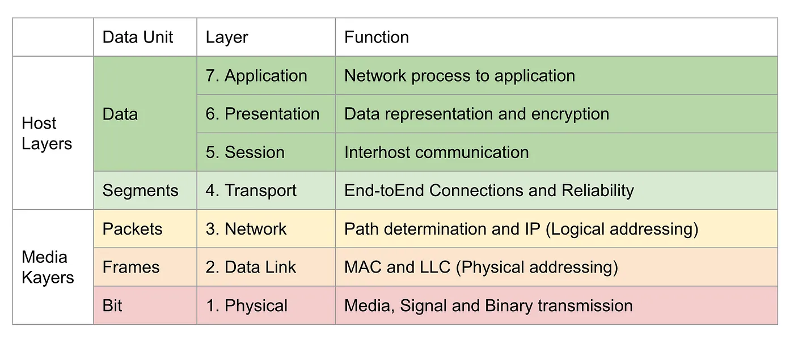

# 网络基础

## OSI

## DNS

DNS是DomainNameSystem的简称，即域名系统。

DNS主要功能是将难于记忆的IP地址转换为域名，以方便访问。DNS是互联网的最重要的服务之一。有了DNS，我们才可以通过域名方便的访问互联网。

+ A 记录或地址记录（也称为主机记录）可将域名关联到托管相应网域服务的计算机物理 IP 地址。
+ AAAA记录和A记录类似，两者都是指向IP地址，但对应的IP版本不同。A记录指向IPv4地址;AAAA记录指向IPv6地址;AAAA记录是A记录的升级版本。
+ CNAME记录（即规范名称记录）将一个别名关联到另一个真正的或规范的域名。例如，www.example.com可能会关联到example.com。

### A记录与CNAME记录的关系
A记录是把域名解析到IP地址，而CNAME记录是把域名解析到另外一个域名，而这个域名最终会指向A记录，在功能实现在上A记录与CNAME记录没有区别。

CNAME记录在做IP地址变更时比A记录方便。CNAME记录允许将多个名字映射到同一台计算机，当有多个域名需要指向同一服务器IP，此时可以将一个域名做A记录指向服务器IP，然后将其他的域名做别名(即：CNAME)到A记录的域名上。当服务器IP地址变更时，只需要更改A记录的那个域名到新IP上，其它做别名的域名会自动更改到新的IP地址上，而不必对每个域名做更改。

