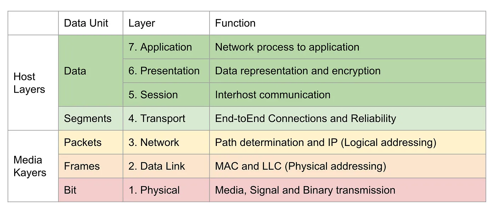
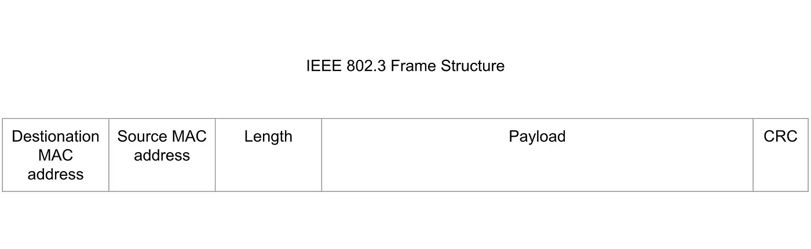
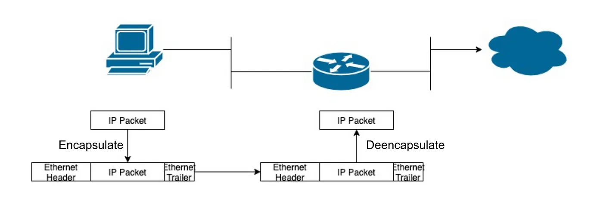
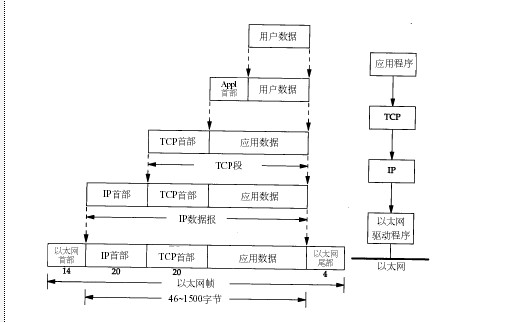
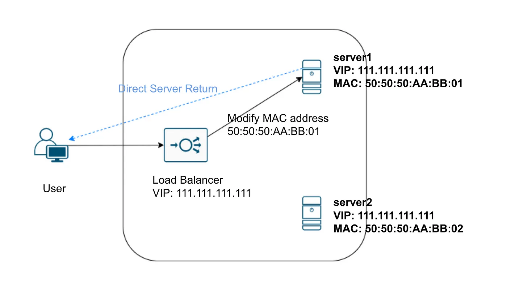
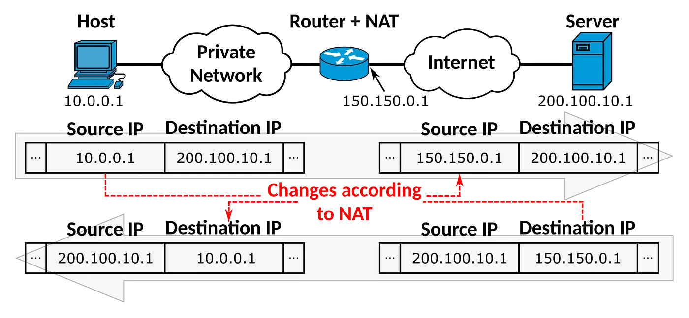
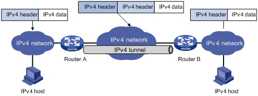
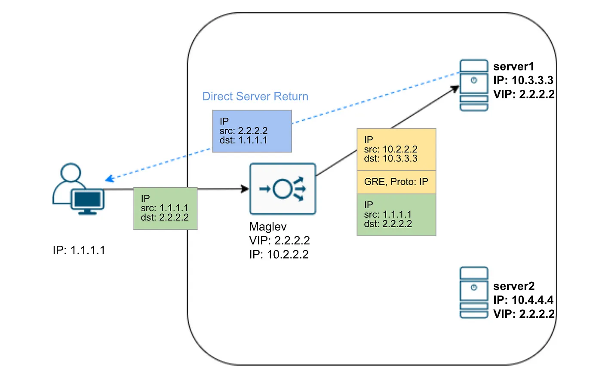
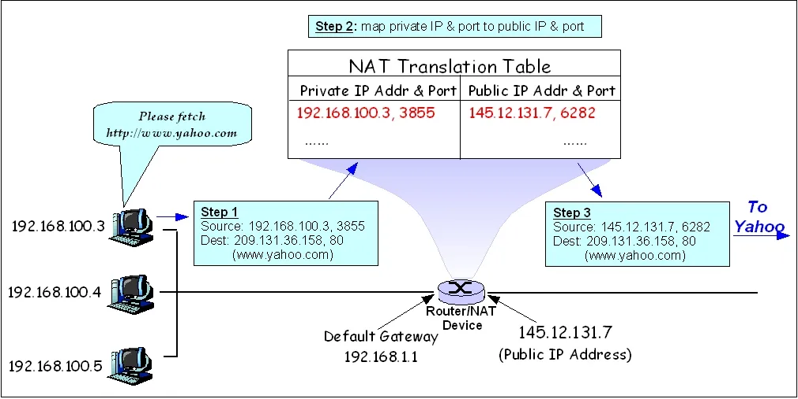

# 负载均衡

https://medium.com/google-cloud/understand-cloud-load-balancer-like-a-senior-engineer-d4f55f3111fc

负载均衡本来是个硬件设备。其实一开始确实是的，然而现在已经不同了。

尤其是云厂商提供的负载均衡方案几乎全部是靠软件。现在的负载均衡不仅是网络流量复杂均衡，几乎所有的平衡多个计算资源负载的方案都可以叫做负载均衡。

## 现代云负载均衡

在云计算背景下，负载均衡其实有一个软件实体--proxy。准确说，他们其实是不一样的，但是不能否认他们的功能其实重叠，proxy将网络转发作为主要功能。并且在所有的service mesh、cloud的资料中，这两个词指的就是同一个东西。

现代云负载均衡一般会有三个基本职责：
+ 端点发现endpoint discover -- liveness
+ 健康监测 health check  -- readiness
+ 负载均衡 load balancing

## L4/L7

其实业界的负载均衡方案，就是这两类：四层负载均衡和七层负载均衡（L4 & L7）。四层和七层指的是OSI 7层模型下的四层、七层。

### L4 load balancing

实际上四层负载均衡的意思是这种模式的负载均衡会维持同一个TCP连接，而不是说它工作在四层（大部分L4 LB还是工作在二层和三层的，有时候大家讨论的二层或者三层负载均衡其实对应的是L4负载均衡）。所以L4 load balancing有一个特点，同一个连接的流量会流向同一个后端服务器。技术上还是靠传统的二层和三层设备转发，只不过现在统一叫四层负载均衡了。

重新回顾OSI七层，
第一层是服务层，传输的是bit比特流，这一层的设备包括网卡、各种电缆光纤，设备之间需要靠交叉线进行直连通信。
第二层是数据链路层，传输的是Frame数据帧，WIFI(802.11)，Ethernet (802.3)， PPP 工作在这一层。这一层的设备一般是交换机，设备之间依靠MAC地址寻址。同一个LAN里面的设备可以相互通信。
第三层是网络层，传输的是Packets 网络包，各种路由协议工作在这一层，比如RIP，OSPF，IS-IS，BGP。这一层的设备就是我们看到的路由器了，设备之间依靠 IPv4/IPv6地址寻址。网络包可以跨越LAN子网，在整个WAN广域网上通信了（比如 internet）。
第四层叫做传输层，传输的是segments 数据段，这里主要是 TCP，UDP协议。协议里包含了主机的port端口号，如果说IP确定了互联网上主机的位置，那么port指向该主机上监听该端口的程序。

前三层叫依靠设备进行转发，从第四层开始流量就已经运行在主机上了。你可以认为前三层的流量转发不需要经过OS Kernel基本上在网卡上就转发走了；但是第四层以上是程序对程序的通信，所以会经过os kernel处理，所以这种只能叫做代理。
在包处理这个场景下，低层的性能更好，所以一般使用二三层做L4 load balancing。

### 二层负载均衡/转发
所谓的转发，其实大致上有两类：封装 & 改写。

在二层主要是改写。你要是找一个802.3的帧结构来看一下的话，大概就是这个样子

别的字段暂时不用看，需要注意的是MAC源地址和MAC目标地址。MAC地址其实是写在网卡上的，交换机会按照目标地址判断目标设备位于哪个端口，然后进行转发。那么问题来了，如果只靠交换机转发，这个网络包是不能跨越子网的。所以路由器其实会进行拆包和封包。

路由器收到网络包之后，会先拆包，移除原来的二层header（主要就是mac源地址和目标地址），然后根据路由判断next hop（下一跳）的地址，将自己的MAC地址作为新的源地址，下一跳的地址作为新的目标地址，重新封包一个新的二层header。二层负载均衡基本上也是这么做的，通过改写二层header进行转发。

第二层负载平衡器以同样的方式工作。例如，谷歌使用Netscalers作为第二层负载平衡器，后来被Maglev取代。一个虚拟IP地址（VIP）将被赋予所有真正的服务器以及负载平衡器。当用户向VIP发送请求时，它首先击中二层负载均衡器，后者确定将请求转发到哪个真实服务器，并修改数据帧中的目标MAC地址。

由于第二层负载均衡器在转发过程中只改变了帧的目的MAC地址，不涉及上层协议（不修改Payload的内容），所以在上层（第三层）看来，所有数据都没有变化。

由于请求包的目的IP与服务器IP相匹配，服务器可以直接传输响应，而不需要再次经过负载均衡器。这就是所谓的L2 DSR（第二层直接服务器返回）。

### 三层负载均衡/转发

三层的功能就比较齐全了，网络地址转换（NAT）和IP封装是两种最常见的形式。

家庭路由器每天都在使用网络地址转换（NAT），将私有IP地址转换为公共IP地址。同样，第三层负载平衡器也可以重写IP头，修改源和目的IP地址，并将流量重定向到适当的后端服务器。其代价是负载平衡器本身必须处理所有的流量，导致性能瓶颈。

另一个选择是IP封装。它将现有的IP头和有效载荷作为一个完整的有效载荷，然后添加一个新的IP头。

这种叫做 IP Tunnel 隧道模式。简单说就是将已有ip header + payload 看作一个整体，当成一个完整的payload，进入隧道之前加上一层新的header，在新的header中写入隧道另一端的ip地址，然后发送出去。隧道另一端的路由器会根据配置解除外层的header，还原网络包。VPN里面的tunnel模式用的就是这种方法。

根据Google Maglev的论文（发表于2016年），每个后端服务器将有一个或多个虚拟IP地址（VIP）。当Maglev得到一个数据包到VIP时，它会选择一个与该VIP相关的服务端点，并使用通用路由封装（GRE）对数据包进行封装，加入一个目的地为该端点的外部IP头。后端服务器将解封装并消费客户的请求包，然后发回响应。谷歌在第3层也使用DSR。因此，响应数据包将有服务器的VIP作为源地址，用户的IP作为目的地址。

DSR负载均衡器只处理入站流量。当你在google.com上搜索东西时，你的请求也许只需要几KB，但响应可能需要几百甚至几千KB，特别是如果结果中有一些图表的话。使用DSR，我们可以节省99%的负载平衡带宽。

### 四层负载均衡/转发

说到四层负载均衡就比较复杂了。理论上四层应该是经过OS Kernel来完成的，因为四层已经是程序和程序之间通信，只能做代理。但是实际上四层的负载均衡是做在三层的路由器上的。这就是理论和实际的差异了.

事实上，这个场景还挺常见，家用路由器上就有。三层上我们说了NAT转换会将私网地址转换成公网地址。比如你在家里有多台设备，但是只有一个对外的公网地址，那这么多设备怎么同时上网呢？或者说多个私网地址怎么映射到一个公网地址？
其实路由器上的NAT模式真正起的是NAPT，它会将来自不同设备的请求映射到同一个公网IP的不同端口。可用的端口号是从0-65535，大部分家用场景完全够用了。

但是改写端口这个事情，这可不归网络层管了。如果你还记得本文最开头关于OSI 7层模型那一段，你会发现端口号并不包含在IP协议里，而是在传输层TCP/UDP协议里。虽然设备还是三层设备，但是做的是四层端口的改写。

### L7 load balancing

四层负载均衡的主要工作原理是转发TCP流量，客户端和服务器之间维持着同一条TCP通道。7层负载均衡的工作方式是代理，客户端会和负载均衡之间建立一条链接，负载均衡器和服务器之间会保持另一条链接。你可以认为7层负载均衡是客户端和真实服务器之间的一个额外的服务器，它会接受来自客户端的请求根据请求的内容进行初步判断，然后再将请求转发给真实服务器。所以一般l7 负载均衡也有反向代理的功能。

举个例子，有些场景是四层负载均衡无法做到，需要依靠7层负载均衡。四层负载均衡只能将流量转发到某一台主机，7层负载均衡可以将流量转达某一类服务。

比如云端用户可以利用负载均衡对已有的服务进行微服务拆分，这时候就可以通过7层负载均衡按照访问路径对流量重新定向到新的微服务，来取代旧的服务。

总的来说，七层（应用层）负载均衡可以感知应用层的内容，提供更复杂的功能，代价是效率会比较低（至少要多进行一轮三次握手）。在微服务架构下，大多数链路治理的工作都是通过7层负载均衡器完成的。