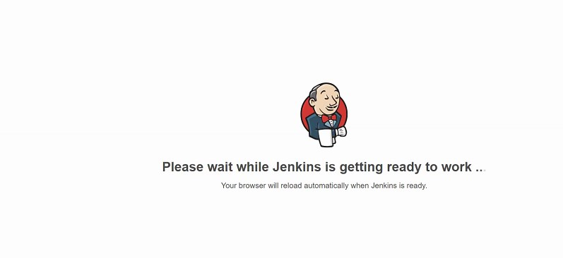
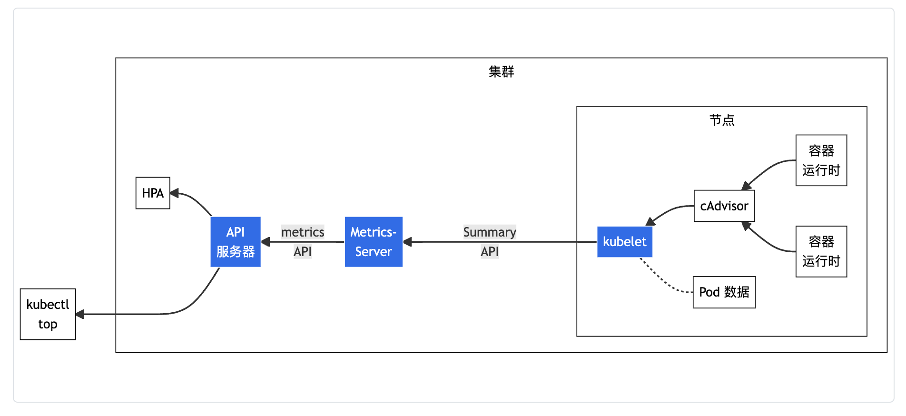

# 可观测性

## readinessProbe 就绪探针

Pod生命周期有几个不同阶段,Pod会有不同的状态。

刚创建Pod时,Pod处于Pending状态｡调度程序会尝试找出放置Pod的位置｡如果调度程序找不到要放置Pod的节点,它将保持Pending状态｡
运行kubectl describe pod命令可以显示停留在Pending状态的原因

一旦放置了Pod,它将进入ContainerCreating容器创建状态。在该状态下,应用程序所需的镜像将被拉入,容器启动｡

一旦pod中的所有container都启动,它就会进入Running运行状态, 并一直处于运行状态,直到程序成功完成或终止｡
kubectl get pods命令的输出中可以看到pod状态｡

在任何时间点,Pod状态只能是这些值之一, 并且只能为我们提供Pod的高级摘要｡

但是有时可能需要其他更详细信息｡我们就要参考Conditions complement Pod status 条件补充状态。它是一个true或false的数组,告诉我们pod的状态｡
1. 在节点上调度pod时, PodScheduled条件将设置为true｡
2. 初始化Pod时, Initialized设置为true｡
3. 一个Pod有多个容器，当pod中的所有容器准备就绪时,ContainersReady条件将设置为true｡
4. Pod本身准备好了，Ready条件将设置为true｡

运行kubectl describe pod命令，从Conditions部分可以查看pod条件状态

Ready状态表示Pod内的应用程序正在运行,并准备好接受用户流量｡

容器本身可以承担运行不同种类的应用程序｡
+ 简单脚本，脚本可能需要几毫秒的时间
+ 数据库服务，数据库服务可能需要几秒钟的时间才能启动
+ 提供服务的大型Web服务器，某些Web服务器可能需要几分钟



之前课程中我们用docker运行Jenkins服务器的实例,服务器初始化大约需要10到15秒，然后用户才能访问Web UI｡
即使在初始化Web UI之后,服务器也需要几秒钟的时间来预热，之后才能为用户提供服务｡
在等待期间, 查看Pod的状态,它会继续指示Pod已Ready, 但这并不反应真实状态｡

应用程序状态和kubernetes报告状态不一致，会导致用户体验到服务中断。
假设这样一个场景, 我们创建了一个Pod, 并使用Service将其暴露给外部用户｡
Service将立即将流量路由到Pod｡Service依赖于Pod的Ready状态来路由流量｡默认情况下, Kubernetes假设容器一旦创建,就可以为用户流量提供服务｡因此, 它将每个容器的Ready条件后的值设置为true｡
但是Service不会意识到这一点, service会在在容器已经处于Ready状态时发送流量, 从而导致用户访问尚未运行实时应用程序的pod｡

所以我们需要的是一种将Ready条件与容器内应用程序的实际状态联系起来的方法｡

作为应用程序的开发人员,应该自己定义容器中的应用程序是否已实际Ready｡
实现这一点的方式就是设置不同类型的测试test或者探针probe｡

+ 对于Web应用程序,可以运行HTTP测试来查看API是否响应
+ 对于数据库,可以测试特定的TCP套接字是否正在侦听端口
+ 对于脚本,可以执行自定义的指令

配置探针probe可以在pod定义文件中, 添加一个名为readinessProbe的新字段
`vim webapp.yml`
```yaml
apiVersion: v1
kind: Pod
metadata:
  name: webapp
spec:
  containers:
  - name: webapp
    image: webapp
    ports:
    - containerPort: 8080
    readinessProbe:
      httpGet:
        path: /api/ready
        port: 8080
```
这里使用httpGet选项，指定端口和API Path｡

这样一来，创建容器后, Kubernetes不会立即将容器上的Ready条件设置为true｡它会先执行测试以查看API是否作出响应｡API正确响应之前，Service不会将任何流量转发到Pod,因为它认为Pod未Ready｡

配置Probe的方法有多种：
+ 对于HTTP, 使用httpGet选项指定端口和API Path
+ 对于TCP, 使用tcpSocket套接字选项和端口
```yaml
readinessProbe:
  tcpSocket:
    port: 3306
```
+ 对于命令行,exec和command选项
```yaml
readinessProbe:
  exec:
    command:
    - cat
    - /app/is_ready
```
一些额外参数：
+ 知道应用程序至少需要10秒的预热时间,则可以为探头添加额外的延迟initialDelaySeconds｡
+ 要指定探测的频率, 可以使用periodSeconds选项｡
+ failureThreshold失败阈值选项，默认情况下, 如果应用程序在三次尝试后仍未Ready,则探测器将停止｡可以覆盖失败阈值选项failureThreshold。
+ successThreshold，连续几次探测成功才认为是正常，对于 startupProbe 和 livenessProbe 来说它只能是 1。
+ timeoutSeconds，探测动作的超时时间，如果超时就认为探测失败，默认是 1 秒。
```yaml
readinessProbe:
  httpGet:
    path: /api/ready
    port: 8080
  initialDelaySeconds: 10
  periodSeconds: 5
  failureThreshold: 8
```

假设有一个ReplicaSet或Deployment, 其中包含多个Pod和一个Service,Service为所有Pod提供流量｡
假设现在有两个Pod已经在为用户提供服务｡
我们要添加一个额外的pod,但pod需要一分钟预热, 如果没有正确配置Ready探测器, Service将立即开始将流量路由到新pod，导致至少部分用户的服务中断｡
如果pod配置了正确的ReadyProbe探测器,Service将继续仅为旧pod提供流量,并等待新pod转为Ready｡一旦准备好, 流量也将被路由到新的pod,确保没有用户受到影响｡

## livenessProbe 活性探针
使用Docker运行nginx的镜像, 它开始为用户提供服务｡由于某种原因, web服务器崩
溃, nginx进程退出, 容器退出｡运行docker ps -a命令时, 可以看到容器的状态exited(1)｡
Docker不是一个编排引擎, 因此将继续停用状态, 并拒绝向用户提供服务,直到手动创建一个新的容器｡

Kubernetes可以编排容器，应用程序崩溃时, Kubernetes尝试重新启动容器以恢复对用户的服务｡
可以在kubectl get pod输出中看到重新启动的计数增加｡

但如果由于代码中的bug, 应用程序陷入了死循环。应用程序没有真正工作, 但容器继续保持活动状态。
从Kubernetes视角, 容器是启动的, 因此认为应用程序是启动的,但是访问容器的用户没有得到服务｡在这种情况下, 我们需要重新启动或销毁容器, 并创建一个新的容器｡所以我们需要活性探针。

在容器上配置活性探针, 以定期测试容器内的应用程序是否正常运行｡
如果探针失败, 则认为该容器不正常, 并将其销毁和重新创建｡

同样活性探针应该由开发人员定义
+ 对于web应用程序，可以查看程序是否在线启动并运行
+ 对于数据库, 可以可以测试特定的TCP套接字是否正在侦听端口, 或者可以简单地执行命令来执行测试｡


活性探针定义在Pod文件中类似readinessProbe，只不过这里使用livenessProbe
+ 对于HTTP, 使用httpGet选项指定端口和API Path
```yaml
livenessProbe:
  httpGet:
    path: /api/healthy
    port: 8080
  initialDelaySeconds: 10
  periodSeconds: 5
  failureThreshold: 8
```
+ 对于TCP, 使用tcpSocket套接字选项和端口
```yaml
livenessProbe:
  tcpSocket:
    port: 3306
```
+ 对于命令行,exec和command选项
```yaml
livenessProbe:
  exec:
    command:
    - cat
    - /app/is_healthy
```

## startupProbe 启动探针

启动探针使用频率并不高。
+ Startup启动探针，用来检查应用是否已经启动成功，适合启动很慢、有大量初始化的应用。
+ Liveness存活探针，用来检查应用是否正常运行，是否存在死循环。
+ Readiness就绪探针，用来检查应用是否可以接收流量，是否能够对外提供服务。


## 监控
观测集群不能用探针这种方式。
Kubernetes没有配备全功能的内置监控解决方案｡
然而, 有许多开源解决方案可用,例如Metrics Server､ Prometheus､ Elastic Stack｡

Heapster是为Kubernetes提供监控和分析功能的项目之一｡Heapster现在被弃用, 并形成了一个精简版本Metrics Server｡

Kubernetes提供了类似linux top的命令，就是 kubectl top。默认情况下这个命令不会生效，必须要安装一个插件Metrics Server才可以。

Kubernetes集群可以部署一个Metrics Server服务器，从每个Kubernetes Node和Pod中发布指标,并聚合存储在内存中｡

Metrics Server 是一个专门用来收集 Kubernetes 核心资源指标（metrics）的工具，它定时从所有节点的 kubelet 里采集信息，但是对集群的整体性能影响极小，每个节点只大约会占用 1m 的 CPU 和 2MB 的内存。

Metrics Server只是一个内存监控解决方案,并不将指标存储在磁盘上｡因此, 无法查看历史性能数据｡

Kubernetes在每个节点上运行一个称为Kubelet的代理，负责接收来自Kubernetes API-Server的指令并在节点上运行Pod｡
Kubelet还包含一个称为cAdvisor容器顾问的子组件｡cAdvisor负责从Pod提取性能指标,并通过Kubelet API发布这些指标, Metrics Server可以使用这些指标｡



图中从右到左的架构组件包括以下内容：
+ cAdvisor: 用于收集、聚合和发布Kubelet中包含的容器指标的守护程序。
+ kubelet: 用于管理容器资源的节点代理。可以使用/metrics/resource和/stats kubelet API 端点访问资源指标。
+ Summary API: kubelet提供的API，用于发现和检索可通过/stats端点获得的每个节点的汇总统计信息。
+ metrics-server: 集群插件组件，用于收集和聚合从每个 kubelet 中提取的资源指标。
+ Metrics API: Kubernetes API 支持访问用于工作负载自动缩放的 CPU 和内存。 要在你的集群中进行这项工作，你需要一个提供 Metrics API 的 API 扩展服务器。


Minikube可以使用来部署Metrics Server
```bash
minikube addons enable metrics-server
```
集群环境可以使用kubectl部署
```bash
wget https://github.com/kubernetes-sigs/metrics-server/releases/latest/download/components.yaml

kubectl apply -f components.yaml
```

部署完成后, 需要给Metrics Server一些时间来收集和处理数据｡
```bash
ubectl top node
# NAME           CPU(cores)   CPU%   MEMORY(bytes)   MEMORY%   
# controlplane   232m         0%     1143Mi          0%        
# node01         106m         0%     289Mi           0%     

kubectl top pod
# NAME       CPU(cores)   MEMORY(bytes)   
# podA       13m          32Mi            
# podB       1m           18Mi            
# podC       105m         252Mi           
```
查看集群性能,提供了每个节点的CPU和内存信息

## 容器日志

在docker中，我们如果直接启动docker，日志会以stream流的形式打印到控制台。
我们可以通过-d参数以detach模式运行docker。这样docker会在后台运行容器，控制台看不到日志。

想查看日志, 可以使用docker logs命令, 后跟容器ID｡
```bash
docker run nginx

docker run nginx -d

docker ps -a

docker logs -f <docker-id>
```

回到Kubernetes视角，我们使用pod yaml文件创建一个具有相同Docker镜像的pod｡
pod开始运行, 可以使用kubectl logs命令和pod名称查看日志，使用-f选项实时传输日志, 就像Docker一样｡
```bash
kubectl run nginx --image nginx

kubectl logs -f nginx
```
Kubernetes以Pod为单位运行容器，但是Kubernetes pod中可以有多个Docker容器｡

我们可以修改pod定义文件, 添加一个容器｡
现在一个pod中有多个容器，使用pod名称运行kubectl logs命令, 必须在命令中显式指定容器的名称｡
`vim webapp.yml`
```yaml
apiVersion: v1
kind: Pod
metadata:
  name: webapp
spec:
  containers:
  - name: nginx
    image: nginx
  - name: redis
    image: redis
```
```bash
kubectl logs -f webapp redis

kubectl logs -f webapp nginx
```
