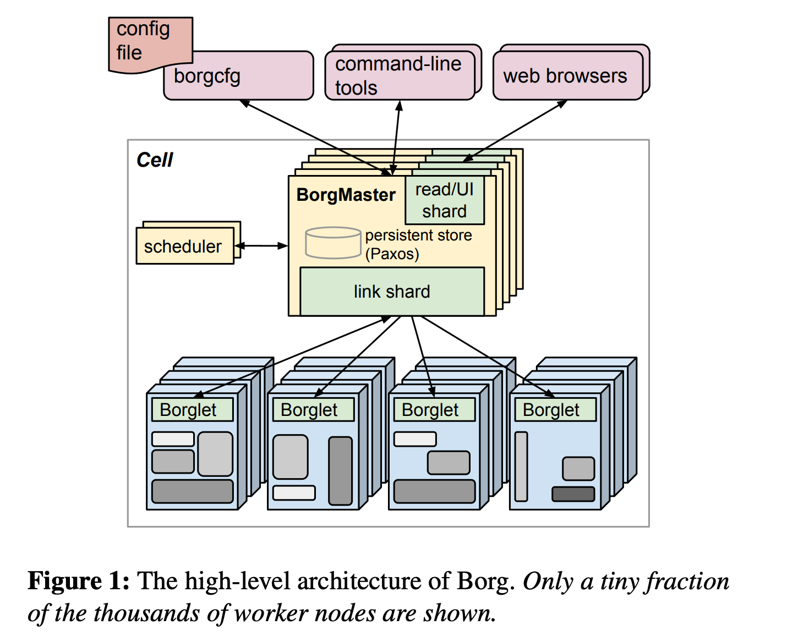

# kubernetes集群管理

## Google Borg


2015年4月，Google发布了Borg论文。Borg是谷歌开发的一个大规模集群管理系统，用于管理Google的计算资源。Borg旨在处理谷歌生产工作负载的规模和复杂性，并提供了一个统一的方式来管理多个集群，每个集群可以包含数百到数千台机器。Borg承载了Google整个基础设施的核心调度，是kubernetes的前身。

高拓展性：
+ 处理大量的机器和作业，使其适用于大规模的生产工作负载。
+ 调度策略灵活

高可用
+ 应用高可用，故障恢复时间短。
+ Borg通过自动重启失败的任务和将任务分散到多台机器上以减少停机的风险

资源分配
+ 资源利用率高，进程级别隔离
+ Borg提供了一个统一的方式来分配资源（完备的任务描述语言），如CPU、内存和磁盘，使其更容易管理多个集群
+ 提供了服务发现，实时状态监控和诊断工具

### Borg架构

1. BorgMaster
+ 处理客户端RPC请求，比如创建Job，查询Job
+ 维护系统组件和服务的状态，比如Node, Job, Task
+ 负责与Borglet通信

2. Borglet
+ Borglet是部署在所有服务器上的代理，负责接收BorgMaster的指令

3. Scheduler服务
+ 调度策略
+ 调度优化



+ Jobs：Jobs是任务的集合，它们作为一个单元一起运行。用户以 Job 的形式提交应用部署请求。一个Job包含一个或多个相同的Task，每个 Task运行相同的应用程序，Task数量就是应用的副本数。
+ Tasks：最小工作单元。它们可以是长时间运行的任务或短暂的任务。
+ Cell: 一个Borg的集群被称之为一个Cell，通常被部署在一个数据中心里。一个中等规模的Cell通常有数万台机器。（一个数据中心的服务器，往往是分多个批次采购的，也就意味着服务器的配置，比如 CPU、内存、硬盘等等各不相同的）。每个Cell的Borg独立部署，避免不同Borg系统相互影响
+ 调度：
  + 每个Job可以定义属性、元信息和优先级，优先级涉及到抢占式调度过程。监控Monitoring > 生产Production > 批处理Batch > 尽力Best Effort，同一优先级下，根据priority参数来区分优先级。Task会继承Job的优先级属性。
  + 通过将在线任务和离线任务混合部署，空闲时，离线任务可以充分利用计算资源；繁忙时，在线任务通过抢占的方式保证优先得到执行，合理地利用资源。
  + alloc的机制：alloc是一组可以预留的资源，防止任务始终被抢占资源。
+ User Interface:
  + Web UI: Sigma, 快速定位job、task信息，获取监控指标和运行日志
  + 命令行
  + 配置文件
+ Master集群：Borg系统的中心控制点。它负责调度任务、监测集群的状态并决策资源分配
  + 通过Paxos协议来维护多个同步复制的副本的。
  + 通过Checkpoint来建立快照
  + 通过Chubby选举master
  + 日志记录所有的操作，便于回滚
+ Scheduler服务器：提交Job后，Master会把job映射到待调度的Tasks，然后加入队列。Scheduler遍历Tasks，Task分配到worker服务器。
+ Worker服务器：是执行由Master分配的任务的机器。服务器上运行Borglet进程。Master定期轮询Borglet获取Worker服务器的状态。Borglet负责启动和停止Task。


## kubernetes 架构


## 集群管理

出于维护目的, 如升级基于的软件或在集群上应用修补程序（如安全修补程序）等，我们有时候需要关闭集群中的节点。

假设有一个包含几个节点和Pod的集群,这些节点和Pod为应用程序提供服务｡
Kubernetes通过心跳协议监控他们的状态，如果一个节点发生故障时：
+ 如果节点立即恢复联机, 则会重启kubelet进程,并且Pod也会恢复联机｡
+ 如果节点关闭时间超过五分钟,则Pod将从该节点终止｡Kubernetes认为这个节点不可用。如果Pod是ReplicaSet的一部分,Kubernetes会在其他节点上重新创建它｡

Kubernetes等待Pod恢复联机的时间称为Pod eviction timeou逐出超时,在controller manager上设置为默认值5分钟｡当节点离线时, controlplane节点最多等待五分钟,然后才认为该节点已停机｡

当节点在pod eviction-timeout之后重新联机时,它将显示为空白, 没有任何pod调度发生在上面｡

要在节点上执行维护任务,如果知道在该节点上运行的工作负载有其他副本, 或者如果它们在短时间内停止运行是可以接受的, 并且确定该节点将在五分钟内恢复联机,则可以进行快速升级和重新启动｡

但是,如果无法确定节点是否会在五分钟内恢复联机，更安全的方法是使用drain清空节点的所有工作负荷，以便将工作负荷移动到集群中的其他节点｡

如果设置了deamonset，drain行为会被阻止，需要--ignore-daemonsets参数
```bash
kubectl drain node-1

# kubectl drain node01 --ignore-daemonsets
# node/node01 already cordoned
# Warning: ignoring DaemonSet-managed Pods: kube-flannel/kube-flannel-ds-k5gs8, kube-system/kube-proxy-xhthr
# node/node01 drained
```

严格来说,Pod没有被转移。当清空节点时, pod将从其所在的节点正常终止,并在另一个节点上重新创建｡该节点也被封锁cordon或标记为不可调度unschedulable,无法在此节点上调度任何Pod｡

重新启动节点，当节点重新联机时, 仍然无法调度｡需要手动解开uncordon,以便可以在它上面再次调度Pod｡
```bash
kubectl uncordon node-1
```
移到其他节点的pod不会自动移动回来｡只有新的Pod会被调度。

Cordon将节点标记为不可调度unschedulable｡
```bash
kubectl cordon node-1
```

与drain不同, 它不会终止或移动现有节点上的Pod，它只是确保不会在该节点上调度新的pod｡

### kubernetes 集群升级

安装Kubernetes集群时,会选择特定版本的Kubernetes｡
```bash
controlplane $ kubectl get nodes
# NAME           STATUS   ROLES           AGE     VERSION
# controlplane   Ready    control-plane   3d11h   v1.26.1
# node01         Ready    <none>          3d11h   v1.26.1
```

在本例中, 它是版本1.26.1
Kubernetes版本号由三部分组成｡第一个是主要版本, 其次是次要版本,然后是修补程序版本｡

Kubernetes遵循标准的软件发布版本控制过程｡每隔几个月, 它就会通过一个小版本推出新的特性和功能｡

除了stable稳定的Kubernetes，还存在alpha和beta版本｡所有的bug修复和改进首先进入alpha版本,标记为alpha｡在此版本中, 默认情况下禁用新功能,并且可能存在错误｡通过测试之后进入beta版，新的功能是默认启用｡最后,进入主版本｡

在Kubernetes GitHub下载的包，包含所有控制平面组件,所有这些组件都是相同版本的｡
etcd集群和CoreDNS服务器有自己的版本,因为它们是独立的项目｡

现在先不考虑etcd集群和CoreDNS服务器等外部组件的依赖性, 而重点关注核心控制平面组件｡这些组件可以是不同的发布版本。

Kube API-server是控制平面中的主要组件,并且所有其他组件都与该组件进行通信｡任何其他组件的版本都不应高于Kube API-server｡ controller manager和调度器scheduler可以是较低的一个版本,

因此如果API-server版本是x, 则controller manager和scheduler可以是x-1, 而kubelet和kube-proxy组件可以低的两个版本x-2｡

controller manager，scheduler，kubelet和kube-proxy的版本号都不能高于API-server｡ 

而kubectl却不是这样，kubectl可以比API-server高一个版本,或低一个版本｡这种允许的版本偏差允许我们进行不停机升级｡

Kubernetes最多只支持最近的三个次要版本｡当前版本为1.26时，1.25和1.24都是supported version，而1.23为unsupported。
推荐的升级方式是逐个升级1.23->1.24->1.25->1.26
升级过程取决于群集的设置方式｡如果集群是部署在云服务提供商上的托管Kubernetes集群, 只需点击几下UI即可轻松升级集群｡


升级群集包括两个主要步骤｡先升级controlplane节点, 然后升级worker节点｡
升级controlplane节点时，控制平面组件：调度程序、controller manager和API-server等短暂关闭｡
controlplane节点关闭并不意味着集群上的worker节点和应用程序会受到影响｡
controlplane节点关闭后, worker节点上托管的所有工作负载将继续正常为用户提供服务｡

但是所有管理功能都已关闭｡所以无法使用kubectl或其他Kubernetes API访问群集｡无法部署新的应用程序, 也无法删除或修改现有的应用程序｡controller manager也不起作用｡如果某个Pod出现故障, 则不会自动创建新Pod｡
但是, 只要节点和pod处于运行状态, 应用程序就应该处于运行状态, 用户就不会受到影响｡
一旦升级完成且集群恢复上线, kubernetes功能将正常工作｡现在我们有版本1.x+1的controlplane节点和版本1.x的worker节点｡ 

升级worker节点的时候了｡有不同的策略可用于升级worker节点｡

+ 一种方法是一次升级所有应用程序, 但Pod会关闭, 用户在升级期间无法访问程序｡升级完成后, 节点上线，用户恢复访问｡这是一种需要停机的策略｡

+ 第二种策略是一次升级一个节点｡回到controlplane节点已升级且worker节点等待升级的状态, 我们首先升级第一个节点, 工作负载将移动到第二个和第三个节点,用户将从二三节点获得服务｡第一个节点升级并恢复上线后, 我们将更新第二个节点, 工作负载将转移到第一个和第三个节点｡最后是第三个节点, 工作负载在前两个节点之间共享, 直到将所有节点升级到更新的版本,

+ 第三种策略是将新节点添加到具有较新软件版本的群集节点｡如果使用的是云环境, 可以轻松配置新节点和丢弃旧节点, 这一点尤其方便｡可以将具有较新软件版本的节点添加到群集中｡将工作负载移到新的节点，并删除旧节点｡直到最终所有新节点都安装了新的软件版本｡

注意remote version为v1.26.1
```bash
kubeadm upgrade plan
# [upgrade/config] Making sure the configuration is correct:
# [upgrade/config] Reading configuration from the cluster...
# [upgrade/config] FYI: You can look at this config file with 'kubectl -n kube-system get cm kubeadm-config -o yaml'
# [preflight] Running pre-flight checks.
# [upgrade] Running cluster health checks
# [upgrade] Fetching available versions to upgrade to
# [upgrade/versions] Cluster version: v1.25.0
# [upgrade/versions] kubeadm version: v1.25.0
# I0226 19:42:45.721075   21384 version.go:256] remote version is much newer: v1.26.1; falling back to: stable-1.25
# [upgrade/versions] Target version: v1.25.6
# [upgrade/versions] Latest version in the v1.25 series: v1.25.6

# Components that must be upgraded manually after you have upgraded the control plane with 'kubeadm upgrade apply':
# COMPONENT   CURRENT       TARGET
# kubelet     2 x v1.25.0   v1.25.6

# Upgrade to the latest version in the v1.25 series:

# COMPONENT                 CURRENT   TARGET
# kube-apiserver            v1.25.0   v1.25.6
# kube-controller-manager   v1.25.0   v1.25.6
# kube-scheduler            v1.25.0   v1.25.6
# kube-proxy                v1.25.0   v1.25.6
# CoreDNS                   v1.9.3    v1.9.3
# etcd                      3.5.4-0   3.5.4-0

# You can now apply the upgrade by executing the following command:

#         kubeadm upgrade apply v1.25.6

# Note: Before you can perform this upgrade, you have to update kubeadm to v1.25.6.

# _____________________________________________________________________


# The table below shows the current state of component configs as understood by this version of kubeadm.
# Configs that have a "yes" mark in the "MANUAL UPGRADE REQUIRED" column require manual config upgrade or
# resetting to kubeadm defaults before a successful upgrade can be performed. The version to manually
# upgrade to is denoted in the "PREFERRED VERSION" column.

# API GROUP                 CURRENT VERSION   PREFERRED VERSION   MANUAL UPGRADE REQUIRED
# kubeproxy.config.k8s.io   v1alpha1          v1alpha1            no
# kubelet.config.k8s.io     v1beta1           v1beta1             no
# _____________________________________________________________________
```
kubeadm upgrade plan命令提供很多有用的信息｡
目前的集群版本､ kubeadm Tool版本､ Kubernetes的最新稳定版本｡
列出所有控制平面组件及其版本, 以及这些组件可以升级到的版本｡
在我们升级控制平面组件后, 必须手动升级每个节点上的kubelet版本｡

```bash
kubectl drain controlplane --ignore-daemonsets
# node/controlplane already cordoned
# Warning: ignoring DaemonSet-managed Pods: kube-flannel/kube-flannel-ds-hpghx, kube-system/kube-proxy-hmvww
# evicting pod kube-system/coredns-565d847f94-bdp8n
# evicting pod default/blue-5db6db69f7-wjdkb
# evicting pod default/blue-5db6db69f7-47glf
# evicting pod kube-system/coredns-565d847f94-5dr2r
# pod/blue-5db6db69f7-47glf evicted
# pod/blue-5db6db69f7-wjdkb evicted
# pod/coredns-565d847f94-bdp8n evicted
# pod/coredns-565d847f94-5dr2r evicted
# node/controlplane drained
VERSION=1.26.0-00
apt upgrade
apt-get install kubeadm=$VERSION
# Reading package lists... Done
# Building dependency tree       
# Reading state information... Done
# The following packages will be DOWNGRADED:
#   kubeadm
# 0 upgraded, 0 newly installed, 1 downgraded, 0 to remove and 1 not upgraded.
# Need to get 9,730 kB of archives.
# After this operation, 0 B of additional disk space will be used.
# Do you want to continue? [Y/n] Y
# Get:1 https://packages.cloud.google.com/apt kubernetes-xenial/main amd64 kubeadm amd64 1.26.0-00 [9,730 kB]
# Fetched 9,730 kB in 0s (48.8 MB/s)
# debconf: delaying package configuration, since apt-utils is not installed
# dpkg: warning: downgrading kubeadm from 1.26.1-00 to 1.26.0-00
# (Reading database ... 18567 files and directories currently installed.)
# Preparing to unpack .../kubeadm_1.26.0-00_amd64.deb ...
# Unpacking kubeadm (1.26.0-00) over (1.26.1-00) ...
# Setting up kubeadm (1.26.0-00) ...
kubeadm upgrade apply v1.26.0
# [upgrade/config] Making sure the configuration is correct:
# [upgrade/config] Reading configuration from the cluster...
# [upgrade/config] FYI: You can look at this config file with 'kubectl -n kube-system get cm kubeadm-config -o yaml'
# W0226 19:51:09.490787   32880 configset.go:177] error unmarshaling configuration schema.GroupVersionKind{Group:"kubeproxy.config.k8s.io", Version:"v1alpha1", Kind:"KubeProxyConfiguration"}: strict decoding error: unknown field "udpIdleTimeout"
# [preflight] Running pre-flight checks.
# [upgrade] Running cluster health checks
# [upgrade/version] You have chosen to change the cluster version to "v1.26.0"
# [upgrade/versions] Cluster version: v1.25.0
# [upgrade/versions] kubeadm version: v1.26.0
# [upgrade] Are you sure you want to proceed? [y/N]: Y
# [upgrade/prepull] Pulling images required for setting up a Kubernetes cluster
# [upgrade/prepull] This might take a minute or two, depending on the speed of your internet connection
# [upgrade/prepull] You can also perform this action in beforehand using 'kubeadm config images pull'
# [upgrade/apply] Upgrading your Static Pod-hosted control plane to version "v1.26.0" (timeout: 5m0s)...
# [upgrade/etcd] Upgrading to TLS for etcd
# [upgrade/staticpods] Preparing for "etcd" upgrade
# [upgrade/staticpods] Renewing etcd-server certificate
# [upgrade/staticpods] Renewing etcd-peer certificate
# [upgrade/staticpods] Renewing etcd-healthcheck-client certificate
# [upgrade/staticpods] Moved new manifest to "/etc/kubernetes/manifests/etcd.yaml" and backed up old manifest to "/etc/kubernetes/tmp/kubeadm-backup-manifests-2023-02-26-19-51-40/etcd.yaml"
# [upgrade/staticpods] Waiting for the kubelet to restart the component
# [upgrade/staticpods] This might take a minute or longer depending on the component/version gap (timeout 5m0s)
# [apiclient] Found 1 Pods for label selector component=etcd
# [upgrade/staticpods] Component "etcd" upgraded successfully!
# [upgrade/etcd] Waiting for etcd to become available
# [upgrade/staticpods] Writing new Static Pod manifests to "/etc/kubernetes/tmp/kubeadm-upgraded-manifests4108895689"
# [upgrade/staticpods] Preparing for "kube-apiserver" upgrade
# [upgrade/staticpods] Renewing apiserver certificate
# [upgrade/staticpods] Renewing apiserver-kubelet-client certificate
# [upgrade/staticpods] Renewing front-proxy-client certificate
# [upgrade/staticpods] Renewing apiserver-etcd-client certificate
# [upgrade/staticpods] Moved new manifest to "/etc/kubernetes/manifests/kube-apiserver.yaml" and backed up old manifest to "/etc/kubernetes/tmp/kubeadm-backup-manifests-2023-02-26-19-51-40/kube-apiserver.yaml"
# [upgrade/staticpods] Waiting for the kubelet to restart the component
# [upgrade/staticpods] This might take a minute or longer depending on the component/version gap (timeout 5m0s)
# [apiclient] Found 1 Pods for label selector component=kube-apiserver
# [upgrade/staticpods] Component "kube-apiserver" upgraded successfully!
# [upgrade/staticpods] Preparing for "kube-controller-manager" upgrade
# [upgrade/staticpods] Renewing controller-manager.conf certificate
# [upgrade/staticpods] Moved new manifest to "/etc/kubernetes/manifests/kube-controller-manager.yaml" and backed up old manifest to "/etc/kubernetes/tmp/kubeadm-backup-manifests-2023-02-26-19-51-40/kube-controller-manager.yaml"
# [upgrade/staticpods] Waiting for the kubelet to restart the component
# [upgrade/staticpods] This might take a minute or longer depending on the component/version gap (timeout 5m0s)
# [apiclient] Found 1 Pods for label selector component=kube-controller-manager
# [upgrade/staticpods] Component "kube-controller-manager" upgraded successfully!
# [upgrade/staticpods] Preparing for "kube-scheduler" upgrade
# [upgrade/staticpods] Renewing scheduler.conf certificate
# [upgrade/staticpods] Moved new manifest to "/etc/kubernetes/manifests/kube-scheduler.yaml" and backed up old manifest to "/etc/kubernetes/tmp/kubeadm-backup-manifests-2023-02-26-19-51-40/kube-scheduler.yaml"
# [upgrade/staticpods] Waiting for the kubelet to restart the component
# [upgrade/staticpods] This might take a minute or longer depending on the component/version gap (timeout 5m0s)
# [apiclient] Found 1 Pods for label selector component=kube-scheduler
# [upgrade/staticpods] Component "kube-scheduler" upgraded successfully!
# [upload-config] Storing the configuration used in ConfigMap "kubeadm-config" in the "kube-system" Namespace
# [kubelet] Creating a ConfigMap "kubelet-config" in namespace kube-system with the configuration for the kubelets in the cluster
# [kubelet-start] Writing kubelet configuration to file "/var/lib/kubelet/config.yaml"
# [bootstrap-token] Configured RBAC rules to allow Node Bootstrap tokens to get nodes
# [bootstrap-token] Configured RBAC rules to allow Node Bootstrap tokens to post CSRs in order for nodes to get long term certificate credentials
# [bootstrap-token] Configured RBAC rules to allow the csrapprover controller automatically approve CSRs from a Node Bootstrap Token
# [bootstrap-token] Configured RBAC rules to allow certificate rotation for all node client certificates in the cluster
# [addons] Applied essential addon: CoreDNS
# [addons] Applied essential addon: kube-proxy

# [upgrade/successful] SUCCESS! Your cluster was upgraded to "v1.26.0". Enjoy!

# [upgrade/kubelet] Now that your control plane is upgraded, please proceed with upgrading your kubelets if you haven't already done so.
```

必须先升级kubeadm tool本身, 然后才能升级群集｡
kubeadm tool也采用了与Kubernetes相同的软件版本｡
执行`kubeadm upgrade apply v1.26.0`，kubeadm会提取必要的镜像并升级群集组件｡

下一步是升级kubectl｡
```bash
apt-get install kubelet=$VERSION
# Reading package lists... 5%
# Reading package lists... Done
# Building dependency tree       
# Reading state information... Done
# The following packages will be DOWNGRADED:
#   kubelet
# 0 upgraded, 0 newly installed, 1 downgraded, 0 to remove and 2 not upgraded.
# Need to get 20.5 MB of archives.
# After this operation, 4,096 B disk space will be freed.
# Get:1 https://packages.cloud.google.com/apt kubernetes-xenial/main amd64 kubelet amd64 1.26.0-00 [20.5 MB]
# Fetched 20.5 MB in 0s (69.0 MB/s)
# debconf: delaying package configuration, since apt-utils is not installed
# dpkg: warning: downgrading kubelet from 1.26.1-00 to 1.26.0-00
# (Reading database ... 18567 files and directories currently installed.)
# Preparing to unpack .../kubelet_1.26.0-00_amd64.deb ...
# /usr/sbin/policy-rc.d returned 101, not running 'stop kubelet.service'
# Unpacking kubelet (1.26.0-00) over (1.26.1-00) ...
# Setting up kubelet (1.26.0-00) ...
# /usr/sbin/policy-rc.d returned 101, not running 'start kubelet.service'
systemctl daemon-reload
systemctl restart kubelet

kubectl uncordon controlplane 
# node/controlplane uncordoned
```
升级之后, 请重新启动kubelet服务｡

worker节点的升级方式类似
```bash
kubectl drain node01 --ignore-daemonsets

apt-get update

apt-get install kubeadm=1.26.0-00 -y

kubeadm upgrade node

apt-get install kubelet=1.26.0-00 -y

systemctl daemon-reload
systemctl restart kubelet
```

## etcd

etcd是CoreOS基于Raft开发的分布式key-value存储，可用于服务发现、共享配置以及一致性保障（如数据库选主、分布式锁等）.


etcd是一个分布式的、可靠的键值存储数据库。

kubernetes使用etcd来存储Kubernetes集群状态。etcd集群使用Raft一致性算法保证数据的一致性。

### 单独安装etcd
https://github.com/etcd-io/etcd/releases
```bash
ETCD_VER=v3.5.7
DOWNLOAD_URL=https://github.com/etcd-io/etcd/releases/download
rm -f /tmp/etcd-${ETCD_VER}-linux-amd64.tar.gz
rm -rf /tmp/etcd-download-test && mkdir -p /tmp/etcd-download-test

curl -L ${DOWNLOAD_URL}/${ETCD_VER}/etcd-${ETCD_VER}-linux-amd64.tar.gz -o /tmp/etcd-${ETCD_VER}-linux-amd64.tar.gz
tar xzvf /tmp/etcd-${ETCD_VER}-linux-amd64.tar.gz -C /tmp/etcd-download-test --strip-components=1
rm -f /tmp/etcd-${ETCD_VER}-linux-amd64.tar.gz

PATH="$PATH:/tmp/etcd-download-test/"

etcd --version
etcdctl version
etcdutl version
```

```bash
# start a local etcd server
etcd

# write,read to etcd
etcdctl --endpoints=localhost:2379 put foo bar
etcdctl --endpoints=localhost:2379 get foo
```

PS.如果本地的kubernetes正在运行，那么kubernetes的etcd会占用默认端口。为避免跟etcd容器冲突，需要修改etcd的监听端口
```bash
etcd --listen-client-urls 'http://localhost:12379' \
 --advertise-client-urls 'http://localhost:12379' \
 --listen-peer-urls 'http://localhost:12380' \
 --initial-advertise-peer-urls 'http://localhost:12380' \
 --initial-cluster 'default=http://localhost:12380'
```

```bash
etcdctl set key1 value1
# value1

etcdctl get key1
# value1
```

etcd发布过多个版本，其中api经过多次改动，我们可以用这条指令查看etcd的版本
```bash
etcdctl --version
# etcdctl version: 3.3.25
# API version: 2

export ETCDCTL_API=3 
etcdctl version
# etcdctl version: 3.3.25
# API version: 3.3

# 存入数据
etcdctl put key2 value2
# OK

# 查询最新值
etcdctl get key2
# key2
# value2
```

```bash
etcdctl member list --write-out=table --endpoints=localhost:12379

etcdctl --endpoints=localhost:12379 put /key1 val1
etcdctl --endpoints=localhost:12379 put /key2 val2
etcdctl --endpoints=localhost:12379 get --prefix /
etcdctl --endpoints=localhost:12379 get --prefix / --keys-only
etcdctl --endpoints=localhost:12379 watch --prefix /
```

etcd提供了：
+ 高效kv存储
+ watch监听机制
+ key lease机制
+ 监控、选主、服务发现、分布式锁


### raft

https://thesecretlivesofdata.com/raft/
https://www.iteblog.com/api/raft/

## etcd in k8s

```bash
minikube start

kubectl get pods -n kube-system
# NAME                               READY   STATUS    RESTARTS      AGE
# coredns-787d4945fb-cb6bs           1/1     Running   2 (45s ago)   3d2h
# etcd-minikube                      1/1     Running   2 (12m ago)   3d2h
# kube-apiserver-minikube            1/1     Running   2 (45s ago)   3d2h
# kube-controller-manager-minikube   1/1     Running   2 (45s ago)   3d2h
# kube-proxy-tfzx2                   1/1     Running   2 (12m ago)   3d2h
# kube-scheduler-minikube            1/1     Running   2 (45s ago)   3d2h
# storage-provisioner                1/1     Running   4 (12m ago)   3d2h

# kubectl exec [POD] -- [COMMAND]
kubectl exec etcd-minikube -n kube-system -- etcdctl version
# etcdctl version: 3.5.6
# API version: 3.5

kubectl exec etcd-minikube -n kube-system -- sh -c "etcdctl get / --prefix --keys-only --limit=10 --cacert /var/lib/minikube/certs/etcd/ca.crt --cert /var/lib/minikube/certs/etcd/server.crt  --key /var/lib/minikube/certs/etcd/server.key"

# kubectl exec etcd-minikube -n kube-system -- sh -c "etcdctl get / --prefix --keys-only --cacert /var/lib/minikube/certs/etcd/ca.crt --cert /var/lib/minikube/certs/etcd/server.crt  --key /var/lib/minikube/certs/etcd/server.key"
```

## 备份 & 恢复

etcd集群是存储所有集群相关信息的地方, 是备份时候首要考虑的组件.
如果应用程序配置了持久卷,那么也可以用来备份数据｡


对于在集群中创建的资源, 有时会使用命令式方式通过执行命令来创建对象,有时用声明式方法｡

首选方法是在单个文件夹中以API对象定义文件的形式保存，并将这些存储在源代码库中｡源代码库应该配置合适的备份解决方案, 比如GitHub这样的托管或公共源代码库｡即使丢失了整个群集, 也可以通过在群集上应用此配置文件来重新部署｡

备份资源配置可以通过查询API服务器, 使用kubectl或通过直接访问API服务器来查询kubeAPI服务器, 并将在群集上创建的所有对象的所有资源配置保存为副本｡

```bash
kubectl get all --all-namespaces -o yaml > all-deploy-services.yaml
```
使用kubectl获取所有命名空间中的所有pod､ deployment、service, 获取所有命令并以YAML格式提取输出, 然后保存该文件｡

除了备份资源，etcd群集存储有关群集状态的信息｡有关群集本身､ 节点以及群集内创建的所有其他资源的信息都存储在此处｡可以选择备份etcd服务器本身, 而不是备份资源｡

在配置etcd时, etcd集群托管在主节点上，并指定了一个存储所有数据的位置 --data-dir参数｡

Etcd还附带了一个内置的快照解决方案｡可以使用etcdctl快照来创建etcd数据库的快照｡

可以使用snapshot status命令查看备份的状态｡
```bash
etcdctl snapshot save snapshot.db

etcdctl snapshot status snapshot.db
```

从该备份还原群集，首先停止API-server, 因为恢复过程将要求重新启动etcd群集, 而API服务器依赖于它｡
然后运行etcdctl snapshot restore命令
```bash
service kube-apiserver stop

etcdctl \
snapshot restore snapshot.db \
--data-dir /var/lib/etcd-from-backup \
--initial-cluster master-1=https://192.168.5.11:2380,master-2=https://192.168.5.12:2380 \
--initial-cluster-token etcd-cluster-1 \
--initial-advertise-peer-urls https://${INTERNAL_IP}:2380

systemctl daemon-reload

service etcd restart

service kube-apiserver start
```
1. 将路径设置为备份文件的路径, 该备份文件是从备份还原时的快照DB文件｡
2. 初始化一个新的集群配置, 并将旧etcd的成员配置为新集群的新成员。
3. 在运行此命令时, 创建了一个新的数据目录etcd-from-backup｡
4. 修改etcd配置文件，使用新的数据目录｡
5. 重新加载服务守护程序并重新启动etcd服务｡
6. 最后启动API服务器
群集现在应恢复到原始状态
